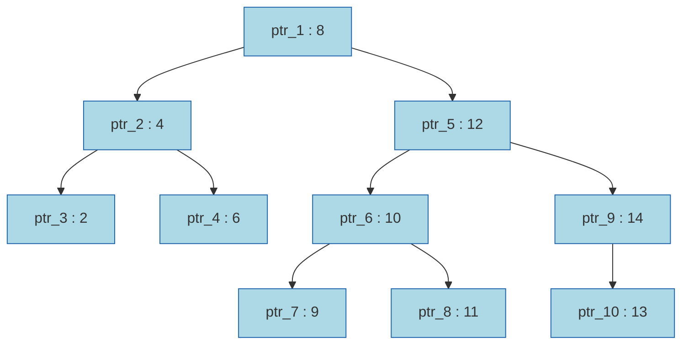
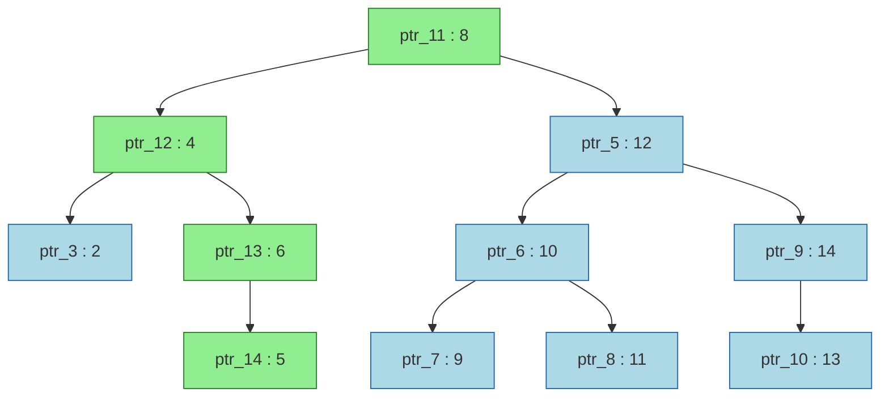
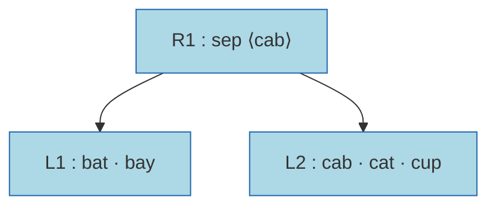
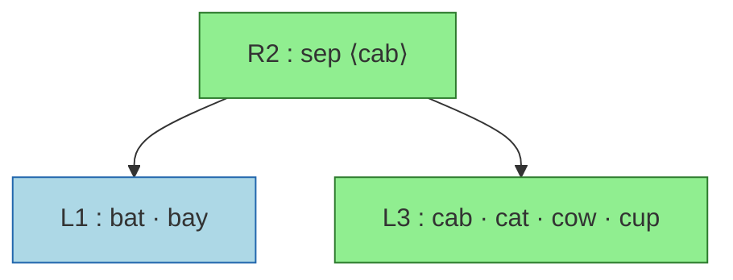

# Persistent B+ Tree with Blind Leaves (the key directory)

This document describes the design of the blind-leaf B+ tree used as the in-memory key directory in ByteCaskDB. It is intended for contributors who need to understand, modify, or reason about correctness of this component, and for readers who want to know how a tree can order and find keys it does not store.

The **Background** section builds up the necessary concepts from scratch — what the key directory has to do, persistent data structures and path copying, how that applies to a B+ tree, tries and PATRICIA, crit bits, blind search and fingerprints — for readers coming without that context. From §1 onward the document covers the C++ design as built: the overview, the leaf layout and key resolution, the two searches, the algorithms, the API, the engine integration, memory, performance and tests. **Appendix A** keeps the design history: the gates the design had to pass, every measurement taken on the way, and the revisions those measurements forced. **Appendix B** lists the prior art.

> **Status: built, measured, and the engine's default key directory**
> (2026-09-24). The tree is `bytecaskdb/blind_btree.cppm`, module
> `bytecask.blind_btree`. The keyed B+ tree (`BYTECASK_KEYDIR=btree`,
> `docs/persistent_btree_design.md`) remains selectable, and CI runs the
> engine suite on both. The persistent radix tree that preceded both as the
> key directory has been retired.

---

## Background

### What the key directory has to do

ByteCaskDB keeps every key in memory. The data files are append-only: a `put` appends a record (header, key, value, CRC) and never touches an older one. To serve a `get`, the engine needs to know *where* the newest record for a key is — which file, which offset — and it needs that for every key, without reading the data files. That map from key to record location is the **key directory**.

It has to do four things:

1. **Point lookup.** Given a key, return its record location, or say the key is absent.
2. **Order.** Iterate keys in byte order, from any starting key, forwards and backwards. `iter_from`, `keys_from`, `del_range` and range guards all need it.
3. **Snapshots.** A reader takes a consistent view of the whole directory in O(1), and keeps it while the writer goes on. This is what makes reads lock-free, and it is what the first half of this Background is about.
4. **One writer.** Inserts, overwrites and erases, with the latency of each one bounded.

The cost that matters is memory per key. A key directory that holds every key in full spends most of its bytes on key bytes: the keyed B+ tree measures 33–42 B/key on structured keys and 71–133 B/key on random ones, and 32 of those bytes are structural before the key itself. At 128 GB that is between one and four billion keys, depending on the key shape. For a deployment where the *number* of keys, not the value data, is what runs out of RAM, the key bytes are the problem.

The keys are already on disk twice: in each key's data record, and in the hint file that indexes the data file. The key directory needs them only to order entries and to confirm a match. The second half of this Background is about how a tree can do both without holding them.

### What is a Persistent Data Structure?

A **persistent data structure** preserves all previous versions of itself when modified. Instead of mutating state in place, every operation returns a new version. Old versions are never altered and remain fully accessible.

> **Note on terminology**: "Persistent" here comes from functional programming — it refers to *immutability and version preservation*, not to storage on disk. A persistent data structure lives entirely in memory. In ByteCaskDB the data files are what is durable; the key directory is persistent in this other sense.

This is the property behind requirement 3 above. If the key directory is never modified in place, a reader that holds a pointer to the version it started with can keep using it, unlocked, for as long as it likes, while the writer publishes new versions beside it. A `Snapshot` is exactly that: a pointer to one version. A `get` on the live database takes the pointer to the newest version and reads through it; nothing the writer does afterwards can change what that pointer leads to.

The simplest way to implement persistence is to deep-copy the entire structure on every write. That is O(N) per operation — correct, but impractical at any real scale.

The efficient alternative is **structural sharing**: since nodes are never mutated after creation, unchanged nodes can be *referenced by both the old and the new version simultaneously*. No copying is needed for any part of the structure that wasn't on the modified path.

For trees, a single insertion or deletion only touches nodes along the *path from the root to the affected leaf*. Everything off that path is shared freely between the two versions — this technique is called **[path copying](https://doi.org/10.1016/0022-0000(89)90034-2)**. Okasaki's [*Purely Functional Data Structures*](https://www.cambridge.org/9780521663502) (1998) develops this and related techniques in depth.

### Persistent BST: Path Copying

Consider a binary search tree holding integer keys. Nodes are identified by a pointer ID (e.g. `ptr_1`) and carry a key (e.g. `8`).

**Version 1** — `root_v1` holds a reference to `ptr_1`:



The search path for inserting 5 is **ptr_1(8) → ptr_2(4) → ptr_4(6)**, where 5 is placed as the left child of `ptr_4` (since 5 < 6). Every node on this path must be copied because their child pointers change. Everything off the path is untouched.

The result is three copies (`ptr_11`, `ptr_12`, `ptr_13`) plus a new leaf (`ptr_14 : 5`). `root_v2` points to `ptr_11`. The remaining 7 nodes on the right subtree and the untouched left leaf are shared unchanged.

**Version 2** — `root_v2 → ptr_11` (after inserting key 5):



- **Green nodes** — newly allocated copies (`ptr_11`, `ptr_12`, `ptr_13`) plus the new leaf (`ptr_14 : 5`). Only 4 nodes out of 11 are new.
- **Blue nodes** — the exact same node objects from Version 1, shared by pointer. No copying occurred.

A caller holding `root_v1` sees the original tree, unchanged. A caller holding `root_v2` sees a tree that contains key 5. Both are valid simultaneously and neither is aware of the other.

Persistence adds O(log N) allocations per write — the length of the copied path — but **does not change the time complexity of any operation**.

Two consequences follow, and both are visible in the engine:

- **Old nodes are garbage only when no version reaches them.** `ptr_1`, `ptr_2` and `ptr_4` are still part of Version 1. They can be freed when the last holder of `root_v1` lets go, and not before. A `db.snapshot()` that lives for an hour therefore keeps alive exactly the nodes of the version it pinned, and nothing retired since. §2.6 says how the engine decides that without reference counts.
- **A batch of writes is one version.** Copying the path once per key and publishing once per key would be wasteful. The writer instead works in a **transient**: a private builder that path-copies a node the first time the batch touches it and then mutates its own copy in place, since nothing outside the batch can see it. When the batch is durable, the transient freezes into one new version and publishes it with one pointer store. The builder-then-freeze pattern is Clojure's [transients](https://clojure.org/reference/transients).

### From a BST to a B+ tree

A binary tree has one key per node, so a path from the root to a key is about log₂ N nodes long — 20 pointer hops for a million keys, each a probable cache miss, and 20 node copies per write. A **B+ tree** is the same idea with wide nodes. The **leaves** hold the entries, in key order, and each holds many of them — tens to hundreds. The **inner nodes** hold **separators**: for each pair of adjacent children, one key that sorts between the last key of the left child and the first key of the right. A search descends from the root, comparing the query against separators to pick a child, until it reaches a leaf, then searches within the leaf.

```
                 inner:   [ "cab" ]                 separators route the search
                         /         \
   leaf:  [bat] [bay]            [cab] [cat] [cup]   entries, in key order
```

Path copying applies exactly as in the BST, with two differences of degree. The path is short: a tree of a million keys with 80-entry leaves and 1 KiB inner nodes is four nodes deep, and a hundred million keys six, so a write copies four to six nodes, whatever N. And copying a leaf copies all of its entries, about a kilobyte, not one key — which is why the transient matters: a batch of a hundred writes that land in the same leaf copies it once.

**Version 1** — `root_v1 → R1`:



**Version 2** — `root_v2 → R2`, after inserting `cow`. The search path is `R1 → L2`, so both are copied; `L1` is shared:



Two properties of the B+ tree matter for what follows. The inner nodes are few: with 80 entries per leaf and about 27 separators per inner node, roughly 1 in 30 nodes is an inner node, so whatever an inner node stores costs little per key. And the leaf is where the key bytes live. In the keyed B+ tree (`docs/persistent_btree_design.md`) each leaf entry holds its key's bytes beside the record location, which is what makes that tree cost 33–133 B/key. The rest of this Background is about what a leaf can hold *instead* of key bytes and still be searched. The inner nodes, the path copying, the transient and the reclamation of versions are the keyed B+ tree's and are reused unchanged.

### Tries: Branching on Key Bytes

A BST or a B+ tree branches based on a *comparison* between whole keys. The path length depends on the number of keys in the tree.

A **Trie** (from the word *re**trie**val*) takes a fundamentally different approach: it branches on *individual characters (or bytes)* of the key, one per level. The depth of any key equals its length, regardless of how many keys are in the tree.

- Each **edge** is labelled with a single character.
- A key's value is stored at the node reached after consuming all its characters.
- All keys sharing a common prefix share the same path down to the point of divergence — prefix sharing is structural, not incidental.

Keys: `app`, `apple`, `apply`, `apt`

```
root
 └─'a'─ node
          └─'p'─ node
                   ├─'p'─ [app ✓]
                   │        └─'l'─ node
                   │                ├─'e'─ [apple ✓]
                   │                └─'y'─ [apply ✓]
                   └─'t'─ [apt ✓]
```

Nodes marked ✓ carry a value. Unmarked nodes are routing-only intermediates.

Path copying applies exactly as in the BST. The path to any key has at most k nodes — one per character — so inserting or updating a key of length k copies at most k nodes. The rest of the trie is shared. Unlike the BST, path length is O(k) — bounded by the key length, not the number of keys N.

What a trie buys is that a search never compares whole keys: it looks at one byte of the query per level and follows the edge for that byte. That observation — *a search can be driven by the query's own bytes, one at a time* — is the one this design is built on. The blind leaf is built on it, one step further on.

### From the trie to PATRICIA: keeping only the bit positions

A trie as drawn above stores a byte on every edge, and a key with no sibling sharing its prefix makes a chain of single-child nodes, one per byte: `"application"` on its own is a chain 11 deep. Radix trees collapse those chains into edges labelled with whole byte strings; that is the usual compression, and it still stores every key byte somewhere in the tree. Morrison's **[PATRICIA](https://dl.acm.org/doi/abs/10.1145/321479.321481)** (1968) goes in a different direction, and it is the one that matters here. To *route* a search, a branching node needs to know only **which bit position** it branches on: the search tests that one bit of the query and goes left on 0 or right on 1. The bytes between one branch and the next are not needed to find the way down, only to confirm, at the bottom, that the key reached is the key sought. So PATRICIA stores one bit index per branching node and no label bytes at all, and compares the full key once, at the end.

Two things follow. A set of *N* keys has *N − 1* branching nodes, so *N − 1* bit positions describe the whole trie. And the walk down it never reads a stored key: it reads the query's own bits. That is a search structure which holds, per key, nothing but a bit position, and reads the key itself once, when it arrives. It is the blind leaf. The next section shows where the N − 1 positions come from, without building a single node.

### Crit bits: what a sorted array remembers about its keys

Take five keys in order:

```
   index   key    bytes (hex)
     0     bat    62 61 74
     1     bay    62 61 79
     2     cab    63 61 62
     3     cat    63 61 74
     4     cup    63 75 70
```

For each pair of **adjacent** keys, find the first bit where they differ. Write a bit position as `(byte, bit)`, with bits numbered 1–8 from the most significant:

```
   boundary          first difference                        position
   bat | bay    't' 0111 0100  vs  'y' 0111 1001  → byte 2, bit 5    (2,5)
   bay | cab    'b' 0110 0010  vs  'c' 0110 0011  → byte 0, bit 8    (0,8)
   cab | cat    'b' 0110 0010  vs  't' 0111 0100  → byte 2, bit 4    (2,4)
   cat | cup    'a' 0110 0001  vs  'u' 0111 0101  → byte 1, bit 4    (1,4)
```

That position is the pair's **crit bit** (critical bit). Because the keys are sorted, the left key always has a 0 at the crit bit and the right key a 1.

Now throw the keys away and keep only the four crit bits:

```
   index   crit bit against the previous entry
     0     —
     1     (2,5)
     2     (0,8)
     3     (2,4)
     4     (1,4)
```

This is enough to decide, for *any* query key, where it belongs in the array — without ever looking at the keys. The reason is that the crit bits of a sorted array *are* a PATRICIA trie, read off from left to right. The boundary with the smallest crit bit splits the array in two: every key left of it has a 0 at that bit, every key right of it a 1. Within each half, the boundary with the smallest crit bit splits again, and so on down to single entries:

```
                      (0,8)                 ← smallest crit bit: 'b' vs 'c'
                    /       \
               (2,5)         (1,4)          ← 'a' vs 'u' in byte 1
              /     \       /     \
            bat     bay   (2,4)   cup
                         /     \
                       cab     cat
```

Each internal node of this trie is one boundary of the array, and each subtree is one contiguous range of it. Nothing had to be built and no node is allocated: the trie is implied by the sorted order and the crit bits, and a search can walk it by scanning the array. The N − 1 bit positions a PATRICIA trie needs are the N − 1 boundaries of the sorted array.

> Keys of different lengths, where one is a prefix of another (`"ab"`, `"abc"`),
> need one more bit per byte so that the end of a key is itself a bit
> position. §2.1 gives that encoding. The examples here use equal-length
> keys so that it can be left out.

### Blind search: finding a key you cannot see

To search for `cat`, walk the trie testing only the query's own bits:

```
   at (0,8):  'c' = 0110 0011, bit 8 is 1   → go right
   at (1,4):  'a' = 0110 0001, bit 4 is 0   → go left
   at (2,4):  't' = 0111 0100, bit 4 is 1   → go right   → entry 3
```

The walk arrives at entry 3 and has read no key at all. Entry 3 is the **candidate**. If `cat` is in the array, this is where it is, because every key in the array that agrees with `cat` on all the bits tested would take the same turns. One read of the candidate's key confirms it.

Now search for `cow`, which is absent:

```
   at (0,8):  'c' → 1   → right
   at (1,4):  'o' = 0110 1111, bit 4 is 0   → left
   at (2,4):  'w' = 0111 0111, bit 4 is 1   → right   → entry 3, "cat"
```

The walk lands on `cat` again. Reading that key says `cow ≠ cat`, and it says more: the first bit where they differ is `j = (1,5)` (`'o'` 0110 1111 vs `'a'` 0110 0001). At every crit bit the walk tested on the way to `cat` — (0,8), (1,4) and (2,4) — it followed `cow`'s own bit, and `cat` has the same bit there, so `j`, where the two differ, is not one of them. A boundary that is not on the path cannot split the keys that agree with `cat` up to `j`: those keys form a contiguous **run** around `cat`, bounded on each side by a boundary whose crit bit is smaller than `j`. Here the run is `[2, 4)`, `{cab, cat}`, the keys that start with `ca` through bit 4 of byte 1. The query's own bit at `j` says which side of the run it falls on: `cow` has a 1 at (1,5), so it sorts after the run, at position 4, between `cat` and `cup`. That is the exact insertion point, from one read.

This is the whole trick. **A sorted array of crit bits places any key with one read of one neighbouring key.** A present key costs its own record's read, which a `get` was going to do anyway; an absent key costs one neighbour's.

Inserting `cow` at position 4 needs only the crit bit against its new predecessor, which is `j`, and the key after it keeps its own: `crit(cow, cup) = (1,4)`, the same as `crit(cat, cup)` was, because `cup` differed from the run at a bit below `j`. Erasing an entry needs no read either: the first difference between two keys is the smallest first difference between any adjacent pair between them, so when entry 3 goes, entry 4's crit bit becomes `min((2,4), (1,4)) = (1,4)`. §4 has the rules.

### Fingerprints: skipping the read on a lookup

Placing a key needs the trie. A **lookup** does not: it only has to find the entry that *is* the key, if there is one. For that, each entry carries a 24-bit **fingerprint**, a hash of its full key taken when the key was inserted. A lookup hashes the query, compares that against every fingerprint in the leaf at once (the fingerprints sit in one contiguous array, so this is a handful of vector compares with no data-dependent branch), and reads the key behind each match until one equals the query.

A present key costs one read, its own. An absent key costs none, unless another key in the leaf happens to share its 24-bit fingerprint — 1 in 16.7 million per entry. A match is always confirmed by comparing the key bytes, so a collision costs a read, never a wrong answer.

The two searches answer different questions and coexist in the same leaf. The fingerprints answer *is it here* (`get`, `contains`, `erase`); the crit bits answer *where does it go* (insert, `lower_bound`, iteration from a key). Both share the record read that confirms the answer.

### Blind leaves in a B+ tree

A **blind leaf** is a B+ tree leaf that stores, per entry, the crit bit against the previous entry, the fingerprint and the record's location — and no key bytes. The inner nodes stay as they are: separators with their key bytes, so routing to the right leaf is exact and needs no I/O, at a cost of under 1 B/key because inner nodes are so few. The literature has gone further — the String B-tree (Ferragina and Grossi, 1999) puts a blind trie in every node, HOT (Binna et al., 2018) is a height-balanced tree of blind nodes — but blinding only the leaves keeps every inner-node algorithm, the path copying, the transient and the reclamation of the persistent B+ tree unchanged. Only the leaf layout and the steps that touch it are new.

Persistence is untouched by the change: a blind leaf is copied and shared by pointer exactly as a keyed leaf is, a version is still a root pointer, and a reader on an old version still sees its leaves as they were. What the record reads add is a dependency the keyed tree did not have: a version's leaves point into data files, so a version must keep those files open for as long as it lives. The engine's snapshot already did that for values; the blind tree makes it true for keys too.

What it costs, against the keyed B+ tree, is reads: a `put` or a `del` reads one record to place or confirm the key, and `keys_from` reads one record per key it yields, where the keyed tree read none. What it saves is every key byte in the directory.

### Big-O summary

Let N = total number of keys, k = length of the key being operated on, L = entries per leaf (80 in the engine's build).

| Structure | `get` | `set` | `erase` | New allocs / write |
|---|---|---|---|---|
| Mutable BST | O(log N) | O(log N) | O(log N) | O(1) |
| **Persistent BST** | O(log N) | O(log N) | O(log N) | **O(log N)** |
| Mutable Trie | O(k) | O(k) | O(k) | O(k) |
| **Persistent Trie** | O(k) | O(k) | O(k) | **O(k)** |
| Mutable B+ tree | O(log N) | O(log N) | O(log N) | O(1) |
| **Persistent B+ tree** | O(log N) | O(log N) | O(log N) | **O(log_L N)** nodes, one a leaf |
| **Persistent blind-leaf B+ tree** | O(log N) + O(L) | O(log N) + O(L) | O(log N) + O(L) | **O(log_L N)** nodes, one a leaf |

**Making a structure persistent does not change the asymptotic time complexity of any operation.** Making the leaves blind adds a scan of the leaf, O(L), bounded by a constant the build chooses; §3 has what it costs in practice.

### Cost summary

What each operation reads from the data files, beyond what it reads on any tree. A *read* is one data record from the buffer pool or page cache.

| Operation | Keyed B+ tree | Blind-leaf B+ tree |
|---|---|---|
| `get`, present | 1 read (the value) | 1 read (key and value together) |
| `get`, absent | 0 reads | 0 reads (bar a fingerprint collision) |
| insert / overwrite / erase | 0 reads | **1 read** (+1 per leaf split) |
| `lower_bound` | 0 reads | **1 read** |
| iteration, keys only | 0 reads per key | **1 read per key** |
| iteration, keys and values | 1 read per key | 1 read per key |
| leaf entry | 32 B + key suffix | **12 B**, whatever the key length |
| snapshot | O(1), a root pointer | O(1), a root pointer |

The O(L) leaf scan is over a 320-byte array with a 16-byte index on top, so in practice it is a few dozen entries; §3 has the numbers and §8 what they cost.

That is the whole idea. The rest of the document is the C++ design as built: §1 what the module is and what it shares with the keyed tree, §2 the key encoding, the leaf and how keys are resolved, §3 the two searches, §4 the algorithms, §5 the API, §6 how the engine uses it, §7 and §8 what it costs in memory and time, §9 the tests and §10 what is still open. Appendix A is how it got there.

---

## 1. Overview

`bytecask.blind_btree` (`bytecaskdb/blind_btree.cppm`) is a persistent B+ tree whose leaves hold no key bytes, built as the key directory for ByteCaskDB. It has the same two handle types as the keyed tree: an immutable `PersistentBlindBTree<LeafBytes>`, where every mutating operation returns a new version sharing unchanged nodes by pointer, and a `TransientBlindBTree<LeafBytes>` builder that mutates nodes its own session created in place and freezes into one version. A `BlindBulkLoader<LeafBytes>` builds a tree from keys in ascending order without a single read, and recovery feeds it a k-way merge of the sorted hint files.

Three facts shape everything below:

- **The value type is a `BlindRef`**, the `(file_id, offset)` of a key's record. Sizes and sequence numbers live in the record's header and are read with the key when an operation confirms it.
- **Keys are never stored.** Every operation that needs a key's bytes takes a **resolver**, an object that returns the key of the record at a location, so the tree module does no file I/O and the tests drive it with an in-memory resolver (§1).
- **The leaf is the only new part.** The 40-byte node header, the inner nodes and their search, `BuildSession` (ownership, path copying, inner-node splits), the level building of `BulkLoader`, `ChainTraits` and the `VersionChain` are the keyed B+ tree's (`bytecaskdb/btree.cppm`), used unchanged. This module adds the leaf layout, both searches, the leaf steps of insert, overwrite, erase and split, its iterator, its handle types and a loader that fills blind leaves.

The engine's build uses 1,024-byte leaves holding 80 entries each; the leaf size is a template parameter (§1).

The design follows the four tenets of the README, correctness, simplicity, predictable latency and then performance, and one consequence of them governs this tree: it adds a record read to the write path, and that read is one per operation, bounded, and served from a cache, so write latency stays flat (§4.4). The in-leaf search is CPU work on the hot read path, and Appendix A records how much of the design effort went into keeping it level with the keyed tree's.

---

## 2. Architectural Design

### 2.1. Key encoding and crit bits

Keys are byte strings of any length up to 65,535, and one can be a prefix of another (`"ab"`, `"ab\0"`, `"abc"`). Zero-padding a short key would make `"ab"` and `"ab\0"` identical, so crit bits are defined over an encoding that keeps byte-lexicographic order and gives every key a distinct bit string:

```
each key byte b  →  1 b7 b6 b5 b4 b3 b2 b1 b0      (9 bits: continuation, then the byte)
end of key       →  0                              (then 0 forever)
```

A bit position is written `byte << 4 | r`: `r = 0` is the byte's continuation bit, `r = 1..8` its bits from the most significant. That is the `(byte, bit)` pair of the Background packed into one integer. Positions written this way compare in bit order, and splitting one is a shift and a mask rather than a division by 9. Bit `p` of key `k` is:

```cpp
auto bit(std::span<const std::byte> k, std::uint32_t p) -> std::uint32_t {
  const std::size_t i = p >> 4;
  const auto r = p & 15u;
  if (i >= k.size()) return 0;                      // past the end: 0
  if (r == 0) return 1;                             // a byte is present
  return (std::to_integer<std::uint32_t>(k[i]) >> (8 - r)) & 1u;
}
```

A shorter key has `0` where a longer key with the same prefix has its continuation `1`, so it sorts first, which is what `std::ranges::lexicographical_compare` does on bytes. `crit(a, b)` is the first `p` where `bit(a, p) != bit(b, p)`, or `kNoCrit` (all ones) when the keys are equal. Two distinct keys first differ at byte 65,534 at the latest, so the largest crit bit is `65,534 << 4 | 8`, and 20 bits hold it.

The byte-level common prefix used for separators is `crit(a, b) >> 4`.

### 2.2. Leaf layout

```
  ┌─────────────┬──────────┬──────────────────────┬───────────────────────────┐
  │ header 40 B │ top 16 B │ meta: u32 × capacity │ loc: u64 × capacity       │
  └─────────────┴──────────┴──────────────────────┴───────────────────────────┘

  top   = top[15], u8 each      the first four levels of the leaf's trie (§2.3); one pad byte
  meta  = crit:20 | fp_lo:12    crit of this key against the previous key in the leaf;
                                unused for index 0
  loc   = file_id:20 | offset:32 | fp_hi:12
```

The header is the B+ tree's `Node` header (tag, first child, capacity, count, prefix length, heap floor, dead bytes, `last_pos`, `is_leaf`; 40 bytes, held there by a `static_assert`), so a blind leaf is a `Node` whose bytes after the header are an index and two arrays instead of slots and a heap. That is what lets the version chain, `BuildSession` and the inner nodes handle it unchanged: children stay `Node *`, `is_leaf` tells a leaf apart, and reclamation never looks inside a leaf. `prefix_len`, `heap_floor` and `dead_bytes` are unused in a blind leaf; `last_pos` records where the last insert went, which the split rule reads (§4.4). The arrays are structure-of-arrays so that each search reads only `meta`.

The leaf size is a template parameter, in bytes, and the capacity follows from it: `(bytes − 56 − 4) / 12` entries, with `loc` aligned to 8. Sizes are jemalloc size classes so no allocation is rounded up. The engine uses **1,024-byte leaves, 80 entries**: `meta` is 320 bytes at offset 56, `loc` 640 bytes at offset 376. The size was picked by measurement over 512–1,280 bytes (Appendix A, *Leaf size, revisited*); capacity must stay below 256 because the `top` index names entries with a byte. Inner nodes are 1 KiB too (`kBTreeNodeBytes`; a `static_assert` ties `kBlindLeafBytes` to it), chosen for the write path's copy volume rather than for reads: a commit of random keys copies one parent per leaf it changes, and at 4 KiB those copies were four times the leaves' (`docs/persistent_btree_design.md`, *Node size, revisited*).

**The fingerprint** (`fp_lo`, `fp_hi`, 24 bits) is a hash of the full key, taken when the key is inserted and never recomputed: a multiply-xor over 8-byte words, inlined, since every lookup and write computes one. Words are loaded in native byte order, since fingerprints live only in memory and are rebuilt with the tree at recovery; a key of eight bytes or more hashes its tail as its last eight bytes, overlapping the word before, so that no byte loop is needed. It is not used for ordering. The low twelve bits sit in `meta`, the one contiguous array the lookup compares in vector registers (§3.1), and the high twelve in `loc` confirm a match before its key is read. The false-match rate is 1 in 16.7 million per entry.

**What the leaf does not hold:** the key bytes, the value size and the 48-bit sequence number. All three are in the record's header, which every confirming read returns (§2.5).

**Invariants:**

- Entries are in key order. `meta[i].crit == crit(key[i-1], key[i])` for `i ≥ 1`; `meta[0].crit` is 0.
- `fp(key[i])` describes the record at `loc[i]`, and that record is a `Put` whose key is `key[i]`.
- `top` is the index §2.3 defines for the leaf's current entries. It is rebuilt after every change to the entries, and debug `validate()` recomputes and compares it.
- Every `loc` in a published version names bytes already written to the data file. Every `loc` in the writer's transient names bytes written *or* bytes in the batch the writer is building (§2.5).
- Within one process, a `(file_id, offset)` pair names at most one record, ever. File ids come from `next_file_id_++` and are never reused; files are append-only; `resume()` trims only bytes no version references and then seals the file. This is what makes location equality mean record equality, which the no-read operations in §3.4 rely on.
- The `meta` words past `count` are zero or stale entries, never uninitialised: the fingerprint scan compares all of them before masking, so a fresh leaf zeroes them at allocation.

### 2.3. The top index

The sorted keys and their crit bits imply a Patricia trie (Background). Its root is the boundary with the smallest crit bit; each child is the boundary with the smallest crit bit within its half; every subtree is a contiguous range of entries. `top[15]` holds that trie's first four levels in heap order — the children of slot `k` are `2k + 1` and `2k + 2` — as the index of the boundary at the root of each range, or 0 for a range of fewer than two entries.

```
   top[0]  = root boundary of [0, count)
   top[1]  = root boundary of [0, top[0])         top[2] = root boundary of [top[0], count)
   top[3..6], top[7..14]: the next two levels
```

For the Background's five keys, `top[0] = 2` (the (0,8) boundary), `top[1] = 1`, `top[2] = 4`, `top[5] = 3`, and the rest 0.

A placement walk takes four bit tests down the index and scans only the range it lands in — about a sixteenth of a leaf of random keys — instead of the whole leaf. Building the index is four passes over the leaf's crit bits (`compute_index`), done after every insert, erase or split; a lookup never reads it. Appendix A, *R6*, records why four levels and not five: the walk is bound by its chain of dependent loads, and a fifth level lengthened it by more than the scan it saved.

### 2.4. What is shared with the keyed B+ tree

`BlindSession<LeafBytes>` derives from `btree_detail::BuildSession<BlindRef>`. The base owns the descent, the path copy of inner nodes, inner-node splits, `make_root`, node ownership (`owns`, `discard`) and the garbage sites; it takes the leaf step as a callback. The blind session supplies only the leaf steps: `upsert_leaf`, `remove_entry`, `split_leaf`, and `own_leaf`, which clones a leaf by copying its arrays and index rather than rebuilding a slotted page. The inner-node search (`child_index`), the separator rule (`separator(prev, key)`), `BulkLoader`'s level building and `concat_into`, `ChainTraits<BlindRef>` and the `VersionChain` are used as they are. `map_bench` showed the keyed B+ tree unchanged by the refactor that exposed those pieces.

### 2.5. Key resolution

Every operation that needs a key's bytes asks a resolver:

```cpp
// Reads the key of the record at a location. The returned span is valid until
// the next call on the same resolver; the tree never holds two at once.
template <typename R>
concept BlindKeyResolver = requires(R &r, BlindRef ref) {
  { r.key_at(ref) } -> std::convertible_to<std::span<const std::byte>>;
};
```

The tree takes the resolver as an argument to each operation that needs one and never stores it. The tree module stays free of file I/O, and the tests drive it with an in-memory resolver that counts its calls.

The engine's resolver is `KeyReader` (`bytecaskdb/internals.cppm`). It reads the whole record at the location through `DataFile::lend_record` — one buffer-pool lookup, no copy unless the record straddles a frame — and CRC-checks it on the write path. The CRC covers header, key and value together, so there is no verified read of the key alone: confirming a key reads its value too (§6.4). It keeps the sequence, value size and value of the last record read, so a `get` that confirmed a key has its value, and a `put` or `erase` has the value size of the record it displaced, without a second read. It resolves through the version's file registry (`KeyDirCtx`), so a snapshot resolves against the files it pins.

One case needs more. Phase 1 of a commit (validate and apply) runs **before** the batch's `pwritev` (`docs/commit_pipeline_design.md`), so the writer's transient can hold locations whose bytes are not yet on disk: a batch that puts `k1` then `k2` may land `k2`'s blind walk on `k1`'s new record. `KeyDirCtx` therefore carries the batch's **pending records**, a map from `(file_id, offset)` to the key, sequence and value size of each record the batch has applied but not written, and `KeyReader` answers from it first. Readers never see these locations, because the version is published after `fdatasync`.

### 2.6. Versions, transients and reclamation

Unchanged from the keyed B+ tree. A `TransientBlindBTree` is a `BuildSession` with a tag; a node whose tag is the session's is mutated in place, any other node is copied and the original retired through `discard`. `persistent() &&` publishes the version into the `VersionChain`, which parks each retired node on the oldest live version that can still reach it and frees it when that version dies. A transient destroyed without `persistent()` frees what it created and gives back what it retired. The `[accounting]` tests run on the blind tree and assert that the nodes which exist are exactly those reachable from a live version plus those the chain still owes a free to. Readers share nodes with no synchronisation, because nothing writes to a node after the session that created it has published.

---

## 3. Search

A leaf answers two questions. A point lookup (`get`, `contains`, `erase`) asks whether `q` is in the leaf and at which index; it scans the fingerprints (§3.1). An insert or `lower_bound` asks where `q` belongs among keys it cannot see; it walks the crit bits to a candidate and reads that key (§3.2, §3.3). Both are preceded by the inner-node descent, which is exact: the search reaches the one leaf that can hold `q`.

### 3.1. Point lookups: the fingerprint scan

`meta` holds the low twelve fingerprint bits of every entry in one contiguous array. A lookup compares all `kCap` of them with the query's in vector registers — ten AVX2 compares for an 80-entry leaf, a fixed count with no loop or branch on data — and masks the result to `count`. Each match is then checked against the twelve bits in `loc` and, if those agree too, its key is read through the resolver; the first key equal to `q` is the answer, in index order.

```cpp
auto find(const Leaf &l, std::span<const std::byte> q, std::uint32_t fpq, R &res)
    -> std::optional<std::uint32_t> {
  auto hits = fp_lo_matches(l, fpq & 0xFFF);           // bitmask over entries
  for (auto i : hits)                                   // ascending
    if (fp_hi(l, i) == fpq >> 12 && res.key_at(ref(l, i)) == q)
      return i;
  return std::nullopt;
}
```

A present key costs one read (its own record), plus one per earlier entry in the leaf with the same 24-bit fingerprint. An absent key costs none, bar a collision. A twelve-bit match that the other twelve bits reject costs one `loc` load and no read, about once in 70 lookups at 56 live entries per leaf; a full 24-bit collision costs one extra read, about three per million lookups. Nothing here depends on the crit bits, so the scan is correct for any leaf the inner nodes route to; the unit tests cover leaves holding keys whose fingerprints collide.

The scan reads all 320 bytes of `meta`, five cache lines, where a trie walk touches two or three; at 1M keys the directory fits in L3 and this shows up nowhere. On targets without AVX2 the same scan runs on SSE2, NEON, or a scalar loop; the algorithm does not change. The NEON kernel masks four compares to disjoint bit positions and reduces them with one `addv` per sixteen entries, since NEON has no movemask and the vector-to-scalar move is the costly step. It has not run on hardware.

The scan replaced a crit-bit walk for lookups: the walk cost about 295 instructions per lookup and carried the data-dependent branches, the scan about 60 and none. Appendix A, *Point lookups by fingerprint scan*, has the measurements.

### 3.2. Placing a key: the blind walk

`candidate(leaf, q)` walks the implied trie (Background) in two stages. First, four bit tests down the `top` index narrow the search to one subtree, a range `[lo, hi)` of the leaf. Then a left-to-right pass over that range finds the candidate. `c` is the candidate. `s` is the crit bit of the last left turn still in force: the boundaries after it with a crit bit at or above `s` are that node's right subtree, which the search did not enter.

```cpp
auto blind_candidate(const Leaf &l, std::span<const std::byte> q) -> std::size_t {
  auto [lo, hi] = index_walk(l, q);                 // four bit tests down top[]
  std::size_t c = lo;
  std::uint32_t s = kNoCrit;                        // above every crit bit
  for (std::size_t i = lo + 1; i < hi; ++i) {
    const auto p = l.crit(i);
    const bool on_path = p < s;
    const bool right = bit(q, p);
    c = (on_path && right) ? i : c;                 // branch-free; one pass
    s = on_path ? (p | (0u - right)) : s;           // kNoCrit on a right turn, p on a left
  }
  return c;
}
```

A boundary with a smaller crit bit is an ancestor of the boundaries between it and the previous smaller one. Turning right at a boundary leaves every subtree to its left, so it clears `s`; turning left starts skipping that boundary's right subtree. The pass is over a range of about a sixteenth of the leaf on random keys, with no branch on data.

Two details are not optional:

- **The reset on a right turn.** A first draft kept `s` across a right turn. That skips boundaries of the subtree the search has just entered and returns a wrong candidate. A brute-force check of this pass, of the resolution in §3.3, and of the insert and erase rules, against sorted arrays of random keys (prefix keys and `\0` bytes included, 23,000 key sets), found it; undoing the reset fails five of the seven tree test cases.
- **The select.** "No branch on data" has to be enforced, not assumed. Clang compiles the ternary `right ? kNoCrit : p` to a conditional jump on `right`, which is a coin flip for every entry scanned. The implementation writes it as `p | (0u - right)` (`kNoCrit` is all ones), which stays a select; the jump cost 2.3 mispredicts per `Get` while lookups used this walk (Appendix A, *G3 on hardware counters*).

### 3.3. Resolving the candidate

`position(leaf, q, resolver)` returns the entry for `q` or its insertion position:

1. If the leaf is empty, the position is 0.
2. `c = candidate(leaf, q)`.
3. Read `key[c]` through the resolver. If it equals `q`, found at `c`.
4. Otherwise let `j = crit(q, key[c])`. The keys that share bits `[0, j)` with `key[c]` are a contiguous run `[a, b)` around `c`: extend left and right while `crit > j`. Every key in the run has the same bit `j` as `key[c]`, so if `bit(q, j)` is 1, `q` sorts after the run and its position is `b`; otherwise it is `a`.

Step 4 is the Patricia argument: `j` cannot be a crit bit on `c`'s path, because the search would have tested it and followed `q`'s bit, not `c`'s. So no boundary inside the run has crit `j`, and the boundaries at `a` and `b` have crit bits below `j` (a boundary with crit `j` next to the run would be on `c`'s path too). The Background's `cow` example is exactly this: candidate `cat`, `j = (1,5)`, run `{cab, cat}`, `bit(cow, j) = 1`, position 4.

The result carries `idx`, whether it was `exact`, whether `q` sorts `after` the run, and `j`; the insert step needs all four (§4.1). An insert or `lower_bound` costs one read unless the leaf is empty.

### 3.4. Lookups by location: no read

Two engine paths know a key *and* the record they expect it to point at, and need to know whether the directory agrees. Vacuum asks whether a record is still live (the key still resolves to `(source_file, offset)`) and, when it copies a record, remaps the key from its old location to the new one. By the location invariant (§2.2), a record holds one key, so an entry that points at the expected record *is* the key's entry, whatever other entries share its fingerprint. `find_at(leaf, fp, ref)` scans the fingerprints like `find` and compares locations instead of reading keys; `holds(key, ref)`, `replace_at(key, from, to)` and `erase_at(key, from)` are built on it. None of them reads a record, so vacuum's liveness check and remap cost the key directory no I/O, as on the keyed tree.

---

## 4. Algorithms

Everything is written once in `BlindSession`, as in the keyed B+ tree. Only the leaf-level steps are described here; the path copying, `own`, splits of inner nodes and garbage sites are the base's. Every write first computes the query's fingerprint.

### 4.1. Insert

With the position from §3.3 and `j = crit(q, key[c])`. The entries are fixed-size, so an insert shifts both arrays above the position by one, then:

- `q` after the run, at `b`: `crit(q) = j`, and the key now after `q` keeps its crit bit (`crit(q, key[b])` is the old `crit(key[b-1], key[b])`, which is below `j`).
- `q` before the run, at `a`: `crit(q)` is the old `crit(key[a-1], key[a])` (0 when `a == 0`), and `key[a]` gets `j`.

No other entry changes, and no key other than `key[c]` is read. `last_pos` records the position, and the index is rebuilt.

```
  Insert "cow" into the Background's leaf (candidate "cat", j = (1,5), after the run):

  index   0      1      2      3      4            0      1      2      3      4      5
  key     bat    bay    cab    cat    cup    →     bat    bay    cab    cat    cow    cup
  crit    —     (2,5)  (0,8)  (2,4)  (1,4)         —     (2,5)  (0,8)  (2,4)  (1,5)  (1,4)
                                                                               new    kept
```

### 4.2. Overwrite

`position` resolves `q` to itself: replace `loc`, keeping the crit bit and fingerprint, which describe the key and the key has not changed. The transient's `upsert` takes a predicate over the existing and the new `BlindRef`, so a caller can refuse the replacement (a recovery resolver that keeps the newer sequence, say) and nothing changes; the displaced location is returned so that the engine can account the old record's bytes.

### 4.3. Erase

`find` (§3.1) gives the index `i`; remove it. If `i > 0` and `i + 1 < count`, the next key's crit bit becomes `min(crit[i], crit[i+1])`: the first difference between two keys is the smallest first difference between any adjacent pair between them. No read beyond the one that confirmed the key. A leaf whose last entry goes is discarded, and the base removes it from its parent.

```
  Erase "cat" (index 3):

  index   0      1      2      3      4            0      1      2      3
  key     bat    bay    cab    cat    cup    →     bat    bay    cab    cup
  crit    —     (2,5)  (0,8)  (2,4)  (1,4)         —     (2,5)  (0,8)  min((2,4),(1,4)) = (1,4)
```

### 4.4. Split

A full leaf plus the new entry is laid out in a scratch copy and cut at `m`. The crit bit at the cut, `crit(left.last, right.first)`, is already in the arrays, and it gives the separator's length: `cpl = crit >> 4`, separator `= right.first[0 .. cpl + 1)`. Building it needs the bytes of `right.first`, **one read per split**. When the key being inserted is `right.first`, its bytes are in hand and the read is skipped. The right leaf's first entry gets crit bit 0, both leaves get a fresh index, and `last_pos` follows the new key into whichever leaf holds it.

**Where to cut.** A blind leaf's capacity is a count, not bytes, so a split that leaves one half nearly full is paid for again at the next insert: `uniform` keys once filled leaves to 0.54 that way. An insert is *ascending* when it lands one or two positions after the leaf's previous insert (`last_pos`). Two positions count because a stream of new keys often runs past one existing key per step: `key_123459` then `key_123460` skip over `key_12346`. In order of preference:

1. **Ascending, and the next key shares at least 8 bytes fewer with the new key than the previous key does** (another key family, read off the two crit bits): the new key ends the left leaf. The stream goes on to fill leaves of its own instead of dragging the other family along.
2. **Ascending, otherwise:** at the insert point, but never left of the middle. An ascending stream appending at the end of the leaf therefore starts the right leaf with the new key, and the left one stays full.
3. **Descending** (an insert at 0 after an insert at 0): after the first entry.
4. **Otherwise** the middle. A short ascending run in the middle of a leaf (every `key_N` after `key_N/10`) is no evidence of a stream.

A split happens once per leaf filled: with 80-entry leaves, a few dozen inserts apart in random order.

### 4.5. Range erase (`del_range`)

As built, the engine walks the range with a keyed iterator, which reads each key (to find the range's end and the record's size for `live_bytes`), then erases each key by name, which reads it again: two reads per key in the range. The data file still takes one append, whatever the range holds. The designed form — two seeks, one read each, and every entry between them erased without a read, with `live_bytes` estimated from the file's average record — is deferred as R3 (#162; Appendix A).

### 4.6. Iteration

`BlindBTreeIterator` is a bidirectional cursor over one version: a stack of `(node, index)` frames, advancing within a leaf and across leaves in memory, like the keyed tree's. It yields a `BlindRef`; `key(resolver)` reads the key of the current entry. A seek (`lower_bound`) costs one read (§3.3); `count_until(end)` counts entries between two cursors from the leaf counts, reading nothing, which is what `Snapshot::count_keys` uses.

What the engine's iterators cost differs by what they yield:

- **Value iterators** (`iter_from`, `riter_from`) read the record at `loc`, which is the read they do on any tree, and take the key from the same bytes. No extra I/O.
- **Key iterators** (`keys_from`, `rkeys_from`) read the header and key of each entry: **one read per key**, where the keyed trees read none. The iterator owns the buffer the key is read into, so the span it yields lives until the next advance, as the lifetime rules require.

### 4.7. Bulk load

`BlindBulkLoader` takes keys in ascending order, so it has every key's bytes in hand: crit bits between neighbours, fingerprints and separators are computed from the stream without a single read. It throws if a key does not sort after the previous one. Leaves are filled to a target that can be a fixed fraction of capacity or spread over a range of fractions, successive leaves taking their target from a golden-ratio sequence so that they do not all reach capacity, and split, at the same time (§7). `finish() &&` assembles the inner levels and returns a tree; `seal() &&` returns the sealed leaves without the levels above them, so that loaders which ran in parallel over disjoint ascending slices can be joined by `concat`, as the keyed tree's are.

### 4.8. Recovery from sorted hint streams

Recovery cannot merge per-worker trees the way the retired radix tree's fan-in did, because merging two blind trees means comparing keys neither holds. It merges the **hint files** instead (`DB::recovery_load_streams`), which are already sorted by key and then by sequence descending (`docs/file_format.md`):

1. **Per file, in parallel.** Verify the CRC. Collect the range tombstones at the head of the file and the file's sequence bounds. Record a fence every 4 KiB: the key and byte offset of the first entry that starts in each step, placed only on the first entry of a key so that a seek never skips an older duplicate. A hint file has no sync marker, so this pass is also the only safe way to find entry boundaries.
2. **Splitters.** Pool the fence keys and cut them into `R` ranges.
3. **Per range, in parallel.** A k-way merge over every hint file's slice of the range, each slice found by seeking to that file's last fence below the range and scanning forward to the first key in it. For each key the highest sequence wins (`kde_newer`'s rules, so `SequenceOverlap` is still thrown); a winning `Delete`, or a range tombstone with a higher sequence covering the key, drops it. Survivors feed a `BlindBulkLoader` and their sizes feed the file's live bytes. Every file is merged in every range, so no tombstone map crosses threads.
4. **Concatenate** the ranges' sealed leaf runs through `BulkLoader::concat_into`.

No intermediate tree is built. The loader fills leaves between 60% and 100% full, spread (§7). The format document allows unsorted hint files; phase 1 sorts one in memory, bounded by `max_file_bytes`, as hint generation does. The `[model]` recovery tests check serial and parallel recovery for equal keys, values and `file_stats`.

---

## 5. API Specification

### 5.1. Resolver concept

Every operation that may read a key takes an `R &res` satisfying `BlindKeyResolver` (§2.5). The tree calls `res.key_at(ref)` at most once per leaf step and never keeps the span past the call.

### 5.2. Persistent API (`PersistentBlindBTree<LeafBytes>`)

All operations leave the original tree unchanged and return a new instance.

*   `PersistentBlindBTree() = default`
*   `std::size_t size() const noexcept`, `bool empty() const noexcept`
*   `std::optional<BlindRef> get(key, R &res) const` — the fingerprint scan; one read if present.
*   `bool contains(key, R &res) const`
*   `bool holds(key, BlindRef ref) const` — whether `key`'s entry points at `ref`. No read.
*   `PersistentBlindBTree set(key, BlindRef ref, R &res) const` — insert or overwrite.
*   `PersistentBlindBTree erase(key, R &res) const`
*   `TransientBlindBTree<LeafBytes> transient() const` — spawns a mutable builder.
*   `begin()`, `end()` (`std::default_sentinel`), `last()`, `end_iter()`, `lower_bound(key, R &res)` — iterators (§5.4).
*   `stats()`, `validate(R &res)`, `visit_nodes(f)` — node counts and depth, the debug invariant check, and a walk over node pointers for the memory tests.

A version can be derived from only while it has no live successor; a second derivation throws `std::logic_error`, as on the other trees.

### 5.3. Transient API (`TransientBlindBTree<LeafBytes>`)

Operations mutate the tree in place under the session's tag. A consumed or moved-from transient throws `std::logic_error` on use.

*   `std::optional<BlindRef> get(key, R &res) const`, `bool holds(key, BlindRef ref) const`
*   `void set(key, BlindRef ref, R &res)`
*   `std::optional<BlindRef> upsert(key, BlindRef ref, R &res, Pred &&should_replace)` — single-traversal insert-or-conditional-replace. Absent: inserts, returns `nullopt`. Present: calls `should_replace(existing, ref)`; if true, replaces and returns the displaced location, else changes nothing and returns `nullopt`.
*   `std::optional<BlindRef> erase(key, R &res)` — the displaced location, if the key was present.
*   `bool replace_at(key, BlindRef from, BlindRef to)` — points `key`'s entry at `to` if it points at `from`. No read.
*   `bool erase_at(key, BlindRef from)` — erases `key`'s entry if it points at `from`. No read.
*   `lower_bound(key, R &res) const`
*   `PersistentBlindBTree<LeafBytes> persistent() &&` — consumes the builder.

### 5.4. Iterator API (`BlindBTreeIterator<LeafBytes>`)

*   Satisfies `std::bidirectional_iterator` over `BlindRef`: `operator*` returns the current entry's location by value, `operator++` and `operator--` move within and across leaves in memory.
*   `key(R &res)` reads the current entry's key; the span is the resolver's and lives until its next call.
*   `count_until(end, limit)` counts entries up to `end`, by leaf counts, without visiting them.
*   Compares equal to `std::default_sentinel` when exhausted, and to another iterator at the same position.

The engine wraps it as `BlindKeyDirIter<Keyed>`: a keyed iterator yields `(key, KeyDirEntry)` and reads the record on every dereference; a value iterator yields a location and reads nothing. An iterator over a published state keeps its own handle on that state's file registry, so it can outlive the call that made it.

### 5.5. Bulk loader (`BlindBulkLoader<LeafBytes>`)

*   `BlindBulkLoader()`, `BlindBulkLoader(double fill)`, `BlindBulkLoader(double fill_min, double fill_max)` — leaves filled to capacity, to a fraction of it, or to fractions spread over the range.
*   `void append(key, BlindRef ref)` — keys must ascend; throws `std::invalid_argument` otherwise.
*   `PersistentBlindBTree<LeafBytes> finish() &&`
*   `LeafRun seal() &&`, `static PersistentBlindBTree<LeafBytes> concat(std::vector<LeafRun>)` — for loaders run in parallel over disjoint ascending slices.

---

## 6. Engine integration

### 6.1. The key directory facade

The engine talks to its key directory through a set of `kd_*` functions in `bytecaskdb/internals.cppm` — `kd_get`, `kd_contains`, `kd_put`, `kd_erase`, `kd_holds`, `kd_put_at`, `kd_erase_at`, `kd_lower_bound`, `kd_count`, `kd_read_value` and the iterator constructors — that speak the engine's terms: a lookup returns a `KeyDirEntry`, a put or erase returns what it displaced (a `KeyDirHit`: location and value size), iterators yield `(key, KeyDirEntry)` or a location. Each takes a `KeyDirCtx`: the version's file registry (a published state's, or the writer's transient one), the writer's pending records (§2.5) and whether to verify CRCs. `bytecaskdb/bytecask.cppm` calls nothing else, so the same engine builds on both trees; the keyed B+ tree ignores the context.

On the blind tree the facade constructs a `KeyReader` per call, over a per-thread scratch buffer and a frame lease. A put is one `upsert`; the predicate always accepts, and the hit it displaced takes its value size from the record the reader just confirmed (`KeyReader::displaced` checks it was that record). `DB::get` takes the value from the same read that confirmed the key.

### 6.2. Sequences

The leaf holds no sequence. Every engine use of a key's sequence — the W-W check and `ensure_unchanged`, range guards, `lost_to` on a conflict, vacuum's remap, `apply_resume` — gets it from the record's header, which the read that confirms the key returns, so `kd_get` yields a full `KeyDirEntry` and those paths run unchanged from the keyed tree. The cost is that a guard on an unchanged key reads a record where the keyed tree read nothing. A design that compares *locations* instead, so that the common path of every guard is free of I/O, is written up but not built (R8; Appendix A, *Sequence without a sequence field*).

Vacuum's liveness check and remap take the no-read path of §3.4 (`kd_holds`, `kd_put_at`, `kd_erase_at`): they know the record they expect, and location equality is record equality.

### 6.3. I/O per operation

Reads of the key directory's own doing, beyond what the operation reads on any tree. Each read is of the whole record, value included (§2.5), and lands on a record the writer or a reader touched recently, often in the active file, which is resident in the page cache and in the buffer pool.

| Operation | Keyed B+ tree | Blind leaves |
|---|---|---|
| `get`, present | 1 read | 1 read (key confirmed in the same bytes) |
| `get`, absent | 0 | 0 (1 in 16.7M on a fingerprint collision) |
| `contains_key`, present / absent | 0 / 0 | **1** / 0 |
| `put`, new key | 0 | **1**, plus 1 per leaf split |
| `put`, overwrite | 0 | **1** |
| `del`, present / absent | 0 / 0 | **1** / 0 |
| `ensure_unchanged`, W-W check, unchanged | 0 | **1** (0 after R8) |
| `del_range` | 0 | **2 per key in the range** (2 in all after R3) |
| `iter_from`, per key | 1 | 1 |
| `keys_from`, per key | 0 | **1** |
| vacuum liveness and remap | 0 | 0 |
| recovery | 0 | 0 |

### 6.4. Latency

A write that reads a key does so while the leader holds the write mutex, in phase 1. On a warm page cache or buffer pool that is under a microsecond; on a cold SATA SSD it is about 100 µs, and a batch of 64 cold reads is several milliseconds of serial I/O before the `fdatasync`. The cost per write is constant, one read, so latency stays predictable; its variance is the cache hit ratio's.

The read is of the whole record, not its header and key, because the CRC covers the value too. An overwrite or delete of a key with a large value therefore reads and checks that value under the mutex, and an insert does the same to its neighbour's: up to `max_value_bytes` (4 MiB by default) per write. `engine_bench`'s puts use small values, so its numbers do not show this. Reading only the header and key would mean confirming a key without verifying it; that trade-off is open (§10, #163).

The fix, if a workload shows the need: resolve candidates *before* joining the commit group, against the latest published version, and at apply time check that the leaf the candidate came from is still the leaf the transient routes to (same node pointer, or same tag). Only a key whose leaf changed in between is re-read under the mutex. The reads then run in parallel across writers and phase 1 stays in memory. That is the second half of R8.

### 6.5. Failure modes

- **A write can fail on a neighbour's record.** An insert reads the candidate's key, which belongs to another key. An I/O error or CRC failure there fails the write: `std::system_error` or `std::runtime_error`, as a failed read does on any tree, and nothing is appended because phase 1 fails before phase 2. The engine does not enter the degraded state, since nothing was written. `CONTRACT.md` records this case; a fault-injection test covers it.
- **A record the directory points at that is not a `Put`** is corruption: `KeyReader` throws `std::runtime_error` rather than treating its bytes as a key.
- **Key resolution during recovery cannot fail this way:** recovery reads hint files, not data entries.
- **A fingerprint collision is not a correctness risk.** A match is always confirmed by the key bytes; the fingerprint only skips reads on a mismatch.

### 6.6. Selection

Build-time. The blind tree is the default; `BYTECASK_KEYDIR=btree` selects the keyed B+ tree, and CI runs the engine suite on both. The on-disk format is the same for both: the blind build recovers from the same hint files, so a database opens under either tree. A runtime `Options::key_directory` is a follow-up that belongs to the pluggable-interface work, not to this tree.

---

## 7. Memory

A leaf entry is 12 bytes. Per key, add the leaf's fixed 56 bytes of header and index spread over its entries, the fill, and under 1 B of inner nodes (1 KiB each, one per 27 leaves or so): at 80 entries, 12 / fill + 56 / (80 × fill) + about 0.7, which is about 13.4 B/key at full leaves and 19.1 at the 0.69 fill random inserts settle at.

Measured with `memory_profile` (`BC_INDEX_ONLY=…`), 1M keys inserted in batches of 100 as the engine does, jemalloc heap per key, 1,024-byte leaves:

| Key shape | Keyed B+ tree | Blind leaves | Ratio |
|---|---:|---:|---:|
| structured (`prefixed`, UUIDv7 with a type prefix) | 33.9 | **13.7** | 2.5× |
| random (`uuidv4_binary`, 16 random bytes) | 71.5 | **19.0** | 3.8× |
| random, long (`sha256_hex`, 64 hex characters) | 132.8 | **19.0** | 7.0× |

The size no longer depends on key length: every random shape measures the same, and a structured shape differs from it only by its fill. The per-shape picture, at 1,280-byte leaves before the header shrank, is in Appendix A, *R2*; the two numbers above moved by −1.1 and −0.9 B/key when it did (*R4*) and by +0.2 and +0.3 when the leaf size was chosen for read speed (*Leaf size, revisited*).

**Fill.** Ordered inserts fill leaves to about 1.0, random inserts to 0.69, and the split rule in §4.4 is what keeps ascending streams from leaving half-full leaves behind. `many_partitions`, whose second pass adds one key after every existing key, is the worst structured shape at 0.67: every full leaf must end up holding twice its capacity.

**Recovery slack.** A tree bulk-loaded with full leaves splits every one of them within the first few percent of random writes, nearly doubling the directory (12.9 → 24.6 B/key) before it settles at the insert-built figure. Recovery therefore loads leaves between 60% and 100% full, spread over successive leaves, which removes the cliff: the peak stays at the steady state. Keys written in order never refill the slack, so a recovered tree of ordered keys keeps about 26% more than a full load would (16.3 against 12.9 B/key). Predictable latency ranks above the smaller footprint; Appendix A, *R5*, has the table.

Against the keyed B+ tree's 33–133 B/key, the directory is 2–7× smaller, and 128 GB holds on the order of six billion keys of any shape. HOT's reported 11–14 B/key is lower because its leaf value is 8 bytes.

---

## 8. Performance

`engine_bench`, 1M keys, buffer pool, release build, AMD Ryzen 7 3700X, not pinned, medians of five interleaved runs, all binaries built the same way on the same day. Ops/sec as a fraction of the keyed B+ tree's, and hardware counters per `Get` call:

| | `Get` | `UUIDv4/Get` | `GetMT`, 16 threads | Cycles/`Get` | Instructions/`Get` | Branch misses/`Get` |
|---|---:|---:|---:|---:|---:|---:|
| Keyed B+ tree | 1.00 (4.18 M/s) | 1.00 (2.83 M/s) | 1.00 (37.5 M/s) | 1,019 | 2,252 | 1.29 |
| Blind, crit-bit walk for lookups | 0.907 | 1.10 | 0.92 | 1,115 | 2,482 | 2.38 |
| **Blind, fingerprint scan** | **1.01** | **1.28** | **0.99** | 1,011 | 2,261 | 1.06 |

These were measured with 4 KiB inner nodes. Inner nodes have since been made 1 KiB for the write path's copy volume (`docs/persistent_btree_design.md`, *Node size, revisited*): against 4 KiB, `Get` +8.5% at 1M keys and level at 10M, `UUIDv4/Get` −10% at 1M and −15% at 10M from the one or two extra levels, `commit_probe`'s serial section −11% to −12% per commit, key directory memory level.

`Get` is at parity, `GetMT` within noise of it, and on random keys the blind tree leads by 28%: the keyed tree's larger random-key footprint misses cache where the blind tree's does not. Per call the blind path's remaining costs are outside the tree — the record read and the key confirmation `memcmp`, which the keyed tree does not do — against the keyed tree's fourth node search, which the blind tree does not do. They cancel. Across dataset sizes, as a fraction of the keyed tree's ops/sec:

| Keys | `Get` | `UUIDv4/Get` |
|---:|---:|---:|
| 500K | 0.96 | 1.31 |
| 1M | 1.01 | 1.28 |
| 2M | 1.05 | 1.25 |
| 10M | 1.00 | 1.29 |

**Writes.** `Put` NoSync is 0.89 of the keyed tree's: one record read per put, from the buffer pool, under the write mutex. `Put` Sync and `MixedBatch` Sync are within the run-to-run noise of `fdatasync`.

**Recovery.** `engine_bench` `Recovery`, 1M keys, three interleaved runs: 1 thread 0.143–0.149 s against the keyed tree's 0.203–0.225 s; 4 threads 0.053–0.056 s against 0.068–0.075 s. The hint-stream merge builds no intermediate tree, and the directory it builds is the smaller one.

**In memory**, without the engine (`map_bench`, default key shape, medians of three, keyed B+ tree in parentheses): `Get` 72 / 46 / 86 ns at 1k / 10k / 100k keys (84 / 54 / 87); `GetAbsent` 65 / 40 / 77 (75 / 45 / 82). `LowerBound`, measured at 1,280-byte leaves when the index landed: 124 / 113 / 141 (152 / 128 / 166). An overwrite reads the key it replaces, which the keyed tree never does, so `TransientUpdate` measured 2–3× its time and `TransientSet` 1.5× in the first version (Appendix A, *Writes and iteration*).

**The gates**, as set before the first line was written, and where each ended:

| # | Gate | Target | Outcome |
|---|---|---|---|
| G1 | Memory | ≤ 18 B/key random, ≤ 14 structured, at or below the keyed tree on every shape | 19.0 random, 13.7 structured: random keys miss by 1 B/key. Accepted: 2–7× below the keyed tree either way |
| G2 | In-memory search | `map_bench` `Get` within 2× | Met: 0.85–1.0× |
| G3 | Point reads | `engine_bench` `Get`, `GetMT` within 10% | Met: 1.01 and 0.99 at 1M keys, `Get` 0.96–1.05 over 0.5M–10M |
| G4 | Writes | `Put` NoSync within 10%, Sync within noise | NoSync 0.89, Sync within noise. Accepted: 1% outside, on the row `fdatasync` does not dominate |
| G5 | Recovery | within 1.5× | Met: 0.66–0.88× the keyed tree's time |

G1 was the reason to build this. How the design got from its first measurements (a `Get` at 1.62× the keyed tree's, 25.9 B/key on random keys) to this table is Appendix A.

---

## 9. Tests

- **Tree, with an in-memory resolver** (`tests/blind_btree_test.cpp`, tag `[blind]`): the encoding's crit bits agree with byte order; a brute-force check of the leaf search over 23,000 single-leaf key sets (prefix keys, embedded and trailing `\0`, long shared prefixes, single-bit differences at every bit of a byte) finds every key and every insertion point; a model test against `std::map` over random insert, overwrite, erase, `lower_bound`, forward and reverse iteration, with snapshots; structured keys build a deep tree; bulk load matches inserting, spreads fill over a range, seals slices that concatenate into one tree, and frees what an abandoned loader sealed; a refused replacement changes nothing; 65,535-byte keys; and a resolver that counts calls asserts the I/O table in §6.3.
- **Fingerprint collisions**: leaves built from pairs of distinct keys with the same 24-bit fingerprint (found by brute force). Every key resolves to its own record, an absent key that shares a pair's fingerprint reads both and finds neither, erasing one of a pair leaves the other findable, and the operations by location pick the key's entry among colliding ones without a read.
- **Crit-bit and index invariants**: debug `validate()` checks `crit(key[i-1], key[i])` and `top` against the stored values on every leaf of every test. Undoing the right-turn reset in the walk fails five of the seven original test cases; swapping the two children in the index walk fails six.
- **Persistence**: the keyed B+ tree's snapshot, transient and `[accounting]` tests run on the blind tree; structural sharing is unchanged.
- **Engine**: the full suite on the blind build, the `[model]` recovery tests included, with serial and parallel recovery checked for equal keys, values and `file_stats`. The suite also runs under `BYTECASK_KEYDIR=btree` in CI.
- **Pending-batch resolution**: a batch whose later op's candidate is an earlier op's record in the same batch.
- **Neighbour failure**: fault injection on the read of a candidate's key; the write fails, nothing is appended, the engine is not degraded.
- **Vector kernels**: the SSE2 kernel is built with `BYTECASK_MARCH=x86-64-v2` and passes the tree tests. The NEON kernel is cross-compiled only; its first run on hardware is `btree_tests '[blind]'` on the blind build, then `engine_bench` `Get` against the keyed tree on that host.

---

## 10. Open questions

- **The write path reads whole records.** A key is confirmed by reading and CRC-checking its record, value included (§6.4). A header-and-key read would bound the cost, but it confirms the key without verifying it; a record whose key bytes are damaged would then compare unequal and the write would add a second entry for the key instead of failing. Tracked in #163.
- **`contains_key`.** One read per present key is a regression for callers that use it as a cheap existence test. A 24-bit fingerprint cannot answer "present" on its own; a caller that tolerates 1-in-16.7M false positives could have a separate `probably_contains`, but that is a new API, not a change to this one.
- **Range deletes** read each key twice (§4.5). The designed form is R3, #162.
- **Guards read a record** (§6.2). Location-based guards and resolving candidates before the commit group are R8; neither affects the benchmarks above, both matter for guard-heavy and cold-cache workloads.
- **Leaf boundaries at short separators in recovery** (#159). The bulk loader could end each leaf at the smallest crit bit within its fill allowance: shorter separators and a shorter scan, without the fill cost that ruled the same rule out for inserts. This is G1's last byte.
- **Hint-stream recovery for the other trees.** §4.8 never builds per-worker trees and may beat the keyed trees' recovery too. Not measured.
- **The facade's shape.** Whether a variant-at-open selection fits the engine's module structure, and what it costs in build time, is part of the pluggable-interface work.

---

## Appendix A: Design history and measurements

The sections above describe the tree as built. This appendix is the record of how it got there, kept because the measurements are the argument for most of the choices in §2–§4: the gates the design had to pass, the first version's results against them, the revision those results forced (R1–R8), the profiling that closed the point-read gap, and the plan as it was worked through. Section names are as they were when the work was done, so that commit messages and issues that cite them still resolve. "B+ tree" in this appendix means the keyed B+ tree; "today" means before the blind tree.

### Sequence without a sequence field (R8, designed, not built)

The engine reads a key's sequence from its record (§6.2). This is the design that would make the common path of every guard free of I/O by comparing locations instead; it is written up here as it was proposed.

| Use of `sequence()` today | Replacement |
|---|---|
| W-W check and `ensure_unchanged` (`bytecask.cppm` §validate) | Compare the **locations** the snapshot and the head resolve to. Equal means unchanged, by the location invariant: the same record, or the same neighbour in both, which means the key is absent in both. Different means a write, or vacuum moved the record: read both entry headers and compare sequences. |
| Range guards and a range delete's conflict check | Walk the snapshot's and the head's leaves over `[from, to)` together. Identical leaf pointers are skipped whole, since the versions share them. A run whose locations match is unchanged. A mismatch reads headers, as above. |
| `lost_to` on a conflict | Read the head entry's header. Conflicts are the slow path. |
| Vacuum liveness (`vacuum_scan_and_copy`) | The record is live when the key resolves to `(source_file, entry_off)`. Vacuum holds the key, so the blind search lands on it if present, and location equality confirms it with no read. |
| Vacuum remap (`apply_vacuum`) | Remap when the key still resolves to its old location. The mapping gains the old offset. No read. |
| `apply_resume`, sequence-wins replay | Read the existing entry's header. `resume()` is rare and already reads the file. |
| Recovery resolution | From the hint streams, which carry sequences. |
| Debug invariant "next_seq > max key_dir sequence" | Dropped. The debug walk in `DB::store_state` checks only what locations show — every entry starts inside its file's committed extent — and reads nothing. |

The location comparison makes the common path of every guard free of I/O:
the only reads are on keys that did change, or that vacuum moved in between.


### Memory estimates (proposal)

The estimates the proposal started from, before anything was measured (the measurements follow under §G1 memory and §R2). A leaf entry was 16 B then. A leaf entry is
16 B; fill is about 0.69 for random insert order and near 1.0 for ascending;
inner nodes add about 0.5 B/key.

| Key shape (from the B+ tree measurements) | B+ tree today | Blind leaves (est.) |
|---|---:|---:|
| prefixed UUIDv7, clustered, hash_prefixed | 33–34 | ~17 |
| binary (8 B) | 47 | ~20 |
| uniform `key_N` | 57 | ~27 |
| uuidv4_binary | 71 | ~24 |
| uuidv4_text, sha256_bin | 96 | ~24 |
| sha256_hex | 133 | ~24 |

Structured keys, which the B+ tree's prefix compression already handles
well, gain about 2×; long random keys gain 4–5×. The size no longer depends
on key length. HOT's reported 11–14 B/key is lower because its leaf value is
8 bytes; dropping `entry_bytes` would get this design to 12 B/key, at the
cost of a read per key in `del_range` and a second read in `get` for values
longer than a first guess. §10 keeps that variant open.


### Gates

These were the conditions for building on, in order, with the design to be
abandoned or revised at the first that failed. They are kept as set, with
where each ended; the tree became the default on 2026-09-24 (§Revised
targets has the final numbers and the two shortfalls accepted).

| # | Gate | Measure | Outcome |
|---|---|---|---|
| G1 | Memory | `memory_profile` per key shape: at or below 25 B/key on every random shape, at or below the B+ tree on every shape | Met as set (19.0 random, 13.7 structured); the tightened target of 18 on random keys missed by 1 B/key |
| G2 | In-memory search | `map_bench` `Get` and `LowerBound` with a resolver that does no I/O: within 2× of the B+ tree | Met; `Get` level with the B+ tree after the fingerprint scan |
| G3 | Point reads | `engine_bench` `Get` and `GetMT`: within 10% | Met; `Get` at parity, `GetMT` 0.99 |
| G4 | Writes | `engine_bench` `Put` NoSync and Sync, `MixedBatch`: record the cost; Sync within 10% | Sync within noise; NoSync 0.89, 1% outside the 10% later set for it, accepted |
| G5 | Recovery | 10M keys, 16 threads: within 1.5× of the B+ tree | Met; faster than the B+ tree since R7 |

G1 was the reason to build this; if it had failed, nothing else would have
mattered.

### Step 1 results

Built: `bytecaskdb/blind_btree.cppm`, tested by `tests/blind_btree_test.cpp`
(a brute-force check of the search over 23,000 single-leaf key sets with
prefix keys, `\0` bytes and single-bit differences; a model test against
`std::map` with snapshots; read counts per operation; 65,535-byte keys).
Undoing the right-turn reset in the search fails five of the seven test
cases.

What the tree shares with `btree.cppm`: the node header and inner nodes,
`BuildSession` (ownership, discard, path copying, inner-node splits and
`make_root`, through a descent that takes the leaf step as a callback), the
level building and publishing of `BulkLoader`, `ChainTraits` and the
`VersionChain`. What it adds: the leaf layout, the search, the leaf steps of
insert, overwrite, erase and split, its iterator, its handle types and a
loader that fills blind leaves. `map_bench` shows the B+ tree unchanged by
the refactor that exposes those pieces.

Measured on a 4-vCPU cloud VM (Intel Xeon @ 2.10 GHz), where repeated runs
vary by up to 30%; `map_bench` figures are medians of three.

#### G1 memory

`BC_INDEX_ONLY=… memory_profile`, 1M keys inserted in batches of 100 as the
engine does, jemalloc heap per key. Leaf fill in parentheses.

| Key shape | B+ tree | Blind 640 (33) | Blind 1280 (73) | Blind 2560 (153) |
|---|---:|---:|---:|---:|
| prefixed | 33.9 | 21.4 (1.00) | 18.4 (1.00) | 17.2 (1.00) |
| hash_prefixed | 33.5 | 20.9 (1.00) | 18.2 (1.00) | 17.0 (1.00) |
| clustered | 33.3 | 20.6 (1.00) | 18.1 (1.00) | 17.0 (1.00) |
| zipfian | 35.0 | 21.4 (0.98) | 18.6 (0.98) | 17.4 (0.98) |
| uuidv7 | 58.5 | 21.1 (1.00) | 18.3 (1.00) | 17.1 (1.00) |
| uuidv7_binary | 41.8 | 20.6 (1.00) | 18.1 (1.00) | 17.0 (1.00) |
| binary | 47.3 | 27.5 (0.74) | 24.5 (0.73) | 22.8 (0.74) |
| uniform | 56.5 | 28.8 (0.72) | 24.8 (0.73) | 23.3 (0.73) |
| incremental | 56.3 | 28.8 (0.72) | 24.8 (0.73) | 23.3 (0.73) |
| many_partitions | 62.6 | 30.7 (0.67) | 27.0 (0.67) | 25.4 (0.67) |
| mixed | 75.9 | 26.5 (0.78) | 23.5 (0.77) | 22.1 (0.77) |
| uuidv4_binary | 71.5 | 29.6 (0.69) | 26.0 (0.69) | 24.3 (0.70) |
| sha256_bin | 96.1 | 29.6 (0.70) | 25.9 (0.69) | 24.0 (0.71) |
| uuidv4_text | 96.1 | 29.8 (0.69) | 25.9 (0.69) | 24.8 (0.68) |
| uuidv4_prefixed | 96.2 | 29.6 (0.69) | 26.1 (0.69) | 24.5 (0.69) |
| sha256_hex | 132.8 | 29.6 (0.69) | 25.9 (0.69) | 24.3 (0.70) |

- Below the B+ tree on every shape at every leaf size: 1.8–2.0× smaller on
  structured keys, 2.8–5.1× on random ones at 1,280 bytes.
- "At or below 25 B/key on every random shape" holds at 2,560 bytes
  (24.0–24.8), misses by about 1 B/key at 1,280 (25.9–26.1) and by 4.6 at
  640. At 1,280 the 104-byte shared header costs 2.1 B/key at 0.69 fill;
  the proposal's 32-byte header would cost 0.6, which puts the random shapes
  at about 24.5. The miss is the price of sharing the B+ tree's header, not
  of the design.
- `many_partitions` is the worst structured shape: its second pass adds one
  key after every existing key, so every full leaf must end up holding twice
  its capacity, three leaves at two thirds each. A leaf with a byte budget
  has the same problem in a milder form.

#### G2 in-memory search

`map_bench`, `generate_uniform_keys`, with a resolver that returns a span
into an in-memory vector (so a key read costs one cache miss, not I/O).

| Benchmark | B+ tree | Blind 640 | Blind 1280 | Blind 2560 |
|---|---:|---:|---:|---:|
| Get/1000 | 67 ns | 127 (1.9×) | 129 (1.9×) | 229 (3.4×) |
| Get/10000 | 42 ns | 82 (1.9×) | 113 (2.7×) | 359 (8.5×) |
| Get/100000 | 76 ns | 159 (2.1×) | 147 (1.9×) | 214 (2.8×) |
| GetAbsent/100000 | 71 ns | 153 (2.2×) | 159 (2.2×) | 229 (3.2×) |
| LowerBound/1000 | 134 ns | 149 (1.1×) | 189 (1.4×) | 242 (1.8×) |
| LowerBound/10000 | 101 ns | 109 (1.1×) | 156 (1.5×) | 361 (3.6×) |
| LowerBound/100000 | 126 ns | 182 (1.4×) | 212 (1.7×) | 275 (2.2×) |

- `LowerBound` passes (within 2×) at 640 and 1,280 bytes. `Get` is at the
  line at 640 and 1,280 (1.9–2.7×), and fails at 2,560.
- In absolute terms a blind `Get` costs 40–90 ns more than a B+ tree `Get`.
  The README's engine `Get` is 728 ns at p50, so if nothing else changed the
  difference would be about 10% of it, which is G3's whole budget.
- `GetAbsent`, which never reads a key, costs the same as `Get`: the time is
  the in-leaf scan, not the key read. It grows by about 2 ns per entry
  (33 → 73 → 153), so the loop is bound by its instruction count (about 20
  µops per boundary), not by the dependency on `s`. Three attempts did not
  move it: shift-and-mask positions instead of division by 9, an inlined
  fingerprint instead of a CRC-32C library call (both kept, as simpler), and
  arithmetic masks instead of conditional moves (slower, dropped). Making it
  faster takes a different in-leaf search, such as HOT's partial keys
  compared with SIMD.

#### Writes and iteration (context, no gate)

| Benchmark | B+ tree | Blind 640 | Blind 1280 |
|---|---:|---:|---:|
| TransientInsertBatch/100000 (100 new keys) | 20.9 µs | 35.2 (1.7×) | 38.4 (1.8×) |
| TransientSet/100000 | 12.9 ms | 20.8 (1.6×) | 19.9 (1.5×) |
| TransientUpdate/100000 (overwrite all) | 6.3 ms | 13.7 (2.2×) | 20.2 (3.2×) |
| Iterate/10000 (with keys) | 76.5 µs | 42.2 (0.6×) | 35.3 (0.5×) |

An overwrite reads the key it replaces, which the B+ tree never does; that
is the 2–3× on `TransientUpdate`. Iteration looks faster only because the
benchmark's resolver hands out a span into memory while the B+ tree copies
each key into the iterator's buffer; in the engine a blind `keys_from` does
one read per key.

#### Leaf size

1,280 bytes (73 entries) is the middle ground: 640 is up to 30% faster to
search and 3–4 B/key larger; 2,560 is 1.5 B/key smaller and 1.5–3× slower.
With a leaner leaf header, 1,280 would also pass G1.

### Steps 2–3 results

Built as the easiest version that runs the whole engine, not the one the
sections above describe in full:

- **The facade** is a set of `kd_*` functions in `bytecaskdb/internals.cppm`
  that take a `KeyDirCtx` (the version's file registry, and the writer's
  records not yet written) and forward to the B+ or radix tree unchanged.
  `bytecaskdb/bytecask.cppm` calls nothing else. A put is now one `upsert`
  on every tree, where it was a `get` and a `set`.
- **Sequences are read, not compared by location.** The read that confirms a
  key returns the whole entry, header included, so `kd_get` returns a full
  `KeyDirEntry` and every guard, vacuum's remap and `resume()` run unchanged.
  §Sequence without a sequence field (above) is not implemented: a guard on an
  unchanged key costs a read.
- **The leaf's size field holds the value size**, not `entry_bytes`: the
  data file API reads an entry given its value size, and every live-bytes
  update already has the key length.
- **Records not yet written** are resolved from `TransientEngineState`'s
  `pending_` map, filled as each put or ingested put is applied.
- **Recovery builds the B+ tree and converts it** (`key_dir_from_recovered`).
- `DB::get` takes the value from the read that confirmed the key.

Tests: the engine suite passes on all three trees (2,784 cases on the B+ and
radix trees, 2,750 on the blind tree). The 34 it does not run are the
`validate_preconditions` and `apply_resume` unit tests, which build an
`EngineState` by hand with entries that point at no data file; the paths
they cover run through the DB-level tests.

`engine_bench`, 1M keys, the default buffer-pool back end, CRC off on reads,
medians of three interleaved runs of each binary on the VM above. "Base" is
the engine before step 2; "B+" is the B+ tree behind the facade.

| Benchmark | Base | B+ | Blind | B+ / base | Blind / B+ |
|---|---:|---:|---:|---:|---:|
| Get | 279 ns | 249 ns | 402 ns | 0.89 | **1.62** |
| GetMT, 2 threads | 258 ns | 276 ns | 409 ns | 1.07 | **1.48** |
| GetMT, 4 threads | 270 ns | 273 ns | 404 ns | 1.01 | **1.48** |
| GetMT, 4 threads, pread | 655 ns | 743 ns | 794 ns | 1.13 | 1.07 |
| Range50 | 2.86 µs | 2.53 µs | 2.92 µs | 0.88 | 1.16 |
| Put, NoSync | 5.20 µs | 4.77 µs | 5.30 µs | 0.92 | 1.11 |
| Put, Sync | 202 µs | 248 µs | 179 µs | 1.23 | 0.72 |
| Del, Sync | 208 µs | 188 µs | 193 µs | 0.91 | 1.03 |
| MixedBatch, Sync | 415 µs | 545 µs | 608 µs | 1.31 | 1.12 |
| Recovery, 4 threads | 60 ms | 57 ms | 100 ms | 0.94 | 1.75 |

- **The facade costs the B+ tree nothing.** Every CPU-bound row is equal or
  faster. The Sync rows swing ±25% between runs of the same binary; five
  more interleaved MixedBatch runs put the B+ build at 328–455 µs against
  405–517 µs for the base, faster in all five.
- **G3 (point reads within 10%) fails.** A warm `Get` costs 150 ns more.
  The in-leaf scan accounts for about 80 ns of it (§G2). The rest is
  probably the read, not measured apart: it looks the header up in the pool
  and then the entry, two lookups where the B+ tree's `read_value` does
  one. Where the read itself is expensive the gap shrinks:
  1.07× through `pread`. Nothing here is a disk read; on a cold cache both
  trees pay the same one.
- **G4 (writes): NoSync +11%, Sync within noise.** A put reads one record,
  from the page cache or the pool, under the write mutex.
- **Recovery is 1.75×**, the cost of building a B+ tree and converting it;
  peak memory at open is the B+ tree's. Step 4 replaces this.

### Revision 2

What steps 1–3 measured changes the plan. The tree already meets its memory
goal against the B+ tree (17–26 B/key, 2–5× smaller); what it misses is G3
(a warm `Get` is 1.62× the B+ tree's) and the proposal's 25 B/key on random
keys at 1,280-byte leaves. Measured, the per-key cost on random keys is
16 B / 0.69 fill + 2.1 B of the 104-byte shared header + 0.5 B of inner
nodes ≈ 26 B, so there are three levers — the entry, the fill and the header
— and the read path has one lookup too many. This revision adds seven
changes, R1–R7, and moves location-based guards and resolving outside the
commit group to later (R8).

#### Benchmark baseline

The buffer pool is the reference back end: `engine_bench`'s `ByteCaskDB/*`
rows (`IoBackend::BufferPool`, pool sized to hold the dataset, warmed before
measuring). G3 and G4 are judged on those rows. The `_Pread` and `_Mmap`
rows are recorded for context: they bound how much of the gap a system call
hides. `memory_profile BC_INDEX_ONLY=…` stays the reference for G1 and
`map_bench` for G2. Every change below reports the B+ tree's rows before and
after as well, since R3 and R4 touch code the B+ tree runs.

#### R1. One lookup per record read

The engine's `KeyReader` calls `DataFile::read_entry`, which on the pool back
end fetches the header (one frame lookup and a copy) and then the whole
entry (a second lookup and a second copy). `lend_entry` already serves an
entry with one `pool.view()` and no copy. The resolver switches to a lending
read, and one that takes the key and value sizes from the header rather than
from the caller, which R2 needs:

```cpp
// Header, key and value of the record at offset, sizes from its header.
// Spans valid until the next call with the same io_buf and lease.
virtual auto lend_record(Offset offset, bool verify,
                         std::vector<std::byte> &io_buf,
                         FrameLease &lease) const -> DataEntryView = 0;
```

- **Buffer pool:** one `view()` of the frame, sizes parsed from the header in
  place; a copy only when the entry straddles a frame boundary.
- **mmap:** the mapping, no copy.
- **pread:** one speculative read of the header, the key and a guessed value
  length (the same over-read `read_entry_unverified` does today), then one
  more `pread` for the remainder if the value is longer. The guess is a
  per-file running estimate of recent value sizes, capped at a few KiB.

`kd_read_value` takes the value from the same lease. Expected: the part of
the 150 ns `Get` gap that is not the in-leaf scan (§Steps 2–3 results
estimates it at about 70 ns). This change is independent of the rest and
helps the current 16-byte entry as much as the 12-byte one.

**Done.** `lend_record(offset, value_size_hint, verify, io_buf, lease)`
replaces `lend_entry`: the entry iterators pass the size they know as the
hint, the blind reader passes its own. Measured (1M keys, buffer pool, medians
of three interleaved runs): blind `Get` 2.04 → 2.21 M ops/sec (+8%), still
0.61 of the B+ tree — the leaf scan is most of what is left. The B+ tree's
`Get`, `Range50` and `GetMT` are unchanged within noise over five more
interleaved runs.

#### R2. 12-byte leaf entry

Drop the size field:

```
  meta = crit:20 | fp_lo:12                     u32
  loc  = file_id:20 | offset:32 | fp_hi:12      u64
```

With R1 no read needs the size in advance. The places that used it:

| Use | With the size field | Without it |
|---|---|---|
| `get`, value iterators | size tells the read length | the header in the same lookup (R1) |
| put / erase, live bytes of the displaced record | size in the leaf | the record was just read to confirm the key; its header has it |
| `del_range`, live bytes of each erased key | size in the leaf | estimated (R3), no read |
| vacuum remap, resume | size from the scan | unchanged |

Memory: 12 B per entry instead of 16, before fill and header. Leaf capacity
at 1,280 bytes goes from 73 to about 98 entries, which lengthens the in-leaf
scan by a third unless R6 lands first or the leaf shrinks to 960 bytes
(about 71 entries).

**Done.** `BlindRef` is `{file_id, offset}`. Until R3, a range delete reads
each erased key's record for its live bytes. A put or an erase takes the
displaced record's value size from the read that confirmed the key (the
reader checks it was that record); records the batch has not written carry
their value size in the pending map. Measured with `memory_profile`, 1M keys,
B/key:

| Shape | 640 (44 entries) | 1,280 (97) | 2,560 (204) | before R2, 1,280 (73) |
|---|---:|---:|---:|---:|
| prefixed | 16.0 | 13.9 | 12.9 | 18.4 |
| uuidv7 | 15.8 | 13.8 | 12.8 | 18.3 |
| uniform | 21.4 | 18.8 | 17.5 | 24.8 |
| sha256_hex | 22.2 | 19.6 | 18.6 | 25.9 |
| uuidv4_binary | 22.1 | 19.7 | 18.9 | 26.0 |
| many_partitions | 23.0 | 20.3 | 19.1 | 27.0 |
| mixed | 20.0 | 17.6 | 16.6 | 23.5 |

The longer leaf costs search time: `map_bench` `Get` at 1,280 bytes is
184–226 ns against the B+ tree's 55–99 ns on this run (2.3–3.7×), and at 640
bytes 108–181 ns (1.8–2.0×). R6 is what has to pay for it.

#### R3. `live_keys` exact, `live_bytes` estimated for range deletes

`FileStats` gains `live_keys`. Every path keeps it exact, including
`del_range`, because every leaf entry names its record's `file_id`: a range
delete knows which file each erased entry lived in without reading it.
`live_bytes` stays exact everywhere except `del_range`, which subtracts the
file's average live entry, `live_bytes / live_keys`, per erased entry; a file
whose `live_keys` reaches 0 gets `live_bytes = 0`. A later exact decrement
that exceeds an estimated total clamps at 0.

Two things must change with it, on every tree:

- **Vacuum's empty-file fast path** (`live_bytes == 0` → unlink without a
  scan) tests `live_keys == 0`. On an estimate, `live_bytes` could reach 0
  with keys still pointing into the file, and the fast path would delete
  live data.
- **`validate_state_consistency`** checks `live_keys` exactly, and
  `live_bytes` exactly only for files no range delete has estimated since
  their last exact count. `FileStats` carries that as a flag, cleared when
  the count is exact again.

Exact again at recovery (recomputed from the hint files, which carry value
sizes) and when vacuum compacts the file. The error is bounded by how far the
erased keys' sizes are from the file's average, and it steers only which file
vacuum picks and when; compaction decides liveness per record, by location.
The `[model]` recovery tests keep comparing exact stats.

#### R4. A 40-byte leaf header

A blind leaf is a `btree_detail::Node` whose 104-byte header includes the B+
tree's 64-byte search hints, which a blind leaf never uses: 1.4–2.1 B/key.
Move `hints` out of the common header into the B+ tree's slotted layout
(stored after the header, as the prefix is), so every node starts with the
same 40-byte header (tag, first child, capacity, count, prefix length,
heap floor, dead bytes, last insert position, leaf flag) and a blind leaf's
arrays follow it directly. The B+
tree's layout changes by position only; `map_bench` and `memory_profile` on
the B+ tree must show no change. About −1.3 B/key on random keys, −0.9 on
structured.

**Done.** `Node` holds only the 40-byte header (a `static_assert` keeps it
there); `hints()` points at the 64 bytes after it, and the prefix and slots
follow as before, so a B+ node's bytes are where they were. The B+ tree's
`memory_profile` heap is byte-for-byte unchanged. Its `map_bench` `Get/100000`
measured a median of 93.3 ns before and 97.1 ns after over eight interleaved
rounds (ranges 91–99 and 92–104, slower in five of the eight): at most about
4%, not separable from this machine's noise. Blind leaves at 1,280 bytes hold
103 entries; 1M keys take 18.5 B/key on random keys (was 19.6) and 13.0–13.1
on structured ones (was 13.8–13.9).

#### R5. Fuller leaves

Random inserts fill leaves to 0.69, ordered ones to 1.0.

1. **Bulk loads leave slack.** Recovery bulk-loads leaves 100% full, and
   the first random insert into each one splits it into two halves, so a
   freshly opened tree drops below 0.69 before it recovers. Loading to 0.8
   avoids the dip. One constant.
2. **Redistribute before splitting** (B*-style): move entries into a sibling
   with room and split two full leaves into three. Fill about 0.8. For blind
   leaves it costs about three key reads (the crit bit between the sibling's
   last entry and the moved first one, and the new separator) and a path copy
   of the sibling. Built only if (1) and the measured fill leave the random
   shapes above target.

**Measured, and (1) is a trade-off rather than a fix.** `BlindBulkLoader`
takes a fill, or a range of fills spread over successive leaves with a
golden-ratio sequence. `memory_profile
BC_INDEX_ONLY=blind_growth BC_BULK_FILL=…` bulk-loads 1M keys of a shape and
then inserts random keys of it. B/key:

| Keys, load fill | at load | +1% | +5% | +10% | +25% | +50% |
|---|---:|---:|---:|---:|---:|---:|
| random, 1.0 | 12.9 | 20.9 | 24.6 | 23.7 | 20.8 | 17.4 |
| random, 0.8 | 16.3 | 16.2 | 15.5 | 14.8 | 17.9 | 21.9 |
| random, 0.6–1.0 spread (recovery) | 16.3 | 16.4 | 17.2 | 18.0 | 19.3 | 19.6 |
| random, 0.5–1.0 spread | 17.3 | 17.5 | 18.0 | 18.5 | 19.3 | 19.1 |
| structured (`uniform`), 1.0 | 12.9 | 13.0 | 13.2 | 13.5 | 14.1 | 14.9 |
| structured (`uniform`), 0.6–1.0 spread | 16.3 | 16.3 | 16.3 | 16.4 | 16.6 | 16.8 |

Leaves loaded full all split within the first few percent of random
writes: the directory nearly doubles (12.9 → 24.6 B/key) before it settles.
A single slack value only moves that cliff (0.8 reaches it at +25%). A spread
removes it: the peak stays at the steady state, 19.6. But keys written in
order never split the leaves they loaded into, so for them the slack is paid
for good (16.3–16.8 against 12.9–14.9). Recovery loads with the 0.6–1.0
spread: the split storm is a burst of allocation on the write path and a
memory peak to size RAM for, and predictable latency ranks above the smaller
footprint. There is no `Options` field; if a workload needs the dense load,
the merged hint stream carries each key's sequence, so the loader could fill
full the ranges whose keys were written in key order. (2) is not built, and
is not planned: it needs the shared descent to reach
a leaf's sibling, a change to the B+ tree's insert path, for the 0.5 B/key by
which insert-built random trees miss G1 (18.5 against 18).

#### R6. Faster in-leaf search

Tracked in #156. First the two-pass scan (extract the query's bits for every
boundary, then walk the crit bits); then a top-of-trie index of about 16
bytes in the leaf header (the root boundary and the next three levels'),
which narrows the scan to the 5–10 entries of one subtree. R6 is what makes
larger leaves affordable, and larger leaves are what makes R2 and R4 pay off.

**Done: the index, not the two-pass scan.** Each leaf keeps `top[15]`, one
byte per slot, after the header: the root boundary of each range of the
leaf's first four trie levels, in heap order, rebuilt after every change to
the leaf's entries (four passes over its crit bits). A search takes four bit
tests down it and scans only the range it lands in. The index costs 16 bytes
per leaf (a 1,280-byte leaf holds 101 entries). `validate()` recomputes it;
swapping the two children in the walk fails six of the seven tree tests.

`map_bench` at 1,280 bytes, B+ tree in parentheses: `Get` 80 / 81 / 111 ns
at 1k / 10k / 100k keys (71 / 54 / 89), was 184 / 207 / 226; `LowerBound`
124 / 113 / 141 (152 / 128 / 166) — faster than the B+ tree. At 2,560 bytes
four levels leave ranges of about 13 entries and `Get/10000` stays at
231 ns, so 1,280 stays the leaf size.

`engine_bench`, 1M keys, buffer pool, medians of three interleaved runs,
ops/sec as a fraction of the B+ tree's: `Get` 0.82 (0.62 before R1),
`GetMT` 0.82–0.84, `Range50` 0.88, `Put` NoSync 0.91, through `pread` 0.95.
G3 still misses its 10%.

#### R7. Recovery from sorted hint streams

Step 4, unchanged: removes the build-and-convert through the B+ tree (1.75×
the B+ tree's recovery time, and its peak memory at open).

**Done** (`DB::recovery_load_streams`, used by the blind build). Per file in
parallel: range tombstones, sequence bounds, and a fence every 4 KiB, placed
only on the first entry of a key so a seek never skips an older duplicate.
Splitters come from the pooled fences; each range merges every file's slice
(seeking to its last fence below the range) straight into a
`BlindBulkLoader`, and `BlindBulkLoader::seal`/`concat` join the ranges
through the B+ tree's `BulkLoader::concat_into`. Every file is merged in
every range, so no tombstone map crosses threads; the newest entry of a key
wins through `kde_newer`, so `SequenceOverlap` is still thrown. No
intermediate tree is built. Seeking to the first fence at or above the range
instead fails the `[model]` and recovery tests.

`engine_bench` `Recovery`, 1M keys, three interleaved runs: 1 thread
0.143–0.149 s against the B+ tree's 0.203–0.225 s (0.255–0.260 s through
the B+ tree and conversion); 4 threads 0.053–0.056 s against 0.068–0.075 s
(0.119–0.125 s). G5 passes: the blind tree now recovers faster than the B+
tree. §10 asks whether the same path would speed up the B+
tree; it is not measured yet.

#### R8. Later

Location-based guards (§Sequence without a sequence field) and resolving
candidates before joining the commit group (§6.4). Neither affects G1–G4
on the benchmarks above; both matter for guard-heavy and cold-cache
workloads.

#### Where `Get` loses (G3 profile)

`engine_bench` `Get`, 1M keys, buffer pool, under callgrind with collection
limited to `DB::get` (1.3M calls; `-march=x86-64-v3`, since valgrind cannot
decode AVX-512). Per call:

| | B+ tree | Blind |
|---|---:|---:|
| Instructions | 2,049 | 2,519 |
| Simulated LL misses | 5.46 | 5.61 |
| Node searches | 4 (3 inner + leaf), 324 instr. each | 3 inner, 374 each |
| Leaf search | (in the 4th node search) | 453: 4 index tests, then ~10 entries scanned at ~27 instr. each |
| Fingerprint of the query | — | ~100, most of it assembling the tail word byte by byte |
| Record read and copy | `read_value` | `key_at` + `lend_record`: about the same |

Cache misses are level; the gap is ~470 instructions, which at this
machine's IPC is the ~20 ns by which the blind `Get` trails. Most of it is the
leaf: the scan the index leaves (about 10 entries, not the 4–5 a balanced
trie of ~70 keys would give, since a search lands more often in the larger
ranges) and the fingerprint. Two changes aim at it:

- A fifth index level: `top[31]`, 32 bytes, halves the scan (~−140
  instructions) for 16 more bytes per leaf, about 0.2 B/key.
- The fingerprint's tail read as one unaligned 8-byte load (the key's last
  eight bytes, overlapping the previous word) when the key has at least eight
  bytes, instead of a byte loop (~−50).

Together about 40% of the gap in instructions. The rest is the inner nodes
(374 against 324 instructions each; the same code on different separators)
and the resolver's bookkeeping.

**Tried, and neither helps; both reverted.** `engine_bench` `Get`, 1M keys,
buffer pool, ops/sec as a fraction of the B+ tree's, medians of 5–6
interleaved runs:

| Variant | `Get` |
|---|---:|
| As before (four levels, branching walk) | 0.86–0.88 |
| Fingerprint tail as one load | 0.85 |
| Five levels, branching walk (+ fingerprint) | 0.82 |
| Four levels, branch-free walk | 0.82 |
| Five levels, branch-free walk (+ fingerprint) | 0.79 |

The fingerprint change is within noise. The other two lose despite fewer
instructions, because the leaf search is bound by its chain of dependent
loads (index slot, its crit bit, the query byte, the next slot), not by
instruction count. A fifth level lengthens that chain by one step, which
costs more than the ~5 scan steps it saves. The branching walk lets the core
speculate past a turn and start the next level's loads; right half the time,
that beats a branch-free walk that must wait for every load. Callgrind counts
instructions, so it pointed at the wrong lever. It also cannot see branch
mispredictions, which is where most of the remaining gap turned out to be.

#### G3 on hardware counters

Measured on an AMD Ryzen 7 3700X (Zen 2) with `perf stat`, per `Get` call:
the 20M-iteration run minus a 1-iteration run, medians of three, both trees
built `releasedbg`.

| per call | B+ tree | Blind |
|---|---:|---:|
| Cycles | 998 | 1,252 |
| Instructions | 2,292 | 2,761 |
| Branch misses | 1.20 | 4.26 |
| L1d misses | 8.3 | 7.7 |

Cache misses are level, and AMD IBS shows the leaf's dependent loads
hitting L1. What callgrind missed is three extra branch misses per call.
Most of them came from one branch clang put in the scan, on the `right` bit
(§3.2). Writing that update as a mask fixes it.

`engine_bench`, 1M keys, buffer pool, release build, performance governor,
not pinned. Ops/sec as a fraction of the B+ tree's, medians of five
interleaved runs (spread under 1% on `Get`), and cycles per call:

| | `Get` | `UUIDv4/Get` | `GetMT`, 16 threads | Cycles/call | Branch misses/call |
|---|---:|---:|---:|---:|---:|
| B+ tree | 1.00 (4.24 M/s) | 1.00 | 1.00 | 1,000 | 1.29 |
| Before | 0.800 | 1.04 | 0.81 | 1,249 | 4.08 |
| Scan `s` update as a select, fingerprint words as single loads | 0.856 | 1.10 | 0.85 | 1,167 | 2.04 |

That is +7% on `Get`, +6% on random keys and +5% on `GetMT`, with
`Put` NoSync unchanged. The select alone removes 2.3 mispredicts per call,
about 30 cycles each, at the same instruction count. The fingerprint
change is the one found within noise above: it takes 40 instructions off a
lookup, and its gain is small but was positive in every run. On random
16-byte keys (`UUIDv4/Get`) the blind tree was already ahead of the B+ tree,
and this widens the lead.

Pin the benchmark to one core and the ratios come out higher: 0.87 before
and 0.92 after. Both trees then lose time to another task on that core,
and B+ loses more of it per call (~48 ns against ~34 ns), so pinning flatters
the blind tree. Unpinned, the ops ratio equals the cycle ratio, on `Get` and
`GetMT` alike. The numbers above are unpinned, and so is
`scripts/run_engine_bench.py`.

Tried on this machine and dropped. Cycles per `Get` against the version each
was tried on (1,280-byte leaves, the select in place), which pinning does not
bias:

| Variant | Cycles/call | Outcome |
|---|---:|---|
| Branch-free index walk | +43 | Misses fall to the B+ tree's (1.30/call), but the walk's dependent loads can no longer overlap, as argued above |
| Fifth index level | +35 | Halves the scan (10.0 → 4.9 entries; `Leaf::find` −70 instructions), but the inner-node searches gain 100: 102 → 100 entries per leaf moves every split point, and with it the separators the inner nodes search |
| `key_at` and `read_header` inlined | +6 to +21 | Instructions unchanged |
| Split leaves at the smallest crit bit within ±16 entries | −13 | −133 instructions and a shorter scan (10.0 → 7.0 entries), but +0.48 branch misses, and leaf fill drops: +11% B/key on random keys, +33% on incremental ones. For recovery's bulk loader, which already chooses fills between 60% and 100%, see #159 |
| Fixed-length scan, 16 masked steps | +90 | Branch misses −0.27; the wasted steps cost far more |
| 64-byte function and loop alignment | −6 | Op-cache delivery 36% → 56% of macro-ops; the front end is not the limit. The same flags cost the B+ tree 26 cycles: code layout alone moves it 2–3% |

What remains of G3 is per-call CPU cost: 1,167 cycles against 1,000. The
gate needs about 1,110.

#### Leaf size, revisited

With the in-leaf search settled, the leaf size was picked again. Each size
built into the engine, `engine_bench` with 1M keys, buffer pool, not pinned,
performance governor, medians of five interleaved runs, as a fraction of the
B+ tree's ops/sec; memory from `memory_profile` (key directory only, built by
inserts):

| Leaf bytes (entries) | `Get` | `UUIDv4/Get` | `GetMT`, 16 threads | Cycles/`Get` | B/key structured | B/key random |
|---|---:|---:|---:|---:|---:|---:|
| 1,280 (101) | 0.855 | 1.10 | 0.89 | 1,174 | 13.4 | 18.8 |
| 1,024 (80) | 0.896 | 1.11 | 0.92 | 1,121 | 13.7 | 19.0 |
| 768 (59) | 0.848 | 1.08 | 0.89 | 1,187 | 14.2 | 19.8 |
| 640 (48) | 0.857 | 1.10 | 0.89 | 1,171 | 14.7 | 20.3 |
| 512 (38) | 0.811 | 1.09 | 0.85 | 1,240 | 15.7 | 21.1 |

The curve is not monotonic: 768 and 640 cost memory and gain nothing, and
branch misses rise as leaves shrink (2.0 to 3.4 per `Get`). Only 1,024
gains. It holds across dataset sizes, 1,280 against 1,024:

| Keys | `Get` | `UUIDv4/Get` |
|---:|---:|---:|
| 500K | 0.862 → 0.872 | 1.12 → 1.12 |
| 1M | 0.855 → 0.896 | 1.10 → 1.11 |
| 2M | 0.835 → 0.957 | 1.08 → 1.10 |
| 10M | 0.880 → 0.906 | 1.12 → 1.12 |

In the engine, 1,024 is never slower, on random keys or structured ones. The
gain on structured keys ranges from 1% to 15% with the dataset size, so it
depends on where leaf boundaries fall in the key set; +3% to +5% is the
typical case.

In memory at 100K keys (`map_bench` `Get`, nine key shapes), the picture is
mixed: 1,024 is 5–13% faster on `clustered`, `many_partitions`,
`hash_prefixed` and `incremental`, level on `prefixed` and `sha256_hex`, and
2–8% slower on `uniform`, `uuidv4_text` and `uuidv7`. At that size the whole
tree is in cache, and the blind tree already trails the B+ tree on uniform
and random-UUID keys. It leads it at the key counts it is meant for, where
the B+ tree's larger random-key footprint misses cache, and there 1,024
costs random keys nothing.

1,024 bytes is the leaf size. It spends about 0.3 B/key of G1 (0.2 on random
keys) on read speed.

#### What is left, at 1,024-byte leaves

Instructions per `Get`, sampled on retired instructions over the read loop:

| | B+ tree | Blind |
|---|---:|---:|
| `Node::search` | 773 (4 searches, 193 each) | 563 (3 inner searches, 188 each) |
| `Leaf::find` | — | 295 |
| `memcmp` | 279 | 285 |
| All of `Get` | 1,912 | 2,161 |

Inner-node searches now cost what the B+ tree's do: the smaller leaves
changed the separators they search. What differs is the leaf. AMD IBS,
which tags single ops and does not skid, puts `Leaf::find` at ~118 cycles
per `Get`: the index walk ~44, the scan ~61 (6.5 entries on average), the
fingerprint check and key confirmation ~13. With `find_ref` (descent and
fingerprint, ~45) the leaf path comes to ~163 cycles, against ~85 for a B+
tree node search: the largest single part of the ~120 cycles still between
the trees. The
rest is spread outside the tree in pieces of about 15 cycles: loading the
read state, the record read, and the benchmark's clock reads absorbing the
lookup's tail latency.

**A vectorised scan, tried and dropped.** The query's bit at each boundary's
crit position does not depend on the other boundaries, so AVX2 can compute
16 of them at once into a mask (two gathers of 4-byte windows that end at the
byte needed, so no load leaves the key), leaving only the selection per
entry: 16 instructions per entry instead of 30. At 6.5 entries that barely
pays for the vector setup, and the gathers are microcoded on Zen 2: −31
instructions, +28 cycles, −2.7% ops.

**A HOT-style search, not built.** HOT (Binna et al., SIGMOD 2018) finds
the match in a node with one extraction of the query's discriminating bits
and a SIMD comparison against a partial key stored per entry: no chain of
dependent steps and no data-dependent branches. Replacing the walk and the
scan (~105 cycles) with a ~40-cycle step would bring `Get` to about 0.95 of
the B+ tree, and that is the ceiling. It cannot search an 80-entry leaf in
one step: every boundary adds a discriminating bit, and HOT caps nodes at 32
entries for that reason. It would mean a leaf of small HOT nodes, with 1–4
bytes of partial key per entry, +8% to +35% on G1, and gather-free extraction
on this machine. Not pursued; the fingerprint scan below gets past its
ceiling without changing the leaf.

**Reads across two buffer-pool frames, tried and dropped** (#158). Serving a
record or value that straddles 4 KiB frames from the frames' views, without
the copying fallback, gains the B+ tree 0.4% (within noise) and costs the
blind tree 1.4%: a straddling read's cost is the per-frame lookups, pins and
copies, which any correct path keeps (`docs/buffer_pool_design.md`, §9).

#### Point lookups by fingerprint scan

Everything above kept the leaf search as designed: walk the crit bits to
the one candidate, then check its fingerprint. The walk is what a lookup
was paying for, ~118 cycles with its dependent loads and its data-dependent
branches, and a lookup does not need a candidate. It needs the entry that
*is* the key, and the leaf already holds a 24-bit fingerprint per entry,
twelve bits of it in `meta`, one contiguous array. So `find` now compares
every `meta` word with the query's fingerprint in vector registers (ten
AVX2 compares for 80 entries, masked to `count`) and reads the key behind
each match, in index order, until one equals the query (§Point lookups: the
fingerprint scan). The count is fixed per leaf, there is no branch on data,
and the crit bits are not read at all. Placing a key for an insert still
walks, and the `top` index stays for that.

`engine_bench`, 1M keys, buffer pool, release build, not pinned, medians of
five interleaved runs, all three binaries built the same way on the same
day:

| | `Get` | `UUIDv4/Get` | `GetMT`, 16 threads | Cycles/`Get` | Instructions/`Get` | Branch misses/`Get` |
|---|---:|---:|---:|---:|---:|---:|
| B+ tree | 1.00 (4.18 M/s) | 1.00 (2.83 M/s) | 1.00 (37.5 M/s) | 1,019 | 2,252 | 1.29 |
| Blind, crit-bit walk (1,024-byte leaves) | 0.907 | 1.10 | 0.92 | 1,115 | 2,482 | 2.38 |
| Blind, fingerprint scan | **1.01** | **1.28** | **0.99** | 1,011 | 2,261 | 1.06 |

`Get` is at parity, `GetMT` within noise of it, and on random keys the blind
tree leads by 28%. Per call the scan removed ~220 instructions and 1.3
branch misses; the blind tree now mispredicts less per lookup than the B+
tree, whose leaf search compares suffixes. What the profile above attributed
to `Leaf::find` and `find_ref` (~163 cycles) is now ~60, so the blind path's
remaining costs are outside the tree: the record read through
`lend_record` and the key confirmation `memcmp`, which the B+ tree does not
do, against the B+ tree's fourth node search, which the blind tree does not
do. They cancel.

Across dataset sizes (same setup; medians of three, of two at 10M), as a
fraction of the B+ tree's ops/sec:

| Keys | `Get` | `UUIDv4/Get` |
|---:|---:|---:|
| 500K | 0.96 | 1.31 |
| 1M | 1.01 | 1.28 |
| 2M | 1.05 | 1.25 |
| 10M | 1.00 | 1.29 |

In memory (`map_bench`, default shape, medians of three, B+ tree in
parentheses): `Get` 72 / 46 / 86 ns at 1k / 10k / 100k keys (84 / 54 / 87),
was 94 / 72 / 117; `GetAbsent` 65 / 40 / 77 (75 / 45 / 82), was 101 / 73 /
117. G2 is met at 1.0× on this shape.

The scan reads all 320 bytes of `meta` (five cache lines) where the walk
touched two or three: at 1M keys the directory fits in L3 and this shows up
nowhere. A twelve-bit match that the other twelve bits reject costs one
`loc` load and no read, about once in 70 lookups at 56 entries per leaf; a
full 24-bit collision costs one extra read, about three per million
lookups. A unit test builds leaves from colliding keys and checks that
every key still resolves to its own record. On targets without AVX2 the
same scan runs on SSE2, NEON, or a scalar loop; the algorithm does not
change. The SSE2 kernel was built with `BYTECASK_MARCH=x86-64-v2` and passes
the tree tests. The NEON kernel (aarch64) masks four compares to disjoint
bit positions and reduces them with one `addv` per sixteen entries, since
NEON has no movemask and the vector-to-scalar move is the costly step;
cross-compiled it is 128 instructions for an 80-entry leaf. It has not run
on hardware: the arm64 pass is `btree_tests '[blind]'` on the blind build,
then `engine_bench` `Get` against the B+ tree on that host.

#### How these were measured

- `engine_bench` with 1M keys and the buffer pool, not pinned to a core.
  Pinned, another task on the same core takes time from both trees, more
  per call from the B+ tree, and the ratio comes out 6–8% too high.
  Unpinned, the ops ratio equals the cycle ratio.
- Ops/sec: medians of five interleaved runs, all variants built from the
  same tree, since code layout alone moves a build by 2–3%. Release (LTO)
  and `releasedbg` builds agree within ~1% per call.
- Counters per call: the 20M-iteration run minus a 1-iteration run, divided
  by 20M − 1, which takes the 1M-key populate out.
- Attribution: AMD IBS for cycles per instruction, and sampling on retired
  instructions for instructions per function. Sampled `cycles` and
  `branch-misses` skid across functions on Zen 2; the first profile of this
  gap relied on them and misattributed both.

#### Revised targets, and where they ended

The estimates Revision 2 started from, against what landed:

| | Before R2 | Estimated after R2 + R4 | Estimated after R5 | Measured (1,024-byte leaves, 1M keys) |
|---|---:|---:|---:|---:|
| Random keys, B/key | 25.9 | ~19 | ~16–17 | 19.0 (`uuidv4_binary`) |
| Structured keys, B/key | 17–18 | ~13–14 | ~13–14 | 13.7 (`prefixed`) |

R5's ~16–17 holds for a recovered tree as loaded (16.3 B/key on random
keys with the 0.6–1.0 spread, §R5); after random writes it settles at the
insert-built figure, which is what G1 measures, plus 0.2 B/key for the
1,024-byte leaves chosen for read speed (§Leaf size, revisited).

| Gate | Revised target | Final |
|---|---|---|
| G1 | ≤ 18 B/key random, ≤ 14 structured (`memory_profile`, 1M keys) | 19.0 random, 13.7 structured: random keys miss by 1 B/key. Accepted: 2–7× below the keyed B+ tree either way |
| G2 | `map_bench` `Get` within 2× of the B+ tree | Met: 0.85–1.0× on the default shape at 1k–100k keys (§Point lookups by fingerprint scan) |
| G3 | `engine_bench` `Get`, `GetMT` within 10% (buffer pool) | Met: `Get` 1.01, `GetMT` 0.99 of the B+ tree's ops/sec at 1M keys, `Get` 0.96–1.05 over 0.5M–10M keys; `UUIDv4/Get` 1.25–1.31 (§Point lookups by fingerprint scan) |
| G4 | `Put` NoSync within 10%, Sync within noise | NoSync 0.89 (one record read per put), Sync within noise. Accepted: 1% outside, on the row `fdatasync` does not dominate |
| G5 | Recovery within 1.5× | Met: 0.66–0.88× the B+ tree's time (§R7) |

With G1 within 1 B/key of its target and G3 met, the tree became the
default key directory (§6.6). G1's last byte is #159's, the bulk
loader ending leaves at short separators.

### Plan

Done:

1. Leaf node, blind search, insert, erase, split, iterators, bulk loader, in
   `bytecaskdb/blind_btree.cppm`, sharing the inner node and `BuildSession`
   code with `btree.cppm`. Tree tests with the in-memory resolver. G1, G2.
2. The key directory facade (`kd_*`) in the engine, with the B+ tree behind
   it and no change in behaviour. Engine suite green on both existing trees.
3. The blind tree behind the facade, with sequences read rather than
   location-based guards, and recovery through the B+ tree. Engine suite
   under `BYTECASK_KEYDIR=blind`. G3, G4 measured.

Next, in order (Revision 2). Each lands with its tests, the engine suite on
all three trees, and before-and-after numbers on the buffer-pool rows:

4. **R1** — `lend_record`, one lookup per record read; `kd_read_value` from
   the same lease. G3 again.
5. **R3** — `FileStats::live_keys`, the range-delete estimate, vacuum's fast
   path on `live_keys`, the consistency check. All trees.
6. **R2** — the 12-byte entry. G1, G2, G3, G4.
7. **R4** — the 40-byte common node header. B+ tree unchanged in
   `map_bench` and `memory_profile`; G1 on the blind tree.
8. **R6** — the in-leaf search (#156). G2, G3; then pick the leaf size again:
   1,024 bytes (§Leaf size, revisited). Then point lookups by fingerprint
   scan, which met G3 (§Point lookups by fingerprint scan).
9. **R5** — bulk-load slack; redistribution only if the random shapes still
   miss G1.
10. **R7** — recovery from sorted hint streams. `[model]` tests. G5.
11. **R8** — location-based guards; resolving before the commit group.

---

## Appendix B: References and Prior Art

Listed as a matter of good faith — this design builds on established ideas from the literature. If you know of a missing reference, please open a PR.

| Concept | Source | Link |
|---|---|---|
| Patricia trie — the crit-bit search every blind leaf implies (Background, §3.2) | D. R. Morrison, *PATRICIA — Practical Algorithm To Retrieve Information Coded in Alphanumeric*, J. ACM 15(4), 1968 | https://dl.acm.org/doi/abs/10.1145/321479.321481 |
| Blind tries in every node of a B-tree — the search this design does in its leaves only | P. Ferragina, R. Grossi, *The String B-tree: A New Data Structure for String Search in External Memory and Its Applications*, J. ACM 46(2), 1999 | https://doi.org/10.1145/301970.301973 |
| Fixed-size partial keys in a main-memory index — the fingerprint's ancestor | P. Bohannon, P. McIlroy, R. Rastogi, *Main-memory index structures with fixed-size partial keys*, SIGMOD 2001 | https://doi.org/10.1145/375663.375681 |
| HOT — a height-balanced tree of blind nodes with SIMD partial-key search; the 11–14 B/key this design is measured against (§7) and the search it was weighed against (Appendix A, *What is left*) | R. Binna, E. Zangerle, M. Pichl, G. Specht, V. Leis, *HOT: A Height Optimized Trie Index for Main-Memory Database Systems*, SIGMOD 2018 | https://doi.org/10.1145/3183713.3196896 |
| Memory-efficient key-value store indexes with partial keys | H. Lim, B. Fan, D. G. Andersen, M. Kaminsky, *SILT: A Memory-Efficient, High-Performance Key-Value Store*, SOSP 2011 | https://doi.org/10.1145/2043556.2043558 |
| Persistent data structures (path copying) — the versioning the tree inherits | Driscoll, Sarnak, Sleator & Tarjan, *JCSS* 38(1), 1989 | https://doi.org/10.1016/0022-0000(89)90034-2 |
| Persistent data structures (accessible introduction) | Okasaki, *Purely Functional Data Structures*, Cambridge University Press, 1998 | [book](https://www.cambridge.org/9780521663502) · [OCaml source](https://github.com/mmottl/pure-fun) |
| Transient/persistent duality — the writer's builder that freezes into a version | Rich Hickey, Clojure (transients added in Clojure 1.1, ~2009) | https://clojure.org/reference/transients |
| The keyed B+ tree whose inner nodes, `BuildSession`, `VersionChain` and bulk loader this tree builds on | `docs/persistent_btree_design.md` | [persistent_btree_design.md](persistent_btree_design.md) |
