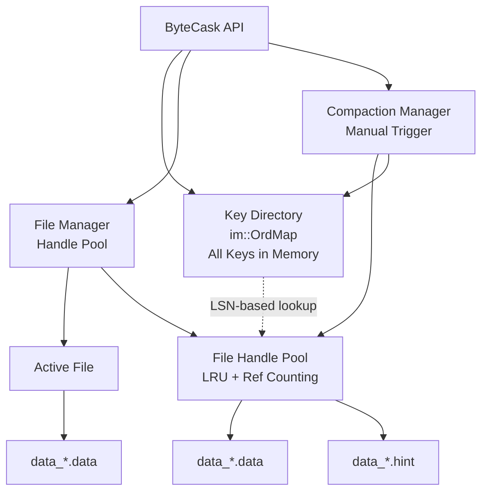
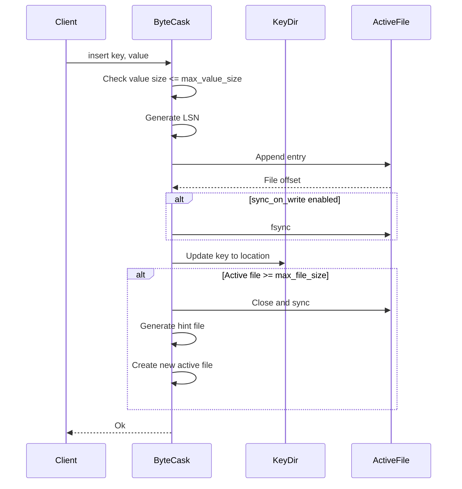
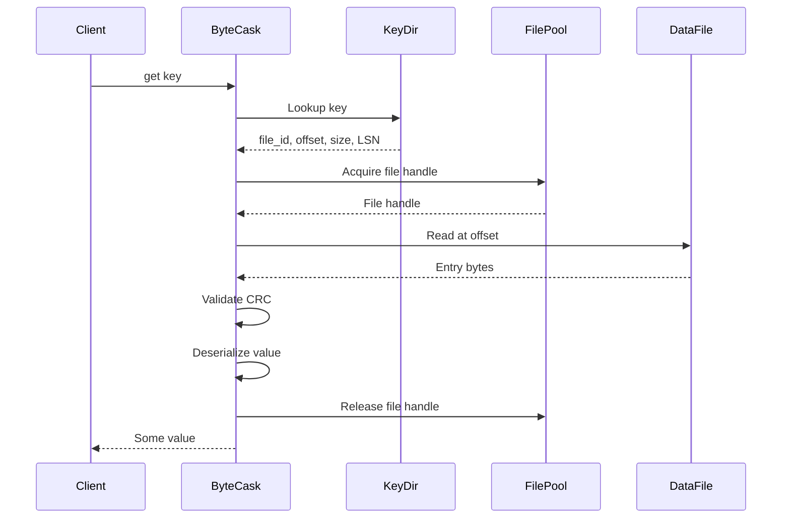
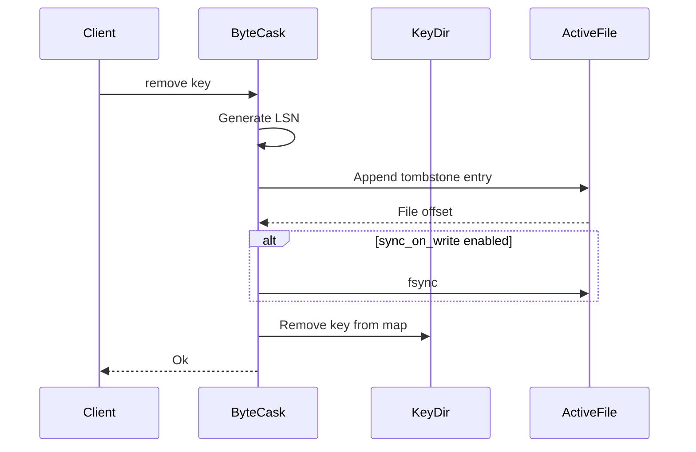
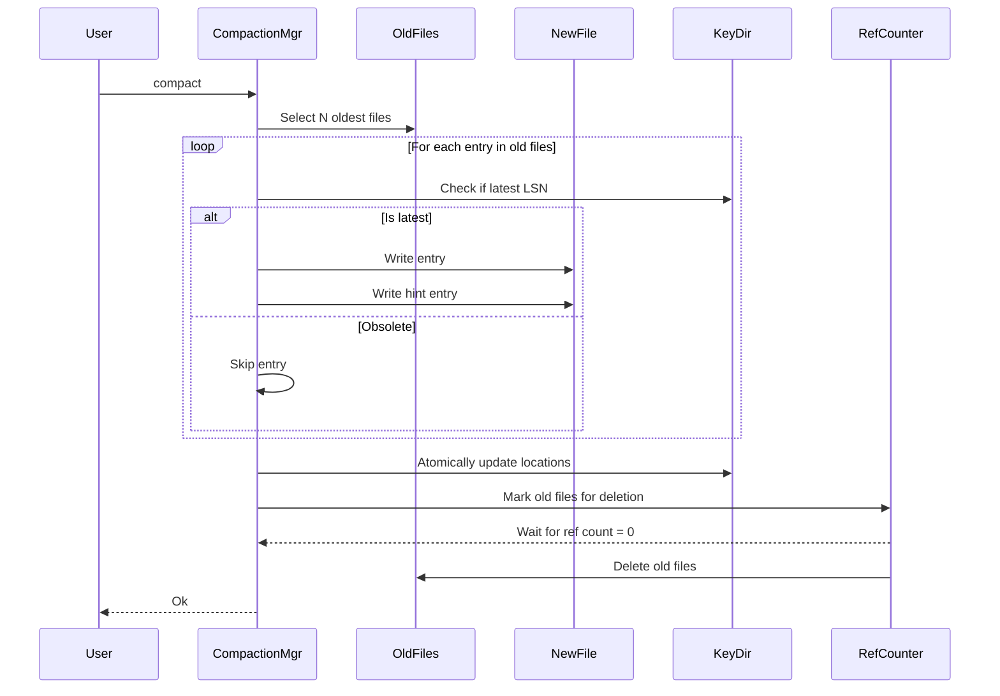
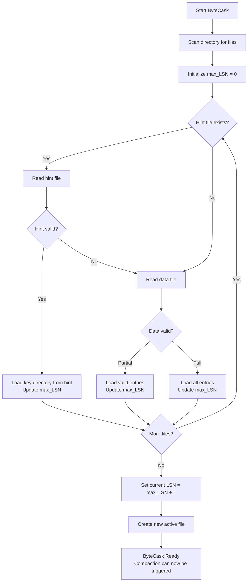

# ByteCask Design Document

## Overview

ByteCask is a [Bitcask](https://riak.com/assets/bitcask-intro.pdf) implementation with a key architectural difference: it uses an immutable **B-Tree** for the Key Directory instead of a Hash Table. This design choice enables efficient **range queries** and **prefix searches** while maintaining Bitcask's core strengths of fast writes and simple recovery. The name "ByteCask" reflects this hybrid approach: **Bitcask algorithm** + **B-Tree index** = **ByteCask**.

Built in Rust, ByteCask provides a [`BTreeMap`](https://doc.rust-lang.org/std/collections/struct.BTreeMap.html)-like interface for byte slice keys and values (`BTreeMap<[u8], [u8]>`), making it a natural choice for applications requiring ordered key-value storage with strong durability guarantees.

**Fundamental Trade-off**: ByteCask keeps **all keys in memory** at all times. This enables extremely fast lookups and range queries but limits database size to available RAM. Considering a memory requirement of approximately 100 bytes per unique key (key data + metadata + tree structure overhead), 10 million keys would require around 1 GB RAM.

**Practical constraints at scale**: Disk I/O for random value reads, compaction duration with high update rates, and startup time for key directory reconstruction become bottlenecks before memory limits are reached.

**Ideal use cases** (where ByteCask's design excels):
- **Read-heavy workloads**: O(log n) lookups + OS page cache make reads fast
- **Range queries and prefix scans**: OrdMap enables efficient ordered iteration
- **Bounded key spaces**: Applications where total unique keys are known and manageable
- **Small-to-medium values** (< 1 MB): Benefit from effective OS page caching
- **Append-mostly patterns**: Occasional updates/deletes, infrequent compaction needed
- **Single-node embedded storage**: No network overhead, simple deployment

**Less suitable for**:
- **Extreme scale** (> 1B keys): Startup and compaction become impractical bottlenecks
- **Large values with random access** (> 10 MB): Disk I/O dominates, many file seeks required
- **Update-heavy workloads**: Repeatedly updating same keys requires frequent compaction
- **Unbounded key growth**: Memory exhaustion risk if key count grows indefinitely

## Design Principles

The design follows these core tenets in order of priority:

1. **Correctness**: Data integrity is paramount. All design decisions prioritize correctness over performance.
2. **Simplicity**: The architecture is kept simple to facilitate understanding and maintainability.
3. **Performance**: Optimizations are pursued only when they don't compromise correctness or simplicity.

## Key Design Decisions

### Key Directory Data Structure

**Decision**: Use `im::OrdMap` instead of a hash table for the key directory.

**Rationale**:
- **Ordered Access**: OrdMap maintains key ordering, enabling range scans starting from any key
- **Immutability**: Thread-safe by default without explicit locking
- **Snapshot Support**: Efficient O(1) snapshots for future MVCC implementation
- **Persistent Data Structure**: Copy-on-write semantics minimize memory overhead

**Trade-offs**:
- Slightly slower single-key lookups (O(log n)) compared to hash tables (O(1))
- Acceptable given the benefits for range queries and concurrency
- All keys must fit in memory - this is the fundamental constraint of ByteCask

### Log-Structured Naming Convention

**Decision**: Use timestamp-based file naming: `data_{YYYYMMDDhhmmssnnnn}.data` and `data_{YYYYMMDDhhmmssnnnn}.hint`

**Rationale**:
- **Uniqueness**: Nanosecond precision prevents collisions
- **Chronological Ordering**: Lexicographic sort matches temporal order
- **Debugging**: Human-readable timestamps aid troubleshooting
- **LSN Independence**: File read order doesn't affect correctness when LSN is used
- **File ID**: The timestamp string serves as the unique file identifier

### Log Sequence Number (LSN)

**Decision**: Every entry has a monotonic sequence number to determine data freshness.

**Rationale**:
- **Correctness**: Ensures latest value is always identified regardless of file read order
- **Crash Recovery**: Enables deterministic state reconstruction
- **Compaction Support**: Identifies obsolete entries during merge operations

**Implementation**: Track the maximum LSN during startup by scanning all entries. New writes start from `max_LSN + 1` to maintain monotonicity across restarts.

### Startup Recovery Strategy

**Decision**: Support both hint-file-based fast recovery and full data file scanning.

**Strategy**:
- Files with valid hint files: Read hint file for rapid key directory reconstruction
- Files without hint files: Scan entire data file to build key directory
- Corrupted hint files: Fall back to data file scanning
- Corrupted data files: Read until corruption point, ignore remainder

**Rationale**:
- **Resilience**: System remains operational even with corrupted files
- **Performance**: Hint files accelerate startup when available
- **Correctness**: LSN ensures correct state despite partial corruption

**Important**: Compaction can only be triggered **after** the database has fully started and the key directory is built.

### Active Data File Rotation

**Decision**: Create a new active data file on every startup and when the active file exceeds `max_file_size`.

**Runtime Rotation**: When the active file size reaches or exceeds the configured `max_file_size`:
1. Close and sync the current active file (it becomes immutable)
2. Generate a hint file for the now-immutable file
3. Create a new active file with a new timestamp-based filename
4. Continue writes to the new active file

**Rationale**:
- **Simplicity**: Eliminates need to track or resume previous active file on startup
- **Safety**: Previous file is immutable, reducing corruption risk
- **Clear State**: Each session and rotation has distinct storage, aiding debugging
- **Bounded File Size**: Prevents individual files from growing too large

### File Handle Management

**Decision**: Use a configurable pool of open file handles with a maximum limit.

**Strategy**:
- Maintain a pool of open file handles (configurable, e.g., 100 files)
- Use LRU eviction when pool reaches capacity
- Active file always stays open
- Files opened on-demand for reads
- Closed file handles can be reopened when needed

**Rationale**:
- **OS Limits**: Respects operating system file descriptor limits
- **Scalability**: Supports databases with many data files
- **Performance**: Keeps frequently accessed files open
- **Flexibility**: Configurable pool size based on workload

### Tombstone Management

**Decision**: Remove deleted keys from the key directory immediately, tombstones only persist in data files.

**Strategy**:
- When `delete(key)` is called, write a tombstone entry to the active file
- Immediately remove the key from the in-memory key directory
- During compaction, skip tombstone entries (they're not written to compacted files)
- During startup, tombstones update the key directory by removing the key

**Rationale**:
- **Memory Efficiency**: Prevents memory leaks from accumulating deleted keys
- **Correctness**: LSN ensures proper ordering of delete operations
- **Compaction**: Tombstones naturally disappear during compaction

### Compaction Strategy

**Decision**: Manual compaction only (no automatic triggers), operates on N oldest files.

**File Selection**:
- Always select the N oldest immutable files (configurable N, e.g., 5-10 files)
- Never compact the active file
- Files must be fully immutable (not currently being written to)

**Process**:
1. Select N oldest immutable files
2. Read each entry and check if it's the latest version (using LSN in key directory)
3. Write live entries to new compacted file
4. Generate hint file for compacted file
5. Atomically update key directory to point to new file locations
6. Delay deletion of old files until no active readers reference them (reference counting)
7. Delete old data and hint files

**Rationale**:
- **Simplicity**: Manual trigger gives users full control
- **Predictability**: Compaction runs when the user decides
- **Safety**: Simple oldest-first algorithm is easy to reason about

### File Deletion Safety

**Decision**: Use reference counting to prevent deletion of files that are actively being read.

**Mechanism**:
- Each file has a reference count tracking active readers
- Readers increment count when opening a file
- Readers decrement count when closing or finishing
- Compaction marks files for deletion but waits until reference count reaches zero
- Grace period or background cleanup process removes files when safe

**Rationale**:
- **Correctness**: Prevents "file not found" errors during reads
- **Concurrency**: Allows reads during compaction without blocking
- **Safety**: Ensures data remains accessible until all readers finish

## Architecture

### Module Structure

```
bytecask/
├── src/
│   ├── lib.rs              # Public API and ByteCask struct
│   ├── main.rs             # CLI tool (optional)
│   ├── error.rs            # Error types and Result aliases
│   ├── config.rs           # Configuration struct and defaults
│   ├── batch.rs            # Batch struct and operations
│   ├── storage/
│   │   ├── mod.rs          # Storage layer coordination
│   │   ├── data_file.rs    # Data file read/write operations
│   │   ├── hint_file.rs    # Hint file read/write operations
│   │   ├── entry.rs        # Entry serialization/deserialization
│   │   ├── file_manager.rs # File lifecycle and handle pool management
│   │   └── file_id.rs      # File ID generation and parsing
│   ├── index/
│   │   ├── mod.rs          # Key directory management
│   │   └── key_dir.rs      # OrdMap wrapper and operations
│   ├── compaction/
│   │   ├── mod.rs          # Compaction orchestration
│   │   └── merger.rs       # Multi-file merge logic
│   └── util/
│       ├── mod.rs          # Utility functions
│       ├── crc.rs          # CRC32 checksum utilities
│       └── timestamp.rs    # Timestamp generation
├── tests/
│   ├── integration_tests.rs
│   └── correctness_tests.rs
└── benches/
    ├── read_bench.rs
    ├── write_bench.rs
    ├── batch_bench.rs
    └── compaction_bench.rs
```

### Core Components

#### ByteCask (Main API)

The primary interface exposing database operations:
- **Responsibilities**: Coordinate between index, storage, and compaction layers
- **State**: Holds key directory, active data file handle, file manager, and configuration
- **Thread Safety**: Interior mutability for concurrent reads with exclusive writes
- **LSN Tracking**: Maintains current LSN counter, initialized from max LSN during startup

#### Key Directory (Index Layer)

Maintains in-memory mapping of keys to file locations:
- **Structure**: `im::OrdMap<Vec<u8>, KeyDirEntry>`
- **KeyDirEntry**: Contains `(file_id: String, file_offset: u64, value_size: u32, sequence: u64, timestamp: u64)`
- **Operations**: Insert, delete, get, iterator from key (for range scans)
- **Concurrency**: Lock-free reads via immutable snapshots
- **Deletion**: Keys are immediately removed from map when deleted (tombstones only in files)

#### File Manager (Storage Layer)

Handles physical file operations and handle pooling:
- **Active File**: Current append-only file for writes
- **File Handle Pool**: LRU cache of open file handles with configurable limit
- **Immutable Files**: Read-only historical files, opened on-demand
- **Operations**: Open, close, append, read at offset, sync, rotate
- **Buffering**: Configurable write buffer for performance

#### Entry Format Handler

Serializes and deserializes log entries:
- **Encoding**: Binary format with CRC32 checksum
- **Validation**: CRC verification on read
- **Flags**: Support for deleted entries (tombstones) and future extensions

#### Hint File Manager

Accelerates startup by storing key directory snapshots:
- **Generation**: Created after active file rotation and during compaction
- **Format**: Compact representation of key directory entries
- **Usage**: Loaded on startup instead of scanning data files
- **Timing**: Written when active file rotates or during compaction, **not** on every write

#### Compaction Manager

Manual process to reclaim space:
- **Trigger**: Manual only via `compact()` API call
- **Selection**: Choose N oldest immutable files
- **Merge**: Write live entries to new compacted file
- **Atomicity**: Update key directory and delete old files atomically
- **Safety**: Reference counting ensures files aren't deleted while being read
- **Coordination**: Ensure only one compaction runs at a time

## Data Formats

### Data File Format (.data)

**Storage Location**: All data and hint files are stored in the same directory specified when opening the database.

#### Entry Structure

```
+------------------+
| Entry Header     | 19 bytes
+------------------+
| Key Data         | key_size bytes
+------------------+
| Value Data       | value_size bytes (0 if deleted)
+------------------+
```

#### Entry Header (19 bytes)

| Offset | Size | Field      | Type   | Description                              |
|--------|------|------------|--------|------------------------------------------|
| 0      | 4    | CRC32      | u32 LE | Checksum of header + key + value         |
| 4      | 8    | Sequence   | u64 LE | Monotonic sequence number                |
| 12     | 2    | Key Size   | u16 LE | Key length (max 65,535 bytes)            |
| 14     | 4    | Value Size | u32 LE | Value length (0 for tombstone, max 4GB)  |
| 18     | 1    | Flags      | u8     | Bit 0: deleted flag, Bits 1-7: reserved  |

**Flags Specification**:
- Bit 0: `0x01` = Deleted (tombstone), `0x00` = Active
- Bits 1-7: Reserved (must be 0)

**Serialization**: Native Rust types with little-endian byte order, manual serialization for precise control.

### Hint File Format (.hint)

#### Hint Entry Structure

```
+------------------+
| Hint Header      | 26 bytes
+------------------+
| Key Data         | key_size bytes
+------------------+
```

#### Hint Header (26 bytes)

| Offset | Size | Field       | Type   | Description                      |
|--------|------|-------------|--------|----------------------------------|
| 0      | 4    | CRC32       | u32 LE | Checksum of header + key         |
| 4      | 8    | Sequence    | u64 LE | Entry sequence number            |
| 12     | 8    | File Offset | u64 LE | Byte offset in data file         |
| 20     | 2    | Key Size    | u16 LE | Key length                       |
| 22     | 4    | Value Size  | u32 LE | Value length (for size tracking) |

**Purpose**: Enable fast key directory reconstruction without scanning data files.

**Generation Timing**: Created on active file rotation and compaction completion, not on every write.

## Concurrency Model

### Read Concurrency

**Strategy**: Multiple concurrent readers without locks

**Mechanism**:
- Key directory uses immutable snapshots via `im::OrdMap`
- Each reader gets a consistent view at read start
- No blocking between readers
- Readers don't block writers
- File handle pool manages concurrent file access

### Write Concurrency

**Strategy**: Exclusive write access with interior mutability

**Mechanism**:
- Single writer via `Mutex` or similar synchronization primitive
- Writer updates key directory atomically after append(s)
- Write-ahead approach: append to file, then update index
- Failed writes don't corrupt key directory
- If `sync_on_write` is enabled, operations return only after fsync completes
- Batch operations (`apply_batch`) acquire write lock once for all operations, improving throughput

### Compaction Concurrency

**Strategy**: Background compaction doesn't block reads or writes

**Mechanism**:
- Compaction operates on immutable files only
- Active file is never compacted
- Reads continue using old files until compaction completes
- Atomic key directory update when compaction finishes
- Reference counting prevents deletion of files with active readers
- Old files deleted only after reference count reaches zero

**Startup Coordination**: Compaction can only be triggered after database startup completes and key directory is fully built.

### Synchronization Points

1. **Write Path**: Lock active file for append → Optionally fsync → Update key directory
2. **Read Path**: Clone key directory snapshot → Acquire file handle from pool → Read file at offset → Release handle
3. **Compaction Path**: Lock compaction state → Merge files → Update key directory → Mark files for deletion → Delete when ref count is zero
4. **File Rotation Path**: Lock active file → Close and sync → Generate hint file → Create new active file

## Error Handling Strategy

### Error Categories

1. **I/O Errors**: File system operations (open, read, write, sync)
2. **Corruption Errors**: CRC mismatch, invalid format, truncated data
3. **Logic Errors**: Invalid API usage, value too large, invalid key
4. **Resource Errors**: Disk full, too many open files, memory exhausted

### Error Recovery Strategies

**Startup Corruption**:
- Partial file read: Use valid entries, skip corrupted section
- Invalid hint file: Fall back to data file scan
- Missing files: Continue with available files

**Runtime Corruption**:
- Read failures: Return error to caller, maintain consistent state
- Write failures: Roll back key directory update, preserve consistency
- Compaction failures: Abort merge, retain original files

**Value Size Validation**:
- Reject writes exceeding `max_value_size` (configurable, default 128MB)
- Return clear error message to user

### Rust Error Handling

Custom `ByteCaskError` enum with `Result<T, ByteCaskError>` return types, using `thiserror` for ergonomic definitions with detailed context.

## API Design

### Core Interface

ByteCask provides a BTreeMap-like API for byte-slice operations:

**Primary Operations**:
- `get(key: &[u8]) -> Result<Option<Vec<u8>>>` - Retrieve value for key
- `insert(key: &[u8], value: &[u8]) -> Result<()>` - Write key-value pair (returns after fsync if sync_on_write enabled)
- `remove(key: &[u8]) -> Result<()>` - Remove key (removes from key directory immediately, writes tombstone)
- `contains_key(key: &[u8]) -> Result<bool>` - Check if key exists

**Batch Operations**:
- `apply_batch(batch: Batch) -> Result<()>` - Atomically apply multiple operations (puts and deletes)

**Iterator Operations**:
- `iter_from(key: &[u8]) -> Result<Iterator<(Vec<u8>, Vec<u8>)>>` - Lazy iterator starting from key (supports range and prefix scans)
- `keys_from(key: &[u8]) -> Result<Iterator<Vec<u8>>>` - Lazy iterator of keys starting from key

**Lifecycle Operations**:
- `open(path: &Path, config: Config) -> Result<ByteCask>` - Open or create database
- `sync() -> Result<()>` - Force fsync on active file
- `close() -> Result<()>` - Graceful shutdown (close files, sync)
- `compact() -> Result<()>` - Trigger manual compaction (can only be called after startup)

### Batch API

The `Batch` struct allows building multiple operations that are applied atomically:

**Batch Structure**:
```rust
// Conceptual design (not detailed implementation)
pub struct Batch {
    operations: Vec<BatchOperation>
}

enum BatchOperation {
    Insert { key: Vec<u8>, value: Vec<u8> },
    Remove { key: Vec<u8> }
}
```

**Batch Methods**:
- `Batch::default() -> Batch` - Create new empty batch
- `insert(&mut self, key: &[u8], value: &[u8])` - Add insert operation to batch
- `remove(&mut self, key: &[u8])` - Add remove operation to batch

**Usage Example**:
```rust
let db = ByteCask::open("my_db", Config::default())?;
db.insert(b"key_0", b"val_0")?;

let mut batch = Batch::default();
batch.insert(b"key_a", b"val_a");
batch.insert(b"key_b", b"val_b");
batch.insert(b"key_c", b"val_c");
batch.remove(b"key_0");

db.apply_batch(batch)?;
```

**Atomicity Guarantee**:
- All operations in a batch share the same write lock acquisition
- All entries written sequentially with consecutive LSNs
- Key directory updated once after all writes complete
- If any operation fails, entire batch is rolled back (no partial application)
- Single fsync at end if `sync_on_write` is enabled

**Performance Benefits**:
- Reduced lock contention (one lock acquisition vs N)
- Reduced fsync overhead (one fsync vs N if sync_on_write enabled)
- Better write throughput for bulk operations
- More efficient key directory updates

### Configuration

**Config Struct**:
- `max_file_size`: Threshold in bytes for rotating active file (e.g., 1GB)
- `sync_on_write`: Whether to fsync after each write (default: true for durability)
- `write_buffer_size`: Buffer size for batching writes before flush (e.g., 4KB)
- `max_value_size`: Maximum value size in bytes (default: 128MB, max: 4GB)
- `max_open_files`: Maximum number of file handles to keep open (default: 100)
- `compaction_file_count`: Number of oldest files to merge during compaction (default: 5)

## Phase Implementation Plan

### Phase 1: Core Functionality (No Hint Files, No Compaction)

**Goals**:
- Implement basic put/get/delete operations
- Implement batch write operation for performance
- Create and manage data files with rotation
- Build key directory from data files on startup
- Handle corrupted data files gracefully
- Implement LSN tracking and monotonicity
- Support configurable sync behavior

**Components**:
- ByteCask API (basic operations)
- Data file management (write, read, and rotation)
- Entry serialization/deserialization
- Key directory using `im::OrdMap`
- LSN initialization from max LSN during startup
- Startup recovery from data files
- File handle pool management
- Tombstone handling (immediate removal from key directory)
- Unit tests for correctness
- Benchmarks for read/write performance

**Success Criteria**:
- All unit tests pass
- Correctly handles partial file corruption
- LSN monotonicity maintained across restarts
- Active file rotation works correctly
- Basic read/write benchmarks established
- Memory usage scales linearly with key count

### Phase 2: Hint Files for Fast Startup

**Goals**:
- Generate hint files after active file rotation
- Load key directory from hint files on startup
- Fall back to data file scan if hint file is corrupted

**Components**:
- Hint file generation after rotation
- Hint entry serialization
- Startup recovery using hint files
- Hint file corruption handling
- Extended unit tests for hint file scenarios
- Startup performance benchmarks

**Success Criteria**:
- Hint files correctly reflect key directory state
- Hint files generated on file rotation, not every write
- Startup time significantly reduced with hint files
- Graceful fallback when hint files are invalid

### Phase 3: Compaction

**Goals**:
- Implement manual compaction process
- Merge multiple data files into compacted files
- Generate hint files during compaction
- Atomic key directory updates
- Safe file deletion with reference counting

**Components**:
- Compaction manager and orchestration
- Multi-file merge logic (N oldest files)
- File selection strategy (simple oldest-first)
- Reference counting for safe file deletion
- Atomic file replacement
- Compaction state management (single compaction at a time)
- Startup coordination (compaction only after startup)
- Compaction correctness tests
- Compaction performance benchmarks

**Success Criteria**:
- Compaction reclaims space from deleted/updated entries
- Reads and writes continue during compaction
- Key directory remains consistent throughout compaction
- No data loss during compaction process
- Files safely deleted only when no readers reference them
- Compaction cannot run during startup

## Testing Strategy

### Unit Tests

**Focus**: Individual component correctness

**Coverage**:
- Entry serialization/deserialization with various sizes
- CRC calculation and validation
- Key directory operations (insert, delete, lookup, iterator)
- File naming and timestamp generation
- Error handling for corrupted data
- LSN monotonicity tracking
- Tombstone handling
- Value size limit enforcement
- Batch operations (insert, remove)

### Integration Tests

**Focus**: Component interaction correctness

**Coverage**:
- Full insert/get/remove lifecycle
- Batch operations with mixed inserts and removes
- Active file rotation triggers and behavior
- Startup recovery from data files
- Startup recovery from hint files
- Concurrent read operations
- Write ordering and LSN monotonicity
- Hint file generation timing
- Compaction end-to-end flow
- File handle pool behavior
- Batch atomicity and rollback on failure

### Correctness Tests

**Focus**: Data integrity guarantees

**Scenarios**:
- Crash recovery (simulated process termination)
- Partial file corruption
- Concurrent reads during writes
- Key directory consistency after compaction
- Tombstone handling and deletion semantics
- LSN ordering across restarts
- File rotation during high write load
- Compaction with active readers

### Property-Based Tests

**Approach**: Use `proptest` or `quickcheck` for randomized testing

**Properties**:
- Any key inserted is retrievable
- Removed keys return None
- Latest insert wins for same key (based on LSN)
- Iterator returns keys in sorted order
- Startup recovery produces identical key directory
- File rotation preserves all data

## Benchmarking Strategy

### Performance Metrics

1. **Write Throughput**: Operations per second for sequential writes
2. **Read Throughput**: Operations per second for random reads
3. **Mixed Workload**: Realistic read/write ratio performance
4. **Startup Time**: Time to open database with varying data sizes (with and without hint files)
5. **Compaction Performance**: Time and throughput during compaction
6. **Memory Usage**: RAM per key at different scales

### Benchmark Scenarios

**Write Benchmarks**:
- Sequential inserts with varying key/value sizes
- Batch operations vs individual operations (throughput comparison)
- Different batch sizes (10, 100, 1000, 10000 operations)
- Mixed batch operations (inserts + removes)
- Write batching with different buffer sizes
- Sync vs async write modes
- File rotation overhead

**Read Benchmarks**:
- Random reads with cache-friendly and cache-unfriendly patterns
- Iterator scans of varying ranges
- File handle pool hit/miss rates

**Compaction Benchmarks**:
- Compaction throughput with varying obsolete ratios
- Impact on read/write latency during compaction
- Compaction on different file counts
- Reference counting overhead

**Comparison Baseline**: Compare against sled, RocksDB, or other embedded databases for similar workloads.

## Memory Management

### Key Directory Memory

**Characteristics**: All keys always in memory (~100 bytes per key including metadata). This is ByteCask's fundamental limitation - database size is bounded by RAM available for key storage.

### Write Buffer

**Strategy**: Configurable in-memory buffer for batching writes. Larger buffer improves throughput, smaller buffer reduces memory usage.

### Read Cache

**Strategy**: Rely on OS page cache (no explicit read cache to avoid double-buffering overhead).

## Dependencies

### Required Crates

- `im`: Persistent data structures (`OrdMap`)
- `crc32fast`: Fast CRC32 implementation
- `thiserror`: Ergonomic error handling
- `anyhow`: Error context and propagation (for tests/examples)

### Optional Crates

- `criterion`: Benchmarking framework
- `proptest`: Property-based testing
- `tempfile`: Temporary directories for tests

### Development Tools

- `rustfmt`: Code formatting
- `clippy`: Linting
- `cargo-flamegraph`: Performance profiling

## Future Enhancements

### Potential Enhancements

- **MVCC and Snapshots**: Leverage `im::OrdMap` O(1) snapshots, extend LSN for transaction IDs, garbage collect old versions during compaction
- **Transactions**: Write-ahead log with two-phase commit and optimistic concurrency control
- **Compression**: Per-value compression (zstd, lz4) with configurable threshold

## Diagrams

### System Architecture



### Write Flow with Rotation



### Read Flow



### Delete Flow



### Compaction Flow with Reference Counting



### Startup Recovery Flow

