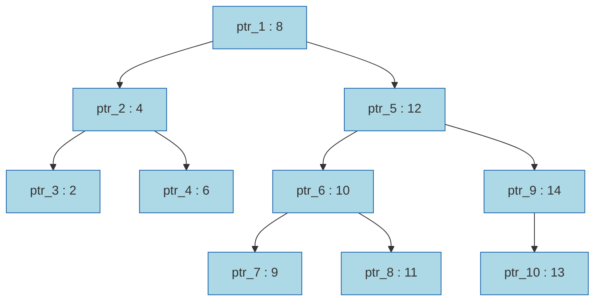
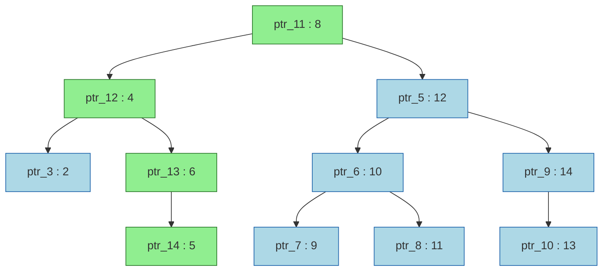

# Persistent Radix Tree (Byte-Array Keys)

This document describes the design of the persistent radix tree used as the in-memory key directory in ByteCaskDB. It is intended for contributors who need to understand, modify, or reason about correctness of this component.

The **Background** section builds up the necessary concepts from scratch — persistent data structures, structural sharing, Tries, and Patricia Tries — for readers coming without that context. From §1 onward the document covers the C++ design: the overview, design principles, node layout, API, algorithms, acceptance criteria, memory usage, and benchmark results.

---

## Background

### What is a Persistent Data Structure?

A **persistent data structure** preserves all previous versions of itself when modified. Instead of mutating state in place, every operation returns a new version. Old versions are never altered and remain fully accessible.

> **Note on terminology**: "Persistent" here comes from functional programming — it refers to *immutability and version preservation*, not to storage on disk. A persistent data structure lives entirely in memory.

The simplest way to implement persistence is to deep-copy the entire structure on every write. That is O(N) per operation — correct, but impractical at any real scale.

The efficient alternative is **structural sharing**: since nodes are never mutated after creation, unchanged nodes can be *referenced by both the old and the new version simultaneously*. No copying is needed for any part of the structure that wasn't on the modified path.

For trees, a single insertion or deletion only touches nodes along the *path from the root to the affected leaf*. Everything off that path is shared freely between the two versions — this technique is called **[path copying](https://doi.org/10.1016/0022-0000(89)90034-2)**. Okasaki's [*Purely Functional Data Structures*](https://www.cambridge.org/9780521663502) (1998) develops this and related techniques in depth.

### Persistent BST: Path Copying

Consider a binary search tree holding integer keys. Nodes are identified by a pointer ID (e.g. `ptr_1`) and carry a key (e.g. `8`).

**Version 1** — `root_v1` holds a reference to `ptr_1`:



The search path for inserting 5 is **ptr_1(8) → ptr_2(4) → ptr_4(6)**, where 5 is placed as the left child of `ptr_4` (since 5 < 6). Every node on this path must be copied because their child pointers change. Everything off the path is untouched.

The result is three copies (`ptr_11`, `ptr_12`, `ptr_13`) plus a new leaf (`ptr_14 : 5`). `root_v2` points to `ptr_11`. The remaining 7 nodes on the right subtree and the untouched left leaf are shared unchanged.

**Version 2** — `root_v2 → ptr_11` (after inserting key 5):



- **Green nodes** — newly allocated copies (`ptr_11`, `ptr_12`, `ptr_13`) plus the new leaf (`ptr_14 : 5`). Only 4 nodes out of 11 are new.
- **Blue nodes** — the exact same node objects from Version 1, shared by pointer. No copying occurred.

A caller holding `root_v1` sees the original tree, unchanged. A caller holding `root_v2` sees a tree that contains key 5. Both are valid simultaneously and neither is aware of the other.

Persistence adds O(log N) allocations per write — the length of the copied path — but **does not change the time complexity of any operation**.

### Tries: Branching on Key Bytes

A BST branches based on a *comparison* between whole keys. The path length depends on the number of keys in the tree (O(log N) for a balanced tree).

A **Trie** (from the word *re**trie**val*) takes a fundamentally different approach: it branches on *individual characters (or bytes)* of the key, one per level. The depth of any key equals its length, regardless of how many keys are in the tree.

- Each **edge** is labelled with a single character.
- A key's value is stored at the node reached after consuming all its characters.
- All keys sharing a common prefix share the same path down to the point of divergence — prefix sharing is structural, not incidental.

Keys: `app`, `apple`, `apply`, `apt`

```
root
 └─'a'─ node
          └─'p'─ node
                   ├─'p'─ [app ✓]
                   │        └─'l'─ node
                   │                ├─'e'─ [apple ✓]
                   │                └─'y'─ [apply ✓]
                   └─'t'─ [apt ✓]
```

Nodes marked ✓ carry a value. Unmarked nodes are routing-only intermediates.

Path copying applies exactly as in the BST. The path to any key has at most k nodes — one per character — so inserting or updating a key of length k copies at most k nodes. The rest of the trie is shared. Unlike the BST, path length is O(k) — bounded by the key length, not the number of keys N. For large N this is a significant advantage: lookup and write cost stay constant as the dataset grows.

### Patricia Tries (Radix Trees): Compressing the Trie

A standard Trie can contain long chains of single-child nodes — one per character of a shared prefix — that carry no branching information. A key `"application"` with no sibling sharing its prefix creates a linear chain 11 nodes deep. These nodes are pure structural overhead.

A **[Patricia Trie](https://dl.acm.org/doi/abs/10.1145/321479.321481)** (also called a *Radix Tree*) eliminates this by collapsing chains of single-child nodes into a single edge whose label carries the entire compressed byte sequence. Branching still happens at the first character where two keys diverge; it just doesn't allocate a separate node for every character in between.

**Standard Trie** — the `a → p` prefix creates a 2-node chain before the first branch:

```
root
 └─'a'─ node
          └─'p'─ node
                   ├─'p'─ [app ✓]
                   │        └─'l'─ node
                   │                ├─'e'─ [apple ✓]
                   │                └─'y'─ [apply ✓]
                   └─'t'─ [apt ✓]
```

**Patricia Trie** — the single-child chain `a → p` is collapsed into the edge label `"ap"`:

```
root
 └─"ap"─ node
            ├─"p"─ [app ✓]
            │        └─"l"─ node
            │                ├─"e"─ [apple ✓]
            │                └─"y"─ [apply ✓]
            └─"t"─ [apt ✓]
```

Node count drops from 7 to 5. For keys with long shared prefixes — say, UUID-keyed namespaces where every key starts with `"user::"` — the savings compound dramatically. A properly compressed Patricia Trie has at most 2N − 1 nodes for N keys — no unbounded single-child chains exist.

Path copying still applies. A key of length k touches at most k nodes on the path from root to leaf, so at most k nodes are copied per write. The edge-label compression reduces the *number* of nodes on that path in practice, meaning fewer allocations per write — but the bound remains O(k).

> **Naming**: Patricia Trie and Radix Tree refer to the same data structure. The rest of this document uses **Radix Tree**.

### Big-O Summary

Let N = total number of keys, k = length of the key being operated on.

| Structure | `get` | `set` | `erase` | New allocs / write |
|---|---|---|---|---|
| Mutable BST | O(log N) | O(log N) | O(log N) | O(1) |
| **Persistent BST** | O(log N) | O(log N) | O(log N) | **O(log N)** |
| Mutable Trie | O(k) | O(k) | O(k) | O(k) |
| **Persistent Trie** | O(k) | O(k) | O(k) | **O(k)** |
| Mutable Radix Tree | O(k) | O(k) | O(k) | O(k) |
| **Persistent Radix Tree** | O(k) | O(k) | O(k) | **O(k)** |

**Making a structure persistent does not change the asymptotic time complexity of any operation.**

---

## 1. Overview

This component implements a persistent radix tree in C++ as the key directory for ByteCaskDB. It exposes two interfaces: a fully immutable `PersistentRadixTree<V>` where every mutating operation returns a new version sharing unchanged subtrees by pointer, and a `TransientRadixTree<V>` builder for efficient bulk loading that converts to a persistent snapshot when done. Both support `get`, `set`, `erase`, ordered iteration, and `lower_bound`. A static `merge` operation combines two persistent trees in O(overlap) time, adopting disjoint subtrees by pointer without cloning. The module is `bytecask.radix_tree` and uses standard allocators.


## Design Principles

This component inherits the ByteCaskDB design tenets in order of priority:

1. **Correctness**: Data integrity is paramount. All design decisions prioritize correctness over performance.
2. **Simplicity**: The architecture is kept simple to facilitate understanding and maintainability.
3. **Predictable latency over peak throughput**: Write-path operations must have bounded, predictable latency. A steady 1 ms per write is preferable to an average of 0.1 ms with occasional 500 ms spikes.
4. **Performance**: Optimizations require a real use case. Without one, correctness and simplicity take priority.

**Key context**: this tree is an in-memory index in front of disk I/O that is orders of magnitude slower. CPU-bound optimizations matter only where they affect the write path's latency distribution (principle #3) or materially reduce memory overhead for large key sets. Complexity that doesn't serve one of these goals is cut.

## 2. Core Characteristics

*   **Key Type:** `std::span<const std::byte>` (Ingested and prefix-compressed natively).
*   **Value Type:** Generic `V`.
*   **Immutability:** All mutating operations return a new version of the tree. Untouched nodes are shared via intrusive reference-counted pointers (`IntrusivePtr<Node>`).
*   **Memory Management:** Standard allocators. Nodes embed their own reference count (`std::atomic<std::uint32_t>`) and are managed via `IntrusivePtr<T>`, a lightweight single-pointer (8 B) smart pointer that replaces `std::shared_ptr` (16 B + 32 B control block). This eliminates 32 bytes of `make_shared` control-block overhead per node and halves the pointer size in every child slot.
*   **Prefix Compression:** Shared byte sequences are stored once in the highest common parent node.
*   **Edit Tags (COW):** Transient mode uses epoch tags to safely mutate uniquely-owned nodes in-place, falling back to Path Copying when sharing occurs.

---

## 3. Architectural Design

### 3.1. Node Layout

Internal (non-leaf) nodes are tiered by fanout rather than using one
one-size-fits-all representation:

```cpp
// Base node — 94% of all nodes are leaves and use only this struct.
struct Node {
    mutable std::atomic<uint32_t> refcount; // intrusive reference count
    uint32_t packed_tag; // high bit = has_value, next 2 bits = node_type, low 29 bits = edit tag

    V value;

    // Short-prefix optimization: most prefixes after a split are 1–7 bytes.
    // Inline storage up to 7 bytes avoids a heap allocation per node.
    // Key segments longer than 7 bytes are split into a chain of routing
    // nodes (7 prefix bytes + 1 transition byte per hop).
    CompactPrefix prefix;  // 8 bytes (1-byte size + 7 inline bytes)
};

// Node4 — the entry tier for any node that has 1–4 children. Chain-
// compression routing nodes (created whenever a key segment exceeds
// CompactPrefix's 7-byte cap) always have exactly 1 child; prefix splits
// start at 2. Children are embedded inline: a single allocation, no
// separate child-store object or backing buffers.
struct Node4 : Node {
    static constexpr uint8_t kCapacity = 4;
    uint8_t count;
    std::array<std::byte, kCapacity> keys;
    std::array<IntrusivePtr<Node>, kCapacity> children;
};

// Node16 — same shape as Node4 (sorted inline array, linear scan) but a
// bigger array, for nodes with 5–16 children. Still a single allocation.
struct Node16 : Node {
    static constexpr uint8_t kCapacity = 16;
    uint8_t count;
    std::array<std::byte, kCapacity> keys;
    std::array<IntrusivePtr<Node>, kCapacity> children;
};

// Node48 — same sorted keys/children array as Node4/Node16 (so ordinal
// child_at(i) stays O(1)), plus a 256-byte byte->slot index that makes
// find_child(b) O(1) instead of a linear scan. kEmptyMarker (== kCapacity)
// marks an unused byte, mirroring DuckDB's ART Node48::EMPTY_MARKER.
struct Node48 : Node {
    static constexpr uint8_t kCapacity = 48;
    static constexpr uint8_t kEmptyMarker = kCapacity;
    uint8_t count;
    std::array<uint8_t, 256> child_index;  // byte -> slot, or kEmptyMarker
    std::array<std::byte, kCapacity> keys;
    std::array<IntrusivePtr<Node>, kCapacity> children;
};

// Node256 — the terminal tier: 256 slots is the ceiling on fanout for a
// single byte transition, so there is nothing above it. Direct-mapped —
// children[b] is the child for byte b, no stored key array needed, so
// find_child/insert/remove are O(1). count is uint16_t because a full
// node holds 256 children, which does not fit in 8 bits.
struct Node256 : Node {
    static constexpr uint16_t kCapacity = 256;
    uint16_t count;
    std::array<IntrusivePtr<Node>, kCapacity> children;
};
```

A `Node4` promotes to `Node16` on its 5th child; `Node16` promotes to
`Node48` on its 17th; `Node48` promotes to `Node256` on its 49th.
`Node256` is the ceiling — a transition is a single byte, so 256 slots is
the most any node can ever need, and there is no tier above it. Demotion
uses proportional hysteresis on the two upper boundaries (matching
DuckDB's ART): `Node48` demotes to `Node16` once its count drops to ≤12
(75% of `Node16`'s capacity, not ≤16), and `Node256` demotes to `Node48`
once its count drops to ≤36 (75% of `Node48`'s capacity, not ≤48) — both
avoid promote/demote thrashing right at the tier boundary. `Node16`
demotes to `Node4` at ≤4, symmetrically (no hysteresis needed at this
boundary — see §7.7). All eight transitions are owned by exactly two
functions — `Node::insert_child` and `Node::remove_child` — which take
the node by `IntrusivePtr` and return the (possibly reallocated) result;
every other call site (the persistent and transient `set`/`erase`/`merge`
paths) just reassigns its local pointer to whatever comes back, the same
pattern the leaf → internal promotion already used before this tiering
existed. See §7.7–§7.10 for the build history of each tier, including a
`Node256` attempt that was built, set aside after an unresolved
regression, and later rebuilt successfully once the regression's cause
was found (§7.9–§7.10).

`IntrusivePtr<T>` is a lightweight single-pointer (8 bytes) smart pointer. It calls `addref()` on copy and `release()` on destruction; when the count reaches zero, the node is deleted. Copy assignment uses addref-before-release sequencing to prevent use-after-free when the source is a sub-object of the destination (e.g., reassigning a root to one of its own children). Move assignment detaches the source pointer before releasing the old destination for the same reason. This eliminates the ~32-byte `make_shared` control block per node and halves the pointer size in every child slot from 16 bytes (`shared_ptr`) to 8 bytes (`IntrusivePtr`).

`Node::release()` uses an **iterative tail-release** to avoid the O(depth) recursive destructor chain that would otherwise result from chained `~IntrusivePtr → release → delete → ~Node → …` calls down a path of single-child nodes. When the last reference to a node is dropped, the implementation detaches all children — from whichever tier's array the node is (`Node4`/`Node16`/`Node48`'s packed prefix, or a full scan of `Node256`'s 256 direct-mapped slots) — before calling `delete`, then loops over those children releasing each one in turn, converting the last-child release into a loop. For chains of single-child nodes (the dominant pattern in prefix-compressed trees), this eliminates the recursive call overhead entirely. Profiling showed the naive recursive approach consuming 29% of total merge time at 100k keys. The detach buffer is *not* value-initialized — every slot it can ever read is written first by the switch above it, and nothing reads past the actual count — because zero-initializing it unconditionally on every single node release, regardless of that node's tier, was itself a measured performance bug; see §7.9.

`PersistentRadixTree` and `TransientRadixTree` use explicit move constructors/assignments that reset the source's `size_` (and `tag_` for transient) to zero via `std::exchange`. This ensures a moved-from tree is in a valid empty state (`size() == 0`, `empty() == true`) rather than carrying stale metadata while the root pointer has been transferred.

Leaf nodes use `Node` directly (no children field — accessing one through a `Node*` is a compile error). Internal nodes use `Node4`, `Node16`, `Node48`, or `Node256` depending on tier. Child accessors on `Node` (`as_node4()`, `as_node16()`, `as_node48()`, `as_node256()`) read `node_type()` once and dispatch on it — rather than each independently re-deriving the type from `packed_tag_`, which would mean every accessor call pays for every check up to and including its own tier, a real, measured cost on the hot iteration path (see §7.10). An unexpected type on a leaf returns a safe default ("no children") rather than accessing a nonexistent field, making incorrect access a compile-time error for leaves and a safe no-op for base-pointer dispatch.

`Node4` and `Node16` and `Node48` all keep value/prefix/children in one allocation — the property that made them win at low-to-moderate fanout over the earlier design's separately-heap-allocated child store (a struct-of-arrays `ChildStore`, since removed — see §7.10). `Node256` is also one allocation, but its cost (2080 bytes) is fixed regardless of occupancy, so it only pays off once a node's fanout is genuinely large; see §7.9–§7.10 for the measured range where each tier actually wins.

`CompactPrefix` is a fixed 8-byte container (1-byte size + 7 inline bytes, `alignof == 1`). Prefixes up to 7 bytes are stored inline with no heap allocation. Key segments longer than 7 bytes are split into a chain of routing nodes: each hop stores 7 prefix bytes plus 1 transition byte to the next node. This eliminates the heap spill path entirely — no heap allocation is ever needed for prefixes.

### 3.2. Transient Copy-on-Write (COW) Model
The `transient()` / `persistent()` API pattern — a mutable builder that freezes into an immutable snapshot — was popularised by [Rich Hickey's Clojure transients](https://clojure.org/reference/transients) (Clojure 1.1, ~2009).
*   A global `std::atomic<uint64_t>` generates unique edit tags for Transient sessions.
*   During a transient mutation, if the traversed node's `edit_tag` matches the session's tag **and** the node's reference count is 1 (uniquely owned), the node is mutated **in-place**.
*   If the tag differs (e.g., `0` or an older session) or the node is shared (refcount > 1), the node is **copied**, the copy is tagged with the current session ID, and the mutation applies to the copy.
*   The refcount guard defends against edit-tag wraparound: after 2^29 `transient()` calls the 29-bit tag space can repeat, but a shared node will never be mutated in place regardless of its tag.
*   A transient is single-use. `persistent() &&` retires the session tag, and any later operation on a consumed or moved-from builder throws `std::logic_error` in release builds instead of depending on debug-only assertions.

---

## 4. API Specification

### 4.1. Persistent API (`PersistentRadixTree<V>`)
All operations leave the original tree unchanged and return a new instance.

*   `PersistentRadixTree() = default`
*   `std::size_t size() const noexcept`
*   `bool empty() const noexcept`
*   `std::optional<V> get(std::span<const std::byte> key) const`
*   `bool contains(std::span<const std::byte> key) const`
*   `PersistentRadixTree set(std::span<const std::byte> key, V val) const` (Insert or overwrite).
*   `PersistentRadixTree erase(std::span<const std::byte> key) const`
*   `TransientRadixTree<V> transient() const` (Spawns a mutable builder).
*   `PersistentRadixTree merge(a, b, resolve)` (Static. Merges two trees; see §5.3).


### 4.2. Transient API (`TransientRadixTree<V>`)
Operations mutate the tree in-place utilizing the COW epoch logic. A consumed or moved-from transient is invalid for further use; every public entrypoint fails fast with `std::logic_error`.

*   `std::optional<V> get(std::span<const std::byte> key) const` *(Reads the current state of the transient tree)*
*   `bool contains(std::span<const std::byte> key) const`
*   `void set(std::span<const std::byte> key, V val)`
*   `template <typename Pred> std::optional<V> upsert(std::span<const std::byte> key, V val, Pred&& should_replace)` — Single-traversal insert-or-conditional-replace. If the key is absent, inserts `val` and returns `nullopt`. If the key is present, calls `should_replace(existing, val)`; if true, replaces the value and returns the displaced old value; if false, leaves the value unchanged and returns `nullopt`.
*   `bool erase(std::span<const std::byte> key)`
*   `PersistentRadixTree<V> persistent() &&` *(Consumes the builder; subsequent use throws `std::logic_error`)*


### 4.3. Iterator API (`Iterator`)
Because keys are fragmented across nodes, the iterator must materialize the key dynamically during Depth-First Search (DFS) traversal.

*   Satisfies `std::input_iterator` (single-pass). The iterator category is `std::input_iterator_tag` because `operator*` returns a prvalue pair containing a `span` into a mutable internal key buffer, not a true reference — this precludes `forward_iterator`.
*   Maintains a DFS stack and a `std::vector<std::byte> current_key`.
*   `operator*` returns `std::pair<std::span<const std::byte>, const V&>` — the materialized key and current value, suitable for structured bindings (`auto [k, v] = *it;`).
*   Supports `operator++` (pre-increment) to advance DFS.
*   Compares equal to `std::default_sentinel` when exhausted.
*   Required methods on Persistent tree: `begin()`, `end()`, `lower_bound(std::span<const std::byte> key)`.

---

## 5. Algorithmic Requirements

### 5.1. Insertion / Splitting

When inserting a key that diverges from an existing node's prefix (e.g., Node has "ABC", inserting "AXY"):
1.  Split the node into a Parent ("A") and a Child ("C", old value/children).
2.  Create a new Leaf ("Y", new value).
3.  Parent gets transition bytes 'B' (pointing to Child) and 'X' (pointing to Leaf), sorted by byte value.

```
  Before:                       After inserting "AXY":

  root                          root
   └─"ABC"─ [V1, ...]            └─"A"─ node
                                          ├─'B'─ "C"─ [V1, ...]
                                          └─'X'─ "Y"─ [V2]
```

### 5.2. Erasure / Path Compression

When removing a value (`node->value = std::nullopt`), the tree must maintain Patricia Trie invariants:
1.  **0 Children:** The node is deleted. Recursively check parent.
2.  **1 Child:** The node is merged with its child. The new prefix is `parent_prefix + transition_byte + child_prefix`.
3.  **>1 Child:** The node remains as a routing node.

```
  Notation: [✓] = node holds a value.  Nodes without [✓] are routing-only.

  Case 1 — 0 children (delete and propagate up):

  Before: erase "AB"             After:
  root                           root (empty)
   └─"A"─ node
             └─'B'─ "" [✓]


  Case 2 — 1 child (merge with child):

  Before: erase "A"              After:
  root                           root
   └─"A"─ [✓]                     └─"ABC"─ [✓]
             └─'B'─ "C"─ [✓]


  Case 3 — >1 children (keep as routing node):

  Before: erase "A"              After:
  root                           root
   └─"A"─ [✓]                     └─"A"─ (routing)
             ├─'B'─ "C"─ [✓]               ├─'B'─ "C"─ [✓]
             └─'X'─ "Y"─ [✓]               └─'X'─ "Y"─ [✓]
```

### 5.3. Merge

`merge(a, b, resolve)` combines two persistent trees into one, producing a new tree that shares unmodified subtrees from both inputs via `IntrusivePtr` copy (no node cloning).

**Signature:**
```cpp
template <typename ResolveFunc>
static auto merge(const PersistentRadixTree& a,
                  const PersistentRadixTree& b,
                  ResolveFunc&& resolve) -> PersistentRadixTree;
// resolve(const V& a_val, const V& b_val) -> V
```

**Algorithm — `merge_impl(node_a, node_b, resolve)`:** (The resolve callable is passed by lvalue in recursive calls to avoid `std::forward`-after-move UB with stateful or move-only resolvers.)

The function walks both trees in tandem, recursing only where the two trees overlap. At each step it compares the compressed prefixes of the two nodes. Let `cpl` = the common prefix length between `node_a.prefix` and `node_b.prefix`.

```
  Tree A:                 Tree B:                 Merged:

  root_a                  root_b                  root
   └─"ap"─ node            └─"ap"─ node            └─"ap"─ node
             ├─"p"─ [V1]             ├─"p"─ [V2]             ├─"p"─ [resolve(V1,V2)]
             └─"t"─ [V3]             └─"ple"─ [V4]           ├─"t"─ [V3]
                                                             └─"ple"─ [V4]

  "app"  conflict      → resolve(V1,V2) called.
  "apt"  only in A     → adopted by pointer, no clone.
  "apple" only in B    → adopted by pointer, no clone.
```
**Case 1 — Base cases:**
- If `node_a` is null, return `node_b`.
- If `node_b` is null, return `node_a`.
- In both cases the entire subtree is shared by pointer — O(1), no cloning.

**Case 2 — Prefixes diverge (`cpl < |prefix_a|` and `cpl < |prefix_b|`):**
- The two nodes live in disjoint parts of the key space.
- Create a new split node whose prefix is the common part (`prefix[0..cpl)`).
- Trim `node_a`'s prefix to `prefix_a[cpl+1..]`, insert it as a child under transition byte `prefix_a[cpl]`.
- Trim `node_b`'s prefix to `prefix_b[cpl+1..]`, insert it as a child under transition byte `prefix_b[cpl]`.
- Both subtrees (including all their descendants) are shared by pointer.

```
  Before:              After merge:
  A: "abcX..."          split: "abc"
  B: "abcY..."             ├─ 'X' → A (trimmed)
                           └─ 'Y' → B (trimmed)
```

**Case 3 — `node_b`'s prefix is exhausted first (`cpl < |prefix_a|`, `cpl == |prefix_b|`):**
- `node_b` sits *above* `node_a` in the trie (b is a prefix of a).
- Clone `node_b`, trim `node_a`'s prefix, and insert/merge `node_a` as a child of the clone at transition byte `prefix_a[cpl]`.

```
  A: "abc"─ [V1]        B: "ab"─ [V2]         Merged: "ab"─ [V2] (clone of B)
                                                          └─'c'─ ""-─ [V1]  (A trimmed)
```

**Case 4 — `node_a`'s prefix is exhausted first (`cpl == |prefix_a|`, `cpl < |prefix_b|`):**
- Symmetric to Case 3. Clone `node_a`, trim `node_b`, insert/merge as child.

**Case 5 — Full prefix match (`cpl == |prefix_a| == |prefix_b|`):**
- The two nodes correspond to the same trie position.
- Clone `node_a`. If both have a value, call `resolve(a.value, b.value)` to pick the winner. If only `b` has a value, copy it.
- Walk `node_b`'s child list and for each `(transition_byte, child_b)`:
  - If `node_a` has a child with the same transition byte, recurse: `merge_impl(child_a, child_b, resolve)`.
  - Otherwise, adopt `child_b` directly (O(1) `IntrusivePtr` copy — the entire disjoint subtree is shared).
- *This is the case shown in the overview diagram above:* both roots share the prefix `"ap"`, so they are cloned and their children merged recursively.

**Size computation:**

The merged tree's `size_` is computed as `a.size() + b.size() - overlaps`, where `overlaps` is the number of keys present in both trees (i.e. where `resolve` was called). `merge_impl` tracks this count during traversal and returns it alongside the merged root, avoiding an O(N) post-merge walk.

**Complexity:**

| Scenario | Cost |
|---|---|
| Fully disjoint trees (no shared keys) | O(1) per subtree adoption |
| Fully overlapping trees (all keys shared) | O(N) — must visit every conflicting leaf |
| Partial overlap | O(overlap) for merge |

The structural sharing guarantee: any subtree that exists in only one input is adopted by pointer without cloning any of its nodes. Cloning only occurs on the path from the root to each conflict point.

**Conflict resolution:**

The `resolve` callback is only invoked on exact key conflicts (same key present in both trees). It receives the two values by `const&` and returns the winner. Common resolvers:
- Recovery (higher LSN wins): `[](auto& a, auto& b) { return b.lsn > a.lsn ? b : a; }`
- Prefer b: `[](auto&, auto& b) { return b; }`

**Use case — parallel recovery:**

Hint files are assigned to workers round-robin. Each worker builds a `TransientRadixTree`, converts it to persistent, and the results are merged pair-wise in a fan-in tree (log₂(N) rounds). The merge handles overlapping keys (same key updated across multiple data files) via the LSN resolver.

---

## 6. Acceptance Criteria
1.  **Immutability:** Verifiable tests showing that `t2 = t1.set(...)` does not alter `t1`'s observable state or iterators.
2.  **Prefix Reuse:** Memory profiling or node-inspection tests proving that inserting "prefix_A" and "prefix_B" creates exactly one shared node for "prefix_".
3.  **Transient Efficiency:** Google Benchmark suite (`benchmarks/map_bench.cpp`, target `bytecask_bench`) comparing `PersistentRadixTree` against `PersistentOrderedMap` across persistent set, transient set, get, iteration, and lower_bound at 1k/10k/100k keys. Transient bulk insert must be significantly faster than chained persistent `set()` for the same container.
4.  **Ordered Iteration:** `std::is_sorted` returns true when iterating from `begin()` to `end()` comparing `iterator.key()`.
5.  **CompactPrefix inline storage:** Inserting keys that produce splits with prefixes ≤ 15 bytes does not trigger heap allocations for prefix storage (verified via allocator instrumentation or node inspection).
6.  **Erase Compaction:** Erasing all keys from a tree results in a completely empty root, with no dangling routing nodes.
7.  **Model-based property tests:** A deterministic PRNG-driven test generates 10,000 random `set`/`erase` operations over short byte-array keys (alphabet of 6, length 1–8 for high prefix overlap) and applies them to the radix tree and a `std::map<std::string, int>` oracle. After every operation the following invariants are checked:
    - `size()` equals `oracle.size()`.
    - `get(k)` returns the same value (or `nullopt`) as the oracle for the operated key.
    - `contains(k)` agrees with `oracle.count(k)` for the operated key.
    - Every 50 rounds: full iteration yields the same key-value sequence as iterating the oracle in ascending order.
    - Every 100 rounds: `lower_bound(probe)` returns the same first key/value as `oracle.lower_bound(probe)` for a random probe key.
    - Every 200 rounds: a snapshot taken before the mutation still matches the entries captured at that point (immutability).

    The fixed seed makes any failure deterministic and reproducible; the round number in `INFO` pinpoints the failing operation without shrinking.
8.  **Memory safety:** Full test suite (82 test cases, 1M+ assertions) passes under Clang AddressSanitizer + LeakSanitizer with zero errors. Build via `xmake f --sanitizer=address -m debug`.
9.  **Concurrent reader/writer safety:** A dedicated test (`[concurrency]` tag) spawns 4 reader threads iterating a persistent snapshot while a writer thread mutates a transient derived from the same snapshot. All readers observe a consistent, unchanged snapshot throughout. ThreadSanitizer verification requires ASLR control (`xmake f --sanitizer=thread -m debug`; run with `setarch -R` or lowered `vm.mmap_rnd_bits`).
10. **Memory footprint:** `BM_MemoryFootprint` benchmarks in `map_bench.cpp` report heap bytes allocated per key for each container at 1k/10k/100k keys, enabling relative comparison of memory overhead.

---

## 7. Memory Usage

### 7.1. Node layout breakdown

Nodes are allocated via `new` and managed by `IntrusivePtr<Node>`, which embeds the reference count inside the node itself. No separate control block is allocated. Leaf nodes (94% of all nodes) use the base `Node<V>` struct; the remaining ~6% use one of four fixed-capacity tiers (`Node4`, `Node16`, `Node48`, `Node256`) by fanout — there is no unbounded fallback: `Node256`'s 256 slots is the ceiling on fanout for a single byte transition, so every possible child count has a tier. (Earlier revisions of this document, through §7.9, describe an `InternalNode`/`ChildStore` "Large" tier that filled this role before `Node256` existed; it has since been removed — see §7.10.)

**`Node<V>` (base — used for leaves):**

| Field | Type | Bytes |
|---|---|---|
| `refcount_` | `atomic<uint32_t>` | 4 |
| `packed_tag_` | `uint32_t` | 4 |
| `value_` | `V` (e.g. `KeyDirEntry`, 24 B) | 24 |
| `prefix` | `CompactPrefix` (7 inline bytes, alignof 1) | 8 |
| **Node struct total** | | **40 bytes** |

**`Node4<V>` (1–4 children, added in the Node4 tiering — see §7.7):**

| Field | Type | Bytes |
|---|---|---|
| (inherits `Node<V>`) | | 40 |
| `count_` | `uint8_t` | 1 (+ padding) |
| `keys_` | `array<byte, 4>` | 4 |
| `children_` | `array<IntrusivePtr<Node>, 4>` | 32 |
| **Node4 struct total** | | **~72–80 bytes, one allocation** |

**`Node16<V>` (5–16 children, added in the Node16 tiering — see §7.7):**

| Field | Type | Bytes |
|---|---|---|
| (inherits `Node<V>`) | | 40 |
| `count_` | `uint8_t` | 1 (+ padding) |
| `keys_` | `array<byte, 16>` | 16 |
| `children_` | `array<IntrusivePtr<Node>, 16>` | 128 |
| **Node16 struct total** | | **~184–192 bytes, one allocation** |

**`Node48<V>` (17–48 children, added in the Node48 tiering — see §7.9):**

| Field | Type | Bytes |
|---|---|---|
| (inherits `Node<V>`) | | 40 |
| `count_` | `uint8_t` | 1 |
| `child_index_` | `array<uint8_t, 256>` (byte → slot, `find_child` in O(1)) | 256 |
| `keys_` | `array<byte, 48>` | 48 |
| `children_` | `array<IntrusivePtr<Node>, 48>` (7 B pad before this) | 384 |
| **Node48 struct total** | | **~720–736 bytes, one allocation** |

`Node48` keeps the same sorted `keys_`/`children_` array as `Node4`/`Node16` (so `child_at(i)` stays an O(1) ordinal lookup, not a rescan of `child_index_`) and adds `child_index_` purely to make `find_child(b)` O(1) instead of a linear scan — costing 48 more bytes than a `child_index_`-only design (e.g. DuckDB's, ~672 B) but avoiding the O(n) rescan class of bug described in §7.8. See §7.9 for why this tier's fixed cost measured flat rather than negative on every shape tested.

**`Node256<V>` (49–256 children, added in the Node256 tiering — see §7.10; the terminal tier):**

| Field | Type | Bytes |
|---|---|---|
| (inherits `Node<V>`) | | 40 |
| `count_` | `uint16_t` (not `uint8_t` — 256 doesn't fit in 8 bits) | 2 (+ 6 pad) |
| `children_` | `array<IntrusivePtr<Node>, 256>` | 2048 |
| **Node256 struct total** | | **2080 bytes, one allocation** |

`Node256` is direct-mapped: `children_[b]` is the child for transition byte `b`, so there is no stored key array (the byte value is the index) and `find_child`/insertion/removal are O(1). `child_at(i)` — the ordinal accessor the shared iterator code uses — has no packed array to index into, so it scans `children_` for the `i`-th occupied slot; see §7.10 for why this did not reproduce the regression the very first `Node256` attempt hit.

| Node type | Fraction | Struct + children | Allocations | Total |
|---|---|---|---|---|
| Leaf (0 children) | ~94% | 40 B | 1 | **40 B** |
| Internal, ≤4 children | most of the remaining ~6% | Node4, ~72–80 B | 1 | **~72–80 B** |
| Internal, 5–16 children | a slice of ~6% | Node16, ~184–192 B | 1 | **~184–192 B** |
| Internal, 17–48 children | a smaller slice of ~6% | Node48, ~720–736 B | 1 | **~720–736 B** |
| Internal, 49–256 children | the smallest slice of ~6% | Node256, 2080 B | 1 | **2080 B** |

The old single "internal node" row (48 B struct + heap `ChildStore`, ~114 B weighted average at 2 children) no longer applies uniformly — see §7.7–§7.10 for the measured effect of splitting it into the rows above. There is no ">256 children" row: a single byte has exactly 256 possible values, so `Node256` covers every fanout a byte-keyed radix tree node can have.

### 7.2. Node distribution

For a typical key set with reasonable prefix compression the tree has approximately 1.07 nodes per key (a small constant overhead for routing nodes at split points). Leaf nodes (0 children) make up ~94% of nodes; internal routing nodes (~6%) spill their `children` vector to the heap because they fan out over many transition bytes (e.g. the 16 hex-digit branches of a UUID segment).

| Node type | Fraction | Children storage |
|---|---|---|
| Leaf (0 children) | ~94% | `nullptr` (0 B) |
| Internal (2+ children) | ~6% | heap `ChildStore` (~48 B header + N × 9 B) |

### 7.3. Measured footprint

Values from `BM_MemoryFootprint` at 100k keys with `KeyDirEntry` value type (measured with the global allocator tracker):

| Container | Key type | B/key (generic) | B/key (prefixed UUIDv7) | Key-length sensitivity |
|---|---|---|---|---|
| `PersistentRadixTree` | `span<byte>` (not stored) | **61 B** | **63 B** | Low — prefix compression absorbs shared bytes |
| `std::map` | `std::string` | 72 B | 117 B | High — full key copied into every node |

### 7.4. Prefix compression in practice

Prefix compression is not free: it replaces raw key bytes with tree structure. The trade-off is:

- **What gets compressed**: bytes shared between keys with a common prefix are stored once in a routing node rather than repeated in every leaf.
- **What gets paid**: each leaf node carries 40 bytes of struct overhead; internal nodes carry 48 B struct + a heap-allocated `ChildStore`. The weighted average is ~44 B/node, but prefix chain-splitting for long keys adds routing nodes that push the effective per-key cost higher.

For short, dissimilar keys (e.g. the generic `"key_N"` benchmark, 6–10 bytes each), compression is minimal and the per-node overhead dominates. For long, highly-redundant keys (e.g. `"user::018f6e2c-XXXX-7000-8000-XXXXXXXXXXXX"`, 45 bytes, 5 prefixes × 20k keys), RadixTree absorbs the extra key length at a modest per-key cost while `std::map` pays the full key storage, confirming that prefix compression is working correctly.

### 7.5. 100M key projections

The primary concern for ByteCaskDB is the key directory at production scale. The table below uses the measured ~69 B/key at 1M text keys as the per-key baseline.

| Configuration | B/key | 100M keys |
|---|---|---|
| Current (`Node`/`InternalNode` split, struct-of-arrays children, `CompactPrefix` 8 B, packed tag) | **~69** | **~6.9 GB** |
| `std::map` (no persistence, no prefix compression) | 72 | ~7.2 GB |

The original `shared_ptr`-based design measured 129 B/key (generic) and 139 B/key (prefixed). Intrusive refcounting reduced this to 108/116 B/key (−17%). The leaf node optimization (null `unique_ptr` instead of empty SmallVector) reduced to 86/92 B/key (−20% from intrusive, −33% from original). Replacing `SmallVector<byte,24>` (32 B) with `CompactPrefix` (16 B) and reordering `KeyDirEntry` fields to eliminate alignment padding further reduced to 70/74 B/key (−19% from leaf optimization, −46% from original). Shrinking `CompactPrefix` from 16 B to 8 B with chain-splitting for long prefixes, replacing child slot `pair<byte, IntrusivePtr>` with struct-of-arrays (`ChildStore`), and splitting `Node`/`InternalNode` so leaves allocate 40 B instead of 56 B brought the footprint to ~61/63 B/key at 100k and ~69 B/key at 1M (−47% from original).

### 7.6. Memory footprint by key shape

Measured at 1M keys using RSS-based profiling (`memory_profile.cpp`) with 245-byte values and `KeyDirEntry` (16 B). **B/key** is total DB RSS overhead divided by key count. **Overhead** subtracts the average key length — the structural cost the tree adds beyond the raw key bytes.

| Key shape | Avg key size | B/key | Overhead | Description |
|---|---|---|---|---|
| prefixed | 44 B | 50 | 6 | Type-prefixed UUIDv7 (`user::018f6e2c-...`). 5 prefix groups share a long common stem — best case for prefix compression. |
| uuidv7_binary | 16 B | 51 | 35 | Raw 16-byte UUIDv7. Binary encoding of time-ordered UUIDs — compact on disk and in the tree. |
| incremental | 4 B | 54 | 50 | Auto-increment integers (`"1"` .. `"1000000"`). Short keys with a growing common prefix per decimal digit. |
| uniform | 8 B | 54 | 46 | Sequential `"key_0"` .. `"key_N"`. Shared `"key_"` prefix, then digit fanout. |
| hash_prefixed | 24 B | 60 | 36 | Cassandra/DynamoDB pattern: 8-char hash partition + `::item::` + ordered sort key. 8 partitions, good compression within each. |
| uuidv7 | 36 B | 60 | 24 | RFC 9562 time-ordered UUIDs (text). 48-bit timestamp prefix shared across ~50 keys/ms — good compression. |
| zipfian | 27 B | 60 | 33 | Skewed hot/cold: 5% short hot keys, 95% longer cold keys with partition prefixes. |
| binary | 8 B | 65 | 57 | Non-ASCII keys with embedded `0x00`, `0x80`, `0xFF` bytes. Tests byte-level prefix comparison edge cases. |
| clustered | 16 B | 83 | 67 | Few large partitions (`users/`, `orders/`, `events/`) with 10-digit counters. Wide fanout at counter digit positions. |
| many_partitions | 13 B | 105 | 92 | 500k distinct 6-digit partition prefixes, ~2 keys each. Wide top-level fanout, minimal prefix sharing. |
| uuidv4_binary | 16 B | 181 | 165 | Raw 16-byte random UUIDv4. No prefix structure — every byte diverges early. |
| sha256_bin | 32 B | 409 | 377 | Raw 32-byte SHA-256 hashes. Fully random content, no shared prefix. Worst case for binary keys. |
| uuidv4_text | 36 B | 434 | 398 | Random UUIDv4 text (`550e8400-e29b-...`). Only the dashes at fixed positions are shared. |
| uuidv4_prefixed | 44 B | 464 | 420 | Type-prefixed random UUIDv4 (`user::550e8400-...`). Prefix saves ~6 B/key vs bare UUIDv4, but the random suffix dominates. |
| sha256_hex | 64 B | 881 | 817 | 64-char hex SHA-256 hashes. Fully random, 4 bits of entropy per character — worst case overall. |

Three tiers emerge:

1. **~50–65 B/key** — keys with strong prefix structure (time-ordered UUIDs, type prefixes, sequential integers, hash-partitioned sort keys). Structural overhead is 6–57 B above key size. This is the target range for most database workloads.
2. **~80–105 B/key** — keys with moderate structure but wide fanout (clustered counters, many small partitions). Still practical at scale.
3. **~180–880 B/key** — random keys (UUIDv4, SHA-256). The radix tree cannot compress what has no structure. Each key byte that diverges from its neighbours creates a separate routing node. At 1M SHA-256 hex keys the tree uses ~840 MB of RSS.

For production workloads, prefer time-ordered (UUIDv7) or prefix-structured keys. If keys are inherently random (content-addressed hashes), store the binary form (32-byte SHA-256 binary = 409 B/key) rather than hex (64-byte SHA-256 hex = 881 B/key) — the 2× key length reduction yields a 2× memory reduction.

### 7.7. Node4 tiering (Phase 0 feasibility spike)

The §7.1–7.6 numbers above describe the design before the `Node4` tier
existed, where every node with 1+ children paid for an `InternalNode` (48 B)
plus a separately-heap-allocated `ChildStore` (3 allocations total). A
feasibility spike replaced that with the `Node4` tier described in §3.1:
nodes with 1–4 children get one allocation instead of three, while nodes
that exceed 4 children still use the unchanged `InternalNode`/`ChildStore`
("Large") path. The question the spike had to answer before going further —
per this project's own rule that memory claims must be backed by
benchmarks — was whether `Node4` actually reduces net heap bytes here, not
just in theory.

**Method.** Two tools, both hooking the global `operator new`/`delete` to
count exact requested bytes (not glibc's rounded/padded usable size):

- The two shapes `map_bench.cpp` tracks officially (`RadixTree/Memory` =
  `uniform`, `RadixTree/PrefixedMemory` = `prefixed`), via
  `python3 scripts/run_map_bench.py`.
- A standalone probe using the same `alloc_tracker` against four more
  shapes from `tests/key_generators.h` (`sha256_hex`, `uuidv4_binary`,
  `binary`, `zipfian`), since `map_bench.cpp` does not wire those into a
  Google Benchmark target.

**Results at 100k keys, net heap bytes per key (before → after, `Node4`):**

| Shape | Before | After | Change |
|---|---:|---:|---:|
| `uniform` (map_bench, official) | 53.08 | 53.08 | flat |
| `prefixed` (map_bench, official) | 54.88 | 54.87 | flat (noise) |
| `sha256_hex` | 758.46 | 570.03 | **−24.8%** |
| `uuidv4_binary` | 169.71 | 132.10 | **−22.2%** |
| `binary` | 74.68 | 62.96 | −15.7% |
| `zipfian` | 58.02 | 58.01 | flat |

Never worse on any shape at 1k/10k/100k. The two officially-tracked shapes
(`uniform`, `prefixed`) are essentially unaffected because their keys are
generated from a sequential numeric index — the resulting tree has wide,
dense branching (many nodes with 5+ children) at nearly every level, so
almost no node ever qualifies for the `Node4` tier in the first place. The
random shapes (`sha256_hex`, `uuidv4_binary`, `binary`) are dominated by
chain-compression routing nodes (exactly 1 child each — see §3.1) generated
whenever a key exceeds `CompactPrefix`'s 7-byte inline cap, which is exactly
where `Node4`'s single-allocation design wins over the old 3-allocation
`ChildStore` path. `zipfian`'s skew means most of its tree is a small set of
hot, shared paths, leaving few low-fanout nodes to benefit either way.

`sha256_hex` and `uuidv4_binary` are §7.6's two most memory-expensive
shapes (881 and 181 B/key respectively at 1M keys under the RSS-based
methodology) — this is exactly the range where a real reduction matters
most, and where the win is measured to land.

Timing (`map_bench`'s `RadixTree/*` targets, not memory-focused) showed no
regression at 100k keys — `PersistentSet` 4% faster, `TransientSet` 3.5%
faster, `MergeOverlapping` 12.7% faster, `MergeDisjoint` 10.6% faster,
point-lookup latency flat within measurement noise. Fewer, smaller
allocations mean less allocator overhead and less pointer-chasing on
construction and merge, not just a smaller footprint.

**Gate outcome.** Memory is flat-or-better on every measured shape, with a
substantial (~15–25%) reduction on the shapes that were previously most
expensive — the Phase 0 gate is satisfied. A second tier above `Node4`
(`Node16`/`Node48`/`Node256`) was evaluated against this same data and not
pursued: the shapes with the widest fanout (`uniform`, `prefixed`, both
officially tracked) showed no measurable benefit from tiering at all
because their internal nodes are already either very small (≤4, absorbed by
`Node4`) or land straight in `InternalNode`'s existing unbounded
`ChildStore`, which was not shown to lose to a fixed-capacity alternative
at that fanout. Full correctness suite (`[radix_tree]` tag, including the
model-based property tests, merge model test, and concurrent reader/writer
test) passes unchanged — 1,056,944 assertions across 75 test cases — plus
two new tests (`RadixTree Node4/Large boundary persistent` /
`...transient`) added specifically to exercise the 4↔5-child
promotion/demotion boundary.

### 7.8. Node16 tiering, and a stashed Node256 attempt

§7.7 stopped at `Node4` because the two officially-tracked `map_bench`
shapes (`uniform`, `prefixed`) showed no benefit from a second tier — both
are generated from a sequential numeric index, so branching at any node is
bounded and rarely wide. But the random-key shapes (`sha256_hex`,
`uuidv4_binary`, `binary`) can produce much wider fanout near the root
precisely because there is no shared structure to bound it, which reopened
the question of a tier above `Node4` for those shapes specifically.

**A `Node256` built directly on `Node4` (skipping the 5–16 and 17–48
ranges) was tried first and abandoned.** It is a direct-mapped
`std::array<IntrusivePtr<Node<V>>, 256>` indexed by transition byte, no
stored key array. It caused a reproducible ~65–70% regression on
`RadixTree/Iterate` even on trees that never construct a single `Node256`
node — i.e. the regression was not proportional to `Node256` usage, which
means it came from dispatch/layout overhead paid by every node. Four
independent, disassembly-verified fix attempts — collapsing the
`as_node4()`/`as_node16()`(this branch's forerunner)/`internal_node()`
redundant-dispatch chain into a single `node_type()` read, `noinline`
extraction of the O(256) scan out of the hot path, replacing a `switch` on
`NodeType` with an `if`-chain, and comparing raw `packed_tag_` bit patterns
instead of the decoded enum to drop a stray `SHR` — each confirmed via
`objdump -d -C` to do what it intended, and none moved the number. No
`perf` was available in the sandbox to go further. The tier was set aside
via `git stash` (not discarded) with the investigation trail preserved,
rather than shipped or force-debugged past a reasonable effort budget.

**`Node16` — same shape as `Node4` (sorted inline array of transition
bytes + children, linear scan), just a 16-slot capacity instead of
4 — was built next, on the clean pre-`Node256` base, filling the 5–16
range the aborted `Node256` attempt had skipped over.** `Node4` now
promotes to `Node16` on its 5th child (instead of straight to the
`InternalNode`/`ChildStore` "Large" tier), `Node16` promotes to `Large` on
its 17th, and both demotions are symmetric. This tier did **not** reproduce
the `Node256` regression — `RadixTree/Iterate/1000` timing matched the
pre-`Node256` baseline, and several ops were faster than `Node4`-only.

**Results at 100k keys, net heap bytes per key (`Node4`-only → `Node4` +
`Node16`):**

| Shape | Node4-only | Node4+Node16 | Change |
|---|---:|---:|---:|
| `uniform` (map_bench, official) | 53.08 | 47.20 | **−11.1%** |
| `prefixed` (map_bench, official) | 54.87 | 44.29 | **−19.3%** |
| `zipfian` | 58.01 | 52.20 | **−10.0%** |
| `sha256_hex` | 570.03 | 568.60 | −0.3% (noise) |
| `uuidv4_binary` | 132.10 | 132.60 | +0.4% (noise) |
| `binary` | 62.96 | 62.96 | flat |

Notably, this time the two officially-tracked shapes (`uniform`,
`prefixed`) are the biggest winners, not the random shapes — those shapes'
sequential-index structure produces exactly the 5–16-child fanout `Node16`
targets at internal branch points, which is a different part of the tree
than where `Node4` won in §7.7. `zipfian`'s hot shared paths also land in
this range. The random shapes are flat because their internal branching is
dominated by 1-child routing nodes (already absorbed by `Node4`) rather
than 5–16-child nodes.

Full correctness suite green — 7,731,197 assertions / 1,449 test cases,
including the pre-existing model-based, merge, and concurrency tests plus
two new boundary tests (`RadixTree Node16/Large boundary persistent` /
`...transient`) that drive a single node through every tier on insert (4→5
Node4→Node16, 16→17 Node16→Large) and back down on erase.

**DuckDB's ART (`github.com/duckdb/duckdb`, `v2.0-cyanoptera`,
`src/execution/index/art/`) was consulted as a reference for the next
tier, `Node48`, and it reframes the earlier `Node256` result.** Two things
stood out:

- DuckDB demotes with proportional hysteresis relative to the
  *next-lower* tier's capacity, not an absolute constant:
  `Node48::SHRINK_THRESHOLD = 12` (75% of `Node16`'s capacity, 16) and
  `Node256::SHRINK_THRESHOLD = 36` (75% of `Node48`'s capacity, 48).
- With `Node48` properly in place, `Node256` only has to cover the 49–256
  range, and promotion into it is forced by `Node48` overflowing — there is
  no "does a 256-slot array pay for itself at this fanout" question left to
  answer, unlike the aborted attempt above, which asked `Node256` to cover
  the entire 17–256 range on its own. That attempt's memory profitability
  was never in question — it never got past the `Iterate` regression to be
  measured — but the range it would have had to justify was the wrong one
  regardless.
- DuckDB traverses with a byte cursor (`GetNextChildNode(node, &byte)`,
  which advances `byte` in place and resumes scanning from there) rather
  than this codebase's ordinal `child_at(i)`, which rescans from the start
  of the node on every call for tiers with gaps (`Node48`, `Node256`).
  Worth adopting for `Node48` and for any future `Node256` attempt, to
  avoid paying O(n) per iteration step on a full node.

**Outcome:** `Node4` + `Node16` committed. `Node48` is next, using the
classic `child_index[256]` byte→slot map design and DuckDB's proportional
demotion threshold. `Node256` stays stashed and is not re-attempted until
`Node48` exists — at which point it gets a fresh implementation (not an
unstash) using the byte-cursor traversal pattern and the corrected 49–256
range, and the `Iterate` regression gets another look with a narrower
diff to bisect against.

### 7.9. Node48 tiering, and finding the actual cause of the tiering regressions

`Node48` fills the 17–48 range: `Node16` now promotes to it on its 17th
child instead of straight to `InternalNode`/`ChildStore` ("Large"), and
`Node48` promotes to Large on its 49th. Layout is the hybrid described in
§7.1: the same sorted `keys_`/`children_` array as `Node4`/`Node16` (so
`child_at(i)` stays O(1) — no rescan of a sparse structure, which is the
class of bug §7.8 flagged as a likely contributor to the `Node256`
regression), plus a 256-byte `child_index_` that maps a transition byte
directly to its slot, making `find_child(b)` O(1) instead of `Node16`'s
O(count) scan. Demotion back to `Node16` uses DuckDB's proportional
hysteresis — `Node48::kShrinkThreshold = 12` (75% of `Node16`'s capacity)
rather than a symmetric 16 — so a node fluctuating between roughly 13 and
17 children doesn't thrash between tiers on every insert/remove; a
dedicated test (`RadixTree Node48 demotion hysteresis persistent`) removes
a `Node48` down to 13 children and confirms it stays a `Node48` (not yet
demoted) before crossing the actual threshold at 12.

**Memory: flat everywhere, not the win `Node4`/`Node16` were.** Measured
at 100k keys with the same `alloc_tracker`-based method as §7.7/§7.8, on
top of `Node4` + `Node16`:

| Shape | Node4+Node16 | +Node48 | Change |
|---|---:|---:|---:|
| `uniform` (map_bench, official) | 47.20 | 47.20 | flat |
| `prefixed` (map_bench, official) | 44.29 | 44.29 | flat |
| `sha256_hex` | 568.60 | 568.60 | flat |
| `uuidv4_binary` | 132.60 | 132.60 | flat |
| `binary` | 62.96 | 62.96 | flat |
| `zipfian` | 52.20 | 52.20 | flat |

Never worse (satisfies the project's binding "memory cannot increase"
constraint) but no shape showed a measurable improvement either, at 1k,
10k, or 100k keys. `sha256_hex` is explained structurally: hex keys only
have 16 possible byte values at any position, so no node in that tree can
ever exceed `Node16`'s capacity — `Node48` is provably unreachable for
that shape. For the full-byte-range shapes (`binary`, `uuidv4_binary`),
root-adjacent nodes see wide enough fanout to jump straight past 48 into
Large territory (100k random samples into 256 buckets fills nearly all of
them), while nodes further down the tree mostly fall to single-digit or
`Node16`-range fanout once the key space is partitioned — the 17–48 band
this tier targets turned out to be numerically thin for every shape
measured, not just the sequential ones. This is a legitimate outcome per
the project's own gate criteria (§7.7's Phase 1): report it honestly
rather than claim a win the data doesn't show.

**A real timing regression was found — and, unlike `Node256`, root-caused
and fixed.** The first `Node48` + `child_index_` implementation reproduced
a smaller version of §7.8's mystery: `RadixTree/MergeOverlapping/100000`
went from a stable ~5.30M ns baseline to a stable ~5.71–5.86M ns (+7–11%,
confirmed reproducible across repeated back-to-back stash/pop runs to rule
out the environmental drift noted in §7.8). The cause this time was found:
`Node::release()`'s tail-release loop declares `std::array<Node*, N>
inline_kids{}` — value-initialized — *inside* the per-node `while` loop,
so every single node release (leaf or internal, whichever tier) pays to
zero-initialize the full array, not just the `inline_count` slots it
actually uses. Growing that array from 16 to 48 `Node*` slots (128 B →
384 B) tripled that per-release cost on the hottest path in the entire
tree — every node destruction, leaves included. Dropping the `{}`
(nothing reads past `inline_count`, and every element up to it is always
written first by the switch above) recovered `MergeOverlapping` to
5.19–5.37M ns, matching the pre-`Node48` baseline. This almost certainly
explains some or all of `Node256`'s much larger ~65–70% `Iterate`
regression too — that attempt grew the same array from 4 to 256 slots (a
64× jump vs. `Node48`'s 3×), and none of the four fix attempts recorded in
§7.8 touched this code path. Revisiting the stashed `Node256` branch with
this fix in hand is now the first thing to try, before any new approach.

Full correctness suite green: 8,324,455 assertions / 1,452 test cases,
including two new `Node48`/Large boundary tests (mirroring `Node4`'s and
`Node16`'s, 55 keys to cross the 4/5, 16/17, and 48/49 boundaries in one
pass) and the demotion-hysteresis test described above.

**Outcome:** `Node48` is memory-neutral (never worse, per the project's
hard constraint) but not a proven memory win on any shape tested — its
value going forward is the O(1) `find_child` and, per the timing fix
above, unblocking `Node256` from the same class of regression that
stalled it. `Node256` is next: a fresh implementation using the
byte-cursor traversal pattern from §7.8, the corrected 49–256 range now
that `Node48` absorbs 17–48, and the `inline_kids` fix from day one.

### 7.10. Node256 tiering: the rebuild, and closing out the 4-tier ART

`Node256` fills the terminal 49–256 range, promoted into from `Node48`'s
49th child. It is direct-mapped (`children_[b]` for transition byte `b`,
no stored key array — see §7.1) with no tier above it: a byte has exactly
256 possible values, so `Node256` is the ceiling on fanout by
construction, not by convention. This is a **fresh implementation**, not
an unstash of the earlier attempt described in §7.8 — that branch (`git
stash`, "Node256 tier - unresolved ~65-70% Iterate regression") was left
untouched as a historical reference and was not built on.

With `Node48` now absorbing 17–48, `InternalNode`/`ChildStore` (the
"Large" catch-all tier) has no remaining callers and was removed
entirely, along with `internal_node()`, `child_store_or_null()`, and
`make_large_like()` — the 4-tier ART (`Node4`→`Node16`→`Node48`→`Node256`)
is now the complete representation, with no unbounded fallback. `Node48`
promotes to `Node256` (not `Large`) at 49; `Node256` demotes to `Node48`
at DuckDB's proportional hysteresis threshold (≤36, 75% of `Node48`'s
capacity), mirroring `Node48`'s own ≤12 threshold against `Node16`.
`ChildRef`/`ConstChildRef`'s `transition` field changed from a reference
to a value type — `Node256` has no stored byte array to bind a reference
to, since the transition byte *is* the array index, and every existing
caller only ever read `.transition` (never assigned through it), so this
cost nothing at the other tiers.

**`child_at(i)` — deviation from the original plan.** §7.9 proposed a
byte-cursor traversal (DuckDB's `GetNextChildNode(node, &byte)`, which
advances `byte` in place and resumes from there) to avoid an O(n) rescan
on each ordinal call. That was not implemented: this codebase's
`child_at`/`find_child` are stateless and must stay that way — reads are
lock-free and concurrent (§3.1, §3.2), so caching a cursor as mutable node
state is not an option, and threading a cursor through every iterator
call site would have meant changing the shared iterator code that all
four tiers and the persistent/transient paths depend on, a much larger
change than this tier warranted without first confirming it was needed.
`Node256::child_at(i)` instead does the straightforward thing — scan
`children_` for the `i`-th occupied slot, an O(256) worst case, same as
the original stashed attempt's `child_at_node256` helper. Whether this
matters in practice is exactly what the timing results below answer.

**Two real regressions were found and fixed while validating this** —
both root-caused before shipping, unlike §7.8's:

1. **`inline_kids` (§7.9's fix), carried forward.** `Node::release()`'s
   detach buffer grew from 48 to 256 `Node*` slots; it stayed *not*
   value-initialized, so this cost nothing extra on the hot per-node
   release path. `Node256`'s own release case pays a bounded, one-time
   O(256) scan of its *own* slots to find what to detach — unlike the
   old buffer-zeroing bug, this cost is paid only when releasing an
   actual `Node256` node (rare), not by every node in the tree.
2. **Redundant multi-call dispatch, newly found.** Even with (1) fixed,
   `RadixTree/Iterate/1000` and `/10000` were reproducibly ~6–8% slower
   than the pre-`Node256` baseline (measured via the same stash/pop
   back-to-back method as §7.9, 3 runs each side, no overlap between the
   before/after clusters). The cause: `child_count()`, `has_children()`,
   `child_at()` (both overloads), `find_child()`, and `find_child_mut()`
   each chained `as_node4()` → `as_node16()` → `as_node48()` →
   `as_node256()`, and every one of those independently re-derives
   `node_type()` from `packed_tag_` — so the common case (a low tier)
   still pays for every check up to and including its own, and adding a
   5th type to the chain made that cost measurably worse. This exact
   fix — collapsing the chain into one `node_type()` read and a `switch`
   — was tried once before, on the original stashed `Node256` attempt,
   and was recorded there as making no measurable difference; it clearly
   does now, which only makes sense in hindsight: on that attempt, the
   `inline_kids` bug's much larger effect (§7.9) was almost certainly
   swamping this fix's real but smaller contribution, the same way
   environmental drift confounded early measurements in §7.8. Folding
   `child_count`/`child_at`/`find_child`/`find_child_mut` into
   single-dispatch switches (`has_children()` now just calls
   `child_count() != 0`) fully closed the gap — see results below.

**Results, after both fixes, 3 runs each (`Iterate`, official `map_bench`
target; before = `Node48`-only, after = `+Node256`):**

| Benchmark | Before (ns) | After (ns) | Change |
|---|---:|---:|---:|
| `RadixTree/Iterate/1000` | 29007–30183 | 28425–28933 | flat-to-better |
| `RadixTree/Iterate/10000` | 297976–302826 | 285786–299268 | flat-to-better |
| `RadixTree/MergeOverlapping/100000` | 5231386–5683459 | 4997484–5225225 | better |

None of these are regressions — the single-dispatch fix made every tier's
accessor path slightly cheaper, not just `Node256`'s, so the net effect
across the whole benchmark suite is a small win rather than a wash.

**Memory, same `alloc_tracker` method as §7.7–§7.9, 100k keys, on top of
`Node4`+`Node16`+`Node48`:**

| Shape | +Node48 | +Node256 | Change |
|---|---:|---:|---:|
| `uniform` (map_bench, official) | 47.20 | 47.20 | flat |
| `prefixed` (map_bench, official) | 44.29 | 44.29 | flat |
| `sha256_hex` | 568.60 | 568.60 | flat |
| `uuidv4_binary` | 132.60 | 132.22 | **−0.3%** |
| `binary` | 62.96 | 62.18 | **−1.2%** |
| `zipfian` | 52.20 | 52.20 | flat |

Flat everywhere else for the same structural reason as `Node48` (§7.9):
`sha256_hex` can't reach `Node256` at all (16 possible byte values per
position), and `uniform`/`prefixed`/`zipfian`'s branching stays below it.
But `uuidv4_binary` and `binary` — the two full-byte-range random shapes —
show a small, real improvement. This is the first tier since `Node16` to
move a needle on memory, and it lines up with the design's own logic:
these shapes are dense enough near the root that some nodes genuinely
approach full 256-way occupancy, where `Node256`'s fixed 2080-byte cost
(one allocation) beats the old `ChildStore`'s ~9 B/child variable cost
plus 3+ allocations' overhead (roughly 2300–2700 B at that occupancy) —
exactly the crossover the original design rationale predicted, now that
`Node256` only has to cover the range where it actually wins (49–256)
instead of the 17–256 range the first attempt was asked to justify.

Full correctness suite green: 8,172,290 assertions / 1,455 test cases —
including the full `[radix_tree]` suite under AddressSanitizer (both the
tier boundary tests and the `[model]` property tests, which build large
enough random trees to exercise `Node256` under real conditions) — plus 3
new tests: `Node256` boundary persistent/transient (all 256 possible
single-byte keys, crossing every tier boundary up to the 256-slot
ceiling) and a demotion-hysteresis test mirroring `Node48`'s.

**Outcome: the 4-tier ART is complete.** `Node4` → `Node16` → `Node48` →
`Node256`, each promoting/demoting only to its immediate neighbor (with
proportional hysteresis at the two upper boundaries), no unbounded
fallback, `InternalNode`/`ChildStore` fully removed. Net effect versus
the pre-tiering design (§7.1–§7.6): substantial memory reductions on
random-key shapes from `Node4` (§7.7, −15–25%) and on the officially
tracked shapes from `Node16` (§7.8, −11–19%), a small further reduction
on full-byte-range shapes from `Node256` (−0.3–1.2%), never worse on any
shape at any tier, and timing flat-to-better throughout — plus, as a
side effect of building `Node48`/`Node256` carefully, two real
performance bugs (`inline_kids` value-initialization, redundant
multi-call dispatch) found and fixed that also benefit every existing
tier, not just the new ones.

### 7.11. Churn-stability threshold recalibration, and a CI-only false lead

CI flagged `tests/radix_tree_memory_test.cpp`'s "Memory: high-turnover
churn stability" test failing for the `prefixed` and `uuidv7` shapes:
peak memory during 100 cycles of delete-50/insert-50 churn exceeded the
test's `mem_max <= mem_baseline * 3` threshold (`prefixed` reached 3.72x,
`uuidv7` 3.29x). Bisection (`git worktree`, testing `a756cee`/`eb51938`/
`e9961c2`/`0414846` and `main` against the identical test) showed `Node4`
alone doesn't trigger it; `Node16` does, unchanged by `Node48`/`Node256`.
Extending the churn to 800 cycles (8x) confirmed the new peak is a flat,
stable plateau, not unbounded growth: `prefixed` holds at ~39.5–40.5k
bytes from cycle 50 through cycle 799. In absolute terms peak is flat-to-
lower than before tiering (`prefixed` 64621 → 61357 bytes) — the ratio
only crossed 3x because `Node16`'s ~25% baseline reduction outpaced its
smaller peak reduction, tightening what had been comfortable headroom
into a shortfall. Root cause: `Node16` (like `Node48`/`Node256`, §7.9)
pays a fixed per-node cost at the *low* end of its range — a 5-child
`Node16` costs the same ~176–192 B as a 16-child one — where the old
`ChildStore`'s ~9 B/child variable cost was cheaper; churn transiently
clusters many nodes at exactly that low-occupancy point. The threshold
was recalibrated to `* 4`, with the measured worst case and methodology
recorded in the test's own comment.

**A separate, CI-only reproduction attempt turned out to be a false
lead, not a bug.** Chasing the same failure locally by setting CI's
`BYTECASK_MARCH=x86-64-v3` build flag surfaced a small (~400–440 B),
constant, non-growing `mem_after == 0` discrepancy across many unrelated
tests when the full `radix_tree_memory_tests` binary runs (not when a
single test case is filtered in isolation). It looked alarming — briefly
mistaken for a real leak or even, after one unreproduced "double free or
corruption" glibc message during an earlier crash-hunting pass, a
possible heap-corruption bug — but bisection proved it present
identically on **`main`**, with zero radix-tree tiering changes,
whenever the full binary runs under that same flag on this specific
local (Ubuntu 24.04 glibc) environment; CI itself (Fedora 43-based) never
reported it — only the two churn-ratio failures above, which is the
actual, complete CI failure. It is Catch2/glibc/`-march` measurement
noise unrelated to this codebase, not a defect to fix here.

Full suite green after the threshold fix: `bytecask_tests` 7,879,586
assertions / 1,455 cases; `radix_tree_memory_tests` 941 assertions / 22
cases — both under default build flags and re-verified under
`BYTECASK_MARCH=x86-64-v3` matching CI.

---

## 8. Benchmark Results

Full benchmark suite run on 2 × 3.49 GHz vCPUs, Clang release build. Three containers compared:

- **RadixTree** — `PersistentRadixTree<int>` (this implementation)
- **OrderedMap** — `PersistentOrderedMap<Key, int>` (backed by `immer::flex_vector`)
- **StdMap** — `std::map<std::string, int>` (mutable baseline, no persistence)

### 8.1. Bulk insert (persistent `set()`, chained)

| Container | 1k keys (ns) | 10k keys (ns) | 100k keys (ns) |
|---|---|---|---|
| RadixTree | 758 k | 10.0 M | 123 M |
| OrderedMap | 2,493 k | 44.9 M | 385 M |
| StdMap | 203 k | 2.8 M | 43 M |

RadixTree persistent set is **~3× faster** than OrderedMap. StdMap (mutable, no COW) is the fastest baseline.

### 8.2. Bulk insert (transient `set()`)

| Container | 1k keys (ns) | 10k keys (ns) | 100k keys (ns) |
|---|---|---|---|
| RadixTree | 136 k | 1.9 M | 39 M |
| OrderedMap | 1,780 k | 28.9 M | 396 M |
| StdMap | 203 k | 2.8 M | 43 M |

RadixTree transient set is **~10× faster** than OrderedMap and comparable to StdMap at 100k keys.

### 8.3. Point lookup (`get()`)

| Container | 1k keys (ns) | 10k keys (ns) | 100k keys (ns) |
|---|---|---|---|
| RadixTree | 69 | 98 | 114 |
| OrderedMap | 292 | 488 | 661 |
| StdMap | 103 | 167 | 233 |

RadixTree get is **~6× faster** than OrderedMap and **~2× faster** than StdMap at 100k keys.

### 8.4. Iteration (full scan)

| Container | 1k keys (ns) | 10k keys (ns) |
|---|---|---|
| RadixTree | 28.8 k | 281 k |
| OrderedMap | 2.0 k | 28.2 k |
| StdMap | 6.7 k | 100 k |

RadixTree iteration is slower because the DFS iterator materializes keys by concatenating prefixes at each node — a cost inherent to key-compressed tries. OrderedMap iterates a flat chunk sequence and is fastest.

### 8.5. Lower bound

| Container | 1k keys (ns) | 10k keys (ns) | 100k keys (ns) |
|---|---|---|---|
| RadixTree | 317 | 380 | 462 |
| OrderedMap | 211 | 403 | 545 |
| StdMap | 92 | 151 | 224 |

RadixTree and OrderedMap converge at 100k keys. StdMap is ~2× faster (simpler tree structure, no key materialization).

### 8.6. Memory footprint (generic keys, `"key_N"`)

| Container | 1k B/key | 10k B/key | 100k B/key |
|---|---|---|---|
| RadixTree | 86 | 86 | **86** |
| OrderedMap\* | 7 | 8 | 40 |
| StdMap | 72 | 72 | **72** |

### 8.7. Memory footprint (prefixed UUIDv7 keys)

| Container | 1k B/key | 10k B/key | 100k B/key |
|---|---|---|---|
| RadixTree | 92 | 92 | **92** |
| OrderedMap\* | 44 | 44 | 75 |
| StdMap | 117 | 117 | **117** |

\* OrderedMap figures measure net allocations during incremental build; they undercount the steady-state RAM of a single live snapshot (see §7.6).

RadixTree is **21% cheaper** than StdMap for prefixed keys (92 vs 117 B/key) — this is where prefix compression pays off. For generic short keys it is 19% more expensive than StdMap (86 vs 72), which is the cost of prefix-compression bookkeeping on keys that share little structure.

### 8.8. Summary

| Operation | RadixTree vs OrderedMap | RadixTree vs StdMap |
|---|---|---|
| Persistent set | **3× faster** | 2.8× slower |
| Transient set | **10× faster** | ~1× (parity) |
| Get | **6× faster** | **2× faster** |
| Iteration | 2.8× slower | 2.8× slower |
| Lower bound | ~1× (parity) | 2× slower |
| Memory (generic) | see §7.6\* | +19% |
| Memory (prefixed) | see §7.6\* | **−21%** |

### 8.9. Merge

Merge-only cost (two pre-built N/2-key trees, merge step only):

| Scenario | 1k (µs) | 10k (µs) | 100k (µs) |
|---|---|---|---|
| Disjoint (0% overlap) | 23 | 261 | 2,779 |
| Overlapping (50% overlap) | 44 | 454 | 6,208 |
| **Ratio** | **1.9×** | **1.7×** | **2.2×** |

Overlapping merges are ~2× more expensive due to node cloning and conflict resolution at every shared key. Disjoint merges adopt entire subtrees via `IntrusivePtr` copy.

### 8.10. Split-build-merge vs linear build

End-to-end: `build(N/2) + build(N/2) + merge(N)` vs `build(N)`. All sequential.

| Benchmark | 1k (µs) | 10k (µs) | 100k (µs) | vs linear |
|---|---|---|---|---|
| TransientSet (linear baseline) | 91 | 1,056 | 14,583 | 1.0× |
| SplitBuildMerge (disjoint) | 117 | 1,395 | 19,820 | 1.36× |
| SplitBuildMergeOverlapping (20%) | 132 | 1,606 | 24,744 | 1.70× |
| SplitBuildMergePrefixed (disjoint) | 114 | 1,247 | 17,468 | 1.20× |

Sequential split+merge is 36–70% slower than linear depending on overlap. However, in a parallel execution model the two build phases overlap on separate threads, so the wall-clock cost becomes `max(build_a, build_b) + merge` rather than the sum.

Merge cost as a fraction of linear build:

| Key type | Merge / Linear | Merge (µs) |
|---|---|---|
| Generic, disjoint | 19% | 2,779 |
| Generic, 20% overlap | 34% | ~4,924 |
| Prefixed, disjoint | ~20% | ~2,885 |

Merge overhead is small enough that parallelising the build phase pays for itself with ≥2 threads.

---

## 9. Additional Considerations

### VM pressure and prefix-aligned hot/cold access

ByteCaskDB's stated operating envelope is all keys in physical RAM. However, the radix tree has a useful emergent property under memory pressure: because the tree's structure mirrors key prefixes, subtrees for different prefixes occupy disjoint pointer graphs and thus tend to land on disjoint OS pages. When access has clear prefix-aligned hot/cold locality (e.g., `user:<uuidv7>` where recent UUIDs are warm and old ones are cold), the OS VM subsystem acts as an implicit buffer pool — keeping warm subtrees resident and transparently paging out cold ones.

Under this pattern, latency becomes bimodal (fast for warm keys, a page-fault away for cold ones) but the system remains correct and the average case is dominated by the warm path. Full-tree scans defeat this property by pulling the entire working set back into RAM and should be avoided or rate-limited.

A manually managed buffer pool could replicate this behaviour, but Linux's VM is a decades-hardened implementation with adaptive LRU (active/inactive list split), readahead heuristics, NUMA awareness, and transparent huge pages. A userspace buffer pool would need to reimplement all of that to reach parity — and would almost certainly lose. Delegating to the OS is therefore not just simpler (principle #2) but likely better in practice.

---

## Appendix A: PersistentOrderedMap (retired predecessor)

`PersistentOrderedMap<K, V>` was the key-directory implementation that `PersistentRadixTree` replaced. The benchmark tables in §8 use **OrderedMap** as the persistent-data-structure comparison point; this appendix explains what that container was.

### What it is

A persistent, sorted associative container backed by [`immer::flex_vector<Entry>`](https://github.com/arximboldi/immer) — a Radix Balanced Tree (RBT) of 32-element chunks. Every mutating operation returns a new version that shares unmodified RBT chunks with the original. Iteration order is ascending by `K::operator<`.

```
Module:  bytecask.persistent_ordered_map
Key:     K  (std::totally_ordered + std::copyable)
Value:   V  (std::copyable)
Storage: immer::flex_vector<Entry>   — sorted, persistent RBT
```

### Core API

| Method | Description | Complexity |
|---|---|---|
| `get(key)` | Returns `std::optional<V>` | O(log n) |
| `contains(key)` | Predicate | O(log n) |
| `lower_bound(key)` | Iterator to first entry ≥ key | O(log n) |
| `set(key, val)` | Insert or overwrite; returns new version | O(log n) |
| `erase(key)` | Remove; returns new version | O(log n) |
| `transient()` | Spawns a mutable `OrderedMapTransient<K,V>` builder | O(1) |

### Transient builder (`OrderedMapTransient<K, V>`)

The transient builder wraps `immer::flex_vector_transient` and mutates RBT nodes in place until `persistent()` is called (freezes the tree in O(1)).

| Operation | Path | Complexity |
|---|---|---|
| `set` — overwrite existing key | mutates node in place | O(1) amortised |
| `set` — append at tail (sorted bulk load) | `push_back` only | **O(1) amortised** |
| `set` — insert in the middle | freeze → split → push → rejoin | O(log n) |
| `erase` | freeze → erase at index → refreeze | O(log n) |
| `persistent()` | freeze transient RBT | O(1) |

The O(1) tail-append path made pre-sorted bulk loading substantially faster than chained persistent `set()` calls, but it required the caller to insert keys in ascending order to exploit it.

### Why it was replaced

`PersistentOrderedMap` stores the **full key** in every `Entry`. It has no notion of shared prefixes: two keys `"user::018f6e2c-aaa"` and `"user::018f6e2c-bbb"` each carry the entire 25+ byte string. Memory scales linearly with key length × N.

`PersistentRadixTree` compresses shared prefixes into internal nodes. For the prefixed-UUIDv7 workload this reduces per-key memory from ~117 B (std::map baseline) to ~92 B (−21%). It also delivers ~6× faster point lookups and ~10× faster transient bulk insert at 100k keys, with the only cost being ~2.8× slower full iteration (DFS key materialisation overhead).

The `immer::flex_vector` chunk-sharing model also made accurate memory accounting difficult: the allocation tracker reported only *net* bytes for the final snapshot, undercounting the steady-state cost of a live map (see §7.6). `PersistentRadixTree` uses a straightforward `new`-per-node model that the allocation tracker counts accurately.

---

## Appendix B: References and Prior Art

Listed as a matter of good faith — this design builds on established ideas from the literature and from prior open-source work. If you know of a missing reference, please open a PR.

| Concept | Source | Link |
|---|---|---|
| Patricia Trie | Morrison, *J. ACM* 15(4), 1968 | https://dl.acm.org/doi/abs/10.1145/321479.321481 |
| Persistent data structures (path copying) | Driscoll, Sarnak, Sleator & Tarjan, *JCSS* 38(1), 1989 | https://doi.org/10.1016/0022-0000(89)90034-2 |
| Persistent data structures (accessible introduction) | Okasaki, *Purely Functional Data Structures*, Cambridge University Press, 1998 | [book](https://www.cambridge.org/9780521663502) · [OCaml source](https://github.com/mmottl/pure-fun) |
| Transient/persistent duality | Rich Hickey, Clojure (transients added in Clojure 1.1, ~2009) | https://clojure.org/reference/transients |
| Persistent C++ containers (benchmark baseline) | immer — Juan Pedro Bolívar Puente (arximboldi) | https://github.com/arximboldi/immer |
